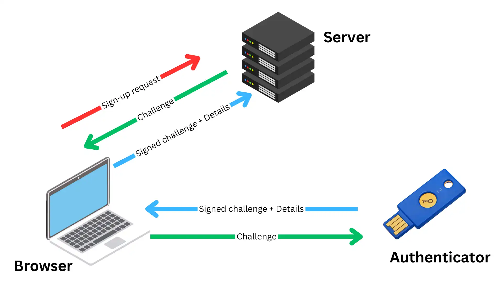
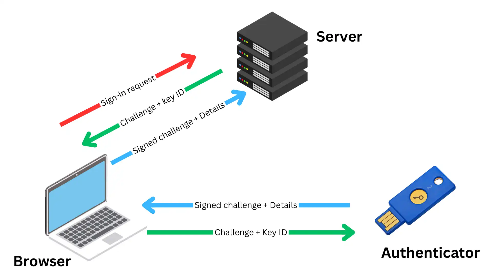
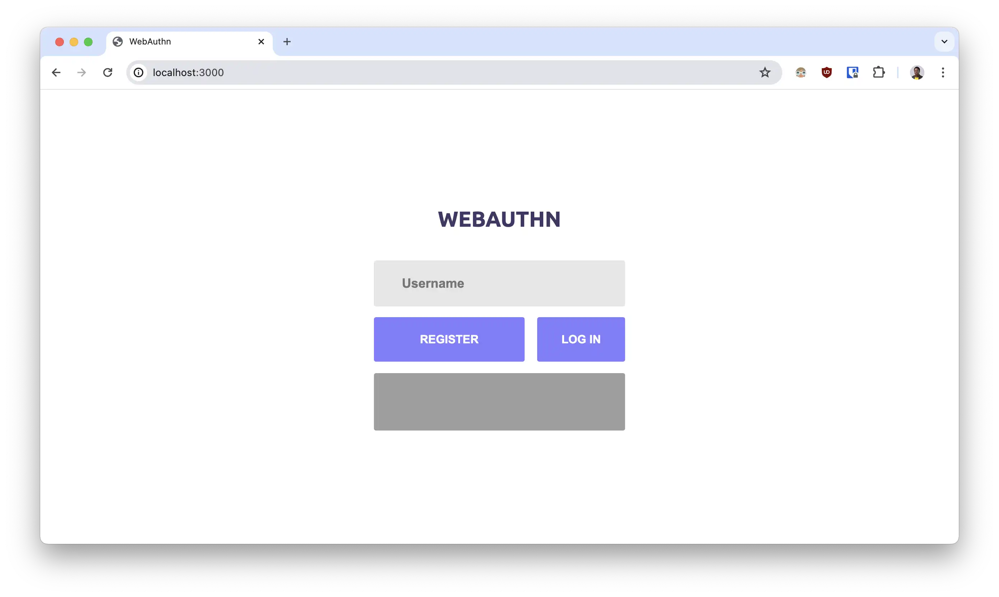
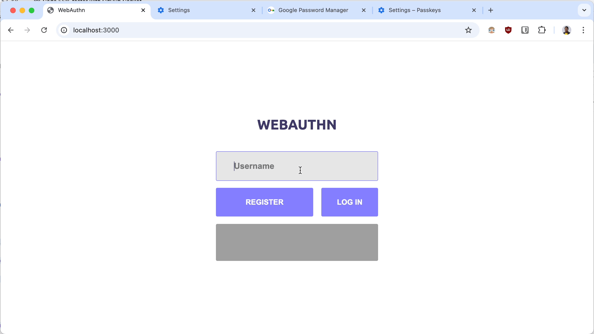
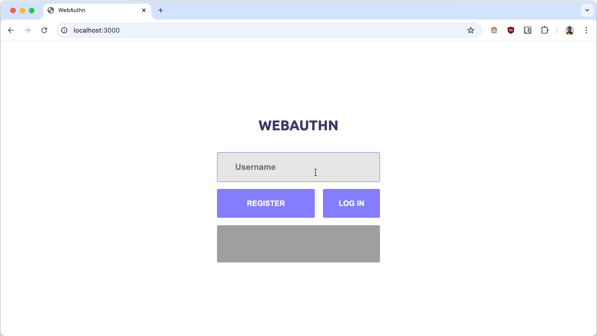

As more people and services come online, security is a rising concern. Security incidents are commonplace, leading to breached credentials and stolen data. Individuals aren’t safe too as phishing is on the rise. Of course, passwords are to blame for some of these. If only there was a better way to authenticate users online securely. Wait, there is!

The WebAuthn API in modern browsers offers a more secure passwordless authentication. In this post, we’ll examine what the WebAuthn API is. Then we'll see how to use it to simplify authentication in your production apps while providing better security for your users.



## What Is WebAuthn

WebAuthn enables authentication through device biometric sensors or hardware authenticators, without passwords. Fingerprint scanners and facial recognition are good examples of biometric sensors. Yubikeys is also a popular hardware authenticator.

When required to log in, the user engages the authenticator device, and voila, they are magically authenticated. It feels like unlocking your device with biometrics. This of course is powered by advanced public-key cryptography. It's way more secure and also doesn’t require storing sensitive information server-side.

There are several advantages to this approach. For one thing, users aren’t required to create and remember insecure passwords. This, in turn, eliminates the attack surface for phishing attempts. And for developers, this means you don’t have to build servers to store and manage passwords. All server-related credentials in WebAuthn are public, thus when a breach occurs, no sensitive data is lost.

WebAuthn is such a huge win for developers and end users. But how does this magical authentication system work in practice? Let’s take a look now.

## How Does WebAuthn Work

Authentication in WebAuthn requires three entities: an authenticating server (or relaying party), a client (i.e. user’s browser), and an authenticator (i.e. fingerprint or Yubikey). Registration (i.e. sign-up) and authentication (i.e. sign-in) are the two main workflows here.

During registration, the browser requests a cryptographic challenge from the server. It's then sent to the authenticator, which generates a public and private key pair. The challenge is signed with the private key and returned to the browser along with the private key ID. Finally, the browser sends the signature details to the server which verifies the signature with the public key. Sign-up is complete if this verification checks out.



Registration/sign-up flow

During authentication, the server returns a new challenge and the saved private key ID. This is relayed to the authenticator, which finds the correct private key with the ID and signs the challenge. Finally, the signed challenge is sent to the server where it’s verified against the saved public key. If this checks out, the user is successfully signed in.



Authentication/sign-in flow

WebAuthn provides a pretty seamless experience for your users. Also, there are a number of libraries to choose from for great development experience. Now, let’s go into the details of implementing WebAuthn in real-world apps.

## How To Implement Authentication With WebAuthn

Let’s build a demo login screen to implement the concepts of WebAuthn. Here’s a link to the [live demo of the app](https://webauthn.megaconfidence.workers.dev/) for you to poke around.

The [starter code can be found here](https://github.com/megaconfidence/webauthn-node/raw/main/webauthn-starter.zip), and the [source repository is here](https://github.com/megaconfidence/webauthn-node/) too. Download the starter code, and open up a terminal in the project repository. Then, run `npm i` to install the project’s dependencies and `npm start` to start a local dev server. The frontend is available on [http://localhost:3000/](http://localhost:3000/)



The starter code contains the basic app UI and allows us to focus on coding the main business logic. This project uses the [SimpleWebAuthn](https://simplewebauthn.dev/) client and server library, but feel free to swap it out if you prefer. Let’s start by building the registration flow.

### Registration or Sign-up Flow

A user creates a new profile or signs up for the application with the registration flow. During registration, the browser requests a challenge from the server and gets it signed by the authenticator. Finally, that challenge is sent to the server for verification.

Open the `public/index.js` file and add this handler for the registration flow:

```jsx
regBtn.addEventListener("click", async () => {
  displayMessage("");

  const challenge = await myfetch("/register", { username: unameInput.value });

  let signedChallenge = await startRegistration(challenge).catch((error) => {
    displayMessage(error);
    throw error;
  });

  const verification = await myfetch("/register/complete", signedChallenge);

  if (verification?.verified) {
    displayMessage("Success!");
  } else {
    displayMessage(`<pre>${JSON.stringify(verification)}</pre>`);
  }
});
```

This event makes two calls to the API, first at `/register` to get the challenge and then at `/register/complete` to verify the signed challenge. Let’s implement these endpoints. In the `server.js` file, import the following installed libraries:

```jsx
const session = require("express-session");

const {
  verifyRegistrationResponse,
  generateRegistrationOptions,
  verifyAuthenticationResponse,
  generateAuthenticationOptions,
} = require("@simplewebauthn/server");

const memoryStore = require("memorystore");
const { LocalStorage } = require("node-localstorage");

const MemoryStore = memoryStore(session);
const localStorage = new LocalStorage("./db");
```

Then create a session middleware to keep track of login-session and declare a few required variables:

```jsx
app.use(express.json());
app.use(
  session({
    resave: false,
    secret: "secret123",
    saveUninitialized: true,
    cookie: {
      httpOnly: true,
      maxAge: 86400000,
    },
    store: new MemoryStore({
      checkPeriod: 86_400_000,
    }),
  }),
);

const rpID = "localhost";
const origin = `http://${rpID}`;
const rpName = "WebAuthn Tutorial";
const expectedOrigin = `${origin}:${port}`;
```

Now we can create a route for the `/register` endpoint which returns a new challenge and adds the user to the session:

```jsx
app.post("/register", async (req, res) => {
  const uname = req.body.username;
  const user = JSON.parse(localStorage.getItem(uname)) || {
    passKeys: [],
    username: uname,
  };

  const { username: userName, passKeys } = user;

  const opts = {
    rpID,
    rpName,
    userName,
    attestationType: "none",
    supportedAlgorithmIDs: [-7, -257],
    authenticatorSelection: {
      residentKey: "discouraged",
    },
    excludeCredentials: passKeys?.map((key) => ({
      id: key.id,
      transports: key.transports,
    })),
  };
  const options = await generateRegistrationOptions(opts);

  req.session.challenge = { user, options };
  res.send(options);
});
```

When the challenge is signed and returned to the server, the server verifies the challenge and adds the user to the database:

```jsx
app.post("/register/complete", async (req, res) => {
  const response = req.body;
  const { options, user } = req.session.challenge;

  const opts = {
    response,
    expectedOrigin,
    expectedRPID: rpID,
    requireUserVerification: false, //Enforce user verification by the authenticator
    expectedChallenge: options.challenge,
  };

  let verification;
  try {
    verification = await verifyRegistrationResponse(opts);
  } catch (error) {
    console.error(error);
    return res.status(400).send({ error: error.message });
  }

  const { verified, registrationInfo } = verification;

  if (verified && registrationInfo) {
    const {
      counter,
      credentialID,
      credentialBackedUp,
      credentialPublicKey,
      credentialDeviceType,
    } = registrationInfo;

    const passKey = user.passKeys.find((key) => key.id === credentialID);

    if (!passKey) {
      user.passKeys.push({
        counter,
        id: credentialID,
        backedUp: credentialBackedUp,
        webAuthnUserID: options.user.id,
        deviceType: credentialDeviceType,
        transports: response.response.transports,
        credentialPublicKey: Array.from(credentialPublicKey),
      });
    }
    localStorage.setItem(user.username, JSON.stringify(user));
  }

  req.session.challenge = undefined;
  res.send({ verified });
});
```

Then head back to the browser to test the registration flow. If the setup was successful, you should get a success message:



### Authentication or Login Flow

The login flow is pretty straightforward. To implement this we need to add an event handler to the login button on the UI in the `public/index.js` file:

```jsx
loginBtn.addEventListener("click", async () => {
  displayMessage("");
  const challenge = await myfetch("/login", { username: unameInput.value });

  let signedChallenge = await startAuthentication(challenge).catch((error) => {
    displayMessage(error);
    throw error;
  });

  const verification = await myfetch("/login/complete", signedChallenge);

  if (verification?.verified) {
    displayMessage("Success!");
  } else {
    displayMessage(`<pre>${JSON.stringify(verification)}</pre>`);
  }
});
```

This handler will grab a challenge from the server and pass it to the same authenticator device. The signed challenge is then sent to the server for verification.

Let’s implement the `/login` and `/login/complete` routes in the `server.js` file:

```jsx
app.post("/login", async (req, res) => {
  const user = JSON.parse(localStorage.getItem(req.body.username));

  const opts = {
    rpID,
    allowCredentials: user?.passKeys.map((key) => ({
      id: key.id,
      transports: key.transports,
    })),
  };
  const options = await generateAuthenticationOptions(opts);

  req.session.challenge = { user, options };
  res.send(options);
});
```

The login route generates a new challenge based on the user's stored passkeys or authenticator device previously used during registration. Then the `/login/complete` route handles the verification of the signed challenge:

```jsx
app.post("/login/complete", async (req, res) => {
  const { options, user } = req.session.challenge;
  const body = req.body;

  const passKey = user.passKeys.find((key) => key.id === body.id);
  if (!passKey) {
    return res
      .status(400)
      .send({ error: `Could not find passkey ${body.id} for user ${user.id}` });
  }

  const opts = {
    response: body,
    expectedOrigin,
    expectedRPID: rpID,
    authenticator: passKey,
    requireUserVerification: false,
    expectedChallenge: options.challenge,
  };

  let verification;
  try {
    verification = await verifyAuthenticationResponse(opts);
  } catch (error) {
    console.error(error);
    return res.status(400).send({ error: error.message });
  }

  const { verified, authenticationInfo } = verification;

  if (verified) {
    passKey.counter = authenticationInfo.newCounter;
    user.passKeys = user.passKeys.map((i) =>
      i.id == passKey.id ? passKey : i,
    );
    localStorage.setItem(user.username, JSON.stringify(user));
  }

  req.session.challenge = undefined;
  res.send({ verified });
});
```

Finally, head to the browser to test the changes. Now you should be able to log in using the authenticator device used to register earlier.



## Conclusion

And that’s WebAuthn in a nutshell. It’s easy to implement and way more secure than a password or OTP-based authentication. I’m as excited as you are to see it grow in adoption to more mainstream web services.

If you’d love to stay up to date with the latest web native trends, let’s connect over on [Linkedin](https://www.linkedin.com/in/megaconfidence/) and [Twitter](https://x.com/megaconfidence). Take care until we meet again!

