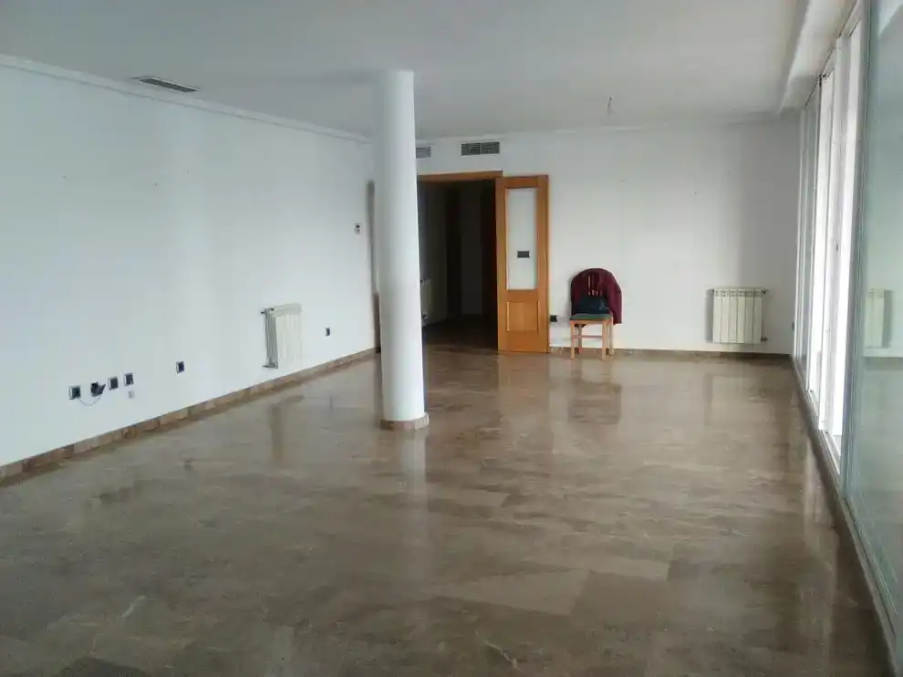

Heya, how's it going? [My previous post](../my-experience-relocating-to-england/) seemed well received, so I wanted to write a follow-up. This article discusses a few things to look out for when searching for accommodation in a new city. You may have recently moved or plan to do so in the coming months, I hope you find this is helpful.

I know getting the right apartment and moving in can be difficult and stressful. So I hope you find a tip or two from this article to help you save time and money.

## Start Searching Early

This is probably the most important tip on this list. It’s super important to start your apartment search early as it will save you a lot of time and effort. Because I did this, I got my apartment in just two weeks of moving, saving several hundred pounds and a lot of time. You can too!

Most cities have online sites where lettings are listed. [Rightmove](https://www.rightmove.co.uk/), [OnTheMarket](https://www.onthemarket.com/), and [Zoopla](https://www.zoopla.co.uk/) are quite popular in the UK. Using these sites, you can search for a place that meets your requirements and book a viewing with the agent. The best part is you don’t have to be in the city to do all of this because everything you need is online. It takes about a week to get a viewing confirmation, so take advantage of this and book in advance. I took my advice and had four confirmed viewings the week I got to the city I live.

## Set A Budget

It might seem obvious, but sometimes we need a reminder. That said, I wouldn’t advise having a strict budget because it may mean you’ll miss out on some great deals. So have a base budget, then set a buffer. For instance, I set aside an extra £100 if I saw something exceptional. Having a budget can also help you streamline your search. Most online sites let you filter properties by price, making it quicker.

Another benefit of having a clear budget is that it can help you find great deals elsewhere. While your budget may only get you a studio flat in one city, it may get you a duplex in another. It may sound like I’m over-exaggerating, but it’s true. Of course, there are always trade-offs, but having a budget will help you optimize your search to get the best value for money.

## “This is not a drill”

The idea here is to take your search seriously. I lost a pretty good deal because I wasn’t as aggressive as I should have been. Don’t make the same mistake, many others are searching too and you’ll have to beat them to it. It’s survival of the quickest. So go above and beyond to make an offer the agent/landlord can't refuse. You can go as far as offering to pay 6 months up-front or offer to pay a slightly higher rent. Whatever the case, you should play to win.

Speaking about taking things seriously, you should use a tool to track your progress. I used a Kanban board to keep track of flats I liked and updated it frequently. This helped me keep the search organized. Also, you start to notice certain patterns when using a tracker For instance, the rent of apartments with certain amenities always falls in close brackets, or a single building may have different agents handling each flat with significant price variations. This means it’s possible to get another flat in the same building for significantly less.

## Don’t Get Scammed

This could happen in various ways. First, you could get scammed by fake agents. Remember that scammers are everywhere, so be cautious of any suspicious behaviour by the agent. You could also get scammed by the images of properties posted online. Images usually don’t tell an accurate story. Sometimes, images are enhanced to make the apartment appear larger or newer than the property is, and it can be misleading.

The best way to avoid both traps is to view the property yourself. Only legitimate agents can provide viewing access to the property. So if an agent wants you to make payment before viewing the property—that’s a red flag. Also, when you go for a viewing, you have a better sense of the size of the flat, and its state of maintenance. Then proceed your expectations are met.

## One More Thing. Actually, Many

If it’s your first time in the UK, you’ll need to know about [EPC ratings](https://www.gov.uk/selling-a-home/energy-performance-certificates). In summary, it’s an A to G metric to measure the energy efficiency of a flat—where A is most efficient. My advice is you aim for flats between 'A' to 'C'. You'll also want to ensure your [Council tax](https://www.moneyhelper.org.uk/en/homes/buying-a-home/how-to-save-money-on-your-council-tax-bill) falls within a reasonable band to avoid paying higher taxes.

Heating should be the largest chunk of your electricity bill, so if you want to save cost, you could go with a gas-heated apartment. The drawback is gas outages are quite frequent, and you may spend a night or two in the cold, without any heating. Conversely, electric heaters are a bit expensive to run, but way more reliable. So, pick your poison.

## Conclusion

Great! So these are a few things to keep in mind when house hunting. Before you go, I’ll leave you with this hot take. In my opinion, houses with visible pillars are poorly designed and you should stay away from them. It’s common for buildings to have load-bearing pillars, but it’s purely bad design to create apartment layouts that reveal them.

This looks ridiculous:

That’s it from me, see you next time. Bye bye! [Follow me Twitter for more updates](https://twitter.com/megaconfidence).
