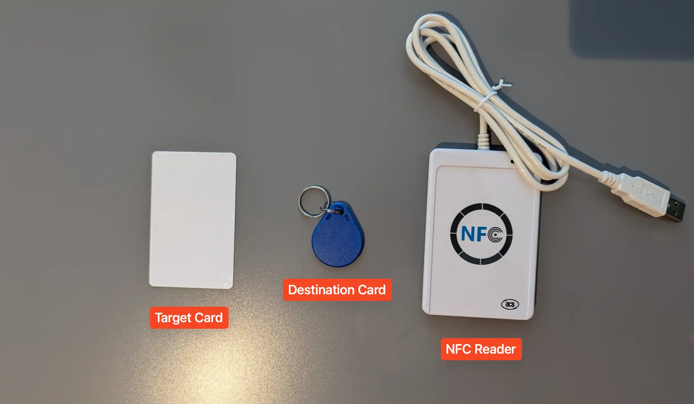
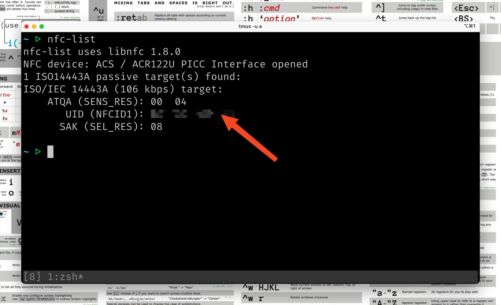
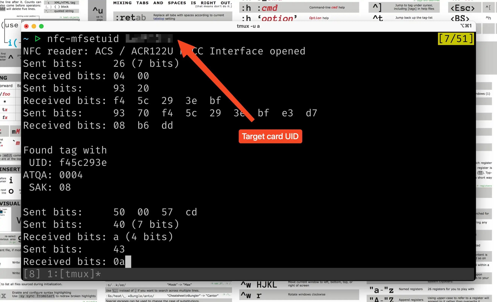
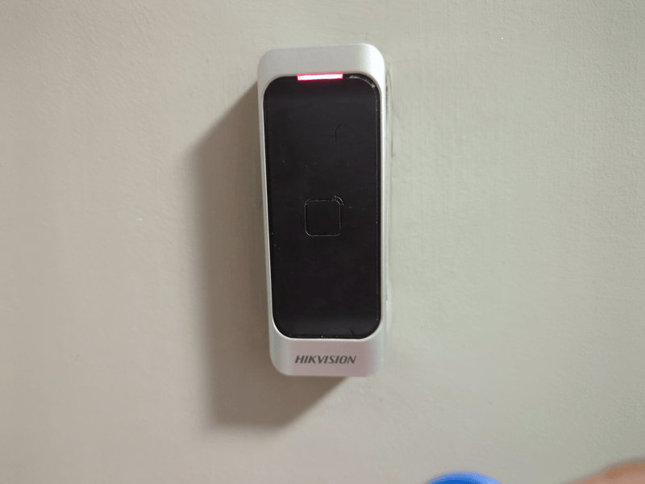

I’ve been doing some NFC experiments lately and discovered it’s possible to completely clone an NFC chip. It surprised me that the process was pretty trivial, exciting, and perhaps confusing (security implications?).

So I’m sharing this quick guide on cloning or duplicating NFC key cards or NFC access cards today. This guide is purely educational, and you should consult the proper authorities if you intend to make a clone.

## Required Hardware & Tools

To get started with the process, you’ll need a few tools. You’ll need the target card you want to clone and a destination card. For this tutorial, both cards we intend to use are Mifare Classic 1k cards with 16 data sectors. You can grab a blank writeable [card from Amazon](https://www.amazon.co.uk/dp/B07DWR2J3X) if you don’t already have one.

> If you’re not sure what cards you have, you can use the [Mifare Classic Tools](https://play.google.com/store/apps/details?id=de.syss.MifareClassicTool&hl=en_GB) app to do a quick check. Go to Tools > Tag Info.

Next, you’ll need an NFC card reader & writer to get the cards connected to your computer. I’ll recommend any USB [NFC reader with the ACR122U](https://www.amazon.co.uk/dp/B07QWRCWMX) chip as it’s fully supported by libnfc. However, you may not need to buy a card reader if your destination card is a Magic Tag 2nd gen card that supports direct write to block 0 (manufacturer’s block). In that case, you can use an NFC-enabled [Android device to clone the card](https://timdows.com/projects/using-a-mobile-phone-to-clone-a-mifare-card/).

Finally, you’ll need to install libnfc, the NFC driver library on your computer. If you are on a Linux, you may check if your package manager has prebuilt binaries or [build from source](https://github.com/nfc-tools/libnfc?tab=readme-ov-file#installation). On macOS, you can install libnfc with Homebrew. The command is `brew install libnfc`.

## Cloning With libnfc

Now you have all the required hardware and software, the rest is pretty easy. Plug the NFC reader into a USB port on your computer and open a new terminal window. Place the target card on the reader and run the following command: `nfc-list`

This prints the UID of the target device (i.e contents of block 0 in sector 0). This is the unique ID of the chip used by the door access system to determine its legitimacy. We’re going to clone this UID into the target card. Place the destination card on the reader and run: `nfc-mfsetuid` with your target card UID (remove all spaces)

This clones the target card’s UID into the destination card. That’s it. You can try testing your cloned card at the door to see if it works.

## Conclusion

Awesome, that’s how easy it is to clone an NFC access card. If you found this exciting, you may find other NFC-related experiments I’m working on. I’d love to connect with you on [Linkedin](https://www.linkedin.com/in/megaconfidence/) and [Twitter](https://x.com/megaconfidence).

Cheers!

