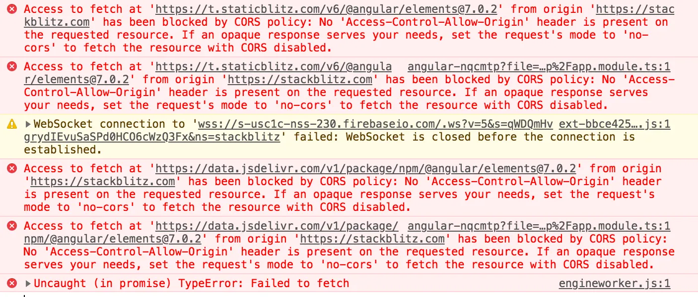

You’re probably building a public API service on Cloudflare Workers and ran into the infamous CORS error while making a fetch request to your service from a client:




Keep calm and don’t freak out. In this post, I’ll show you how to PERMANENTLY fix CORS on Cloudflare Workers for good.

## Fix CORS Errors On Vanilla Cloudflare Workers

If you’re writing a vanilla service on Cloudflare Workers (i.e. in Javascript), fixing CORS is really easy. All you have to do is handle the [CORS preflight](https://developer.mozilla.org/en-US/docs/Glossary/Preflight_request) request which always is an `OPTION` method. Here’s how to get it done in a Javascipt Worker:

```js
export default {
  async fetch(request, env, ctx) {
    if (request.method === "OPTIONS") {
      return new Response("ok", {
        headers: {
          "Access-Control-Allow-Origin": "*", // or specify the client's origin
          "Access-Control-Allow-Methods": "*", // could be GET, POST, DELETE etc
          "Access-Control-Allow-Headers": "*", // you get the idea
        },
      });
    }

    return new Response("Hello World!");
  },
};
```

If your Worker is in a different language (i.e Rust or Python), all you need to do is to adapt the implementation. Simply handle the preflight `OPTIONS` request to respond with a list of allowed `Access-Control-Allow-Origin`s, and optionally some `Access-Control-Allow-Methods` and `Access-Control-Allow-Headers`.

## Fix CORS Errors On Cloudflare Workers And Hono

If you’re using the awesome Hono framework on your Worker, the fix just got 10x easier. Simply import the `cors` utility and create a middleware for your API:

```js
import { Hono } from "hono";
import { cors } from "hono/cors";

const app = new Hono();

app.use("*", cors());

app.get("/", (c) => {
  return c.text("Hello World!");
});
```

Optionally, you can configure what origins, headers or methods are allowed by your service by passing a [configuration object](https://hono.dev/docs/middleware/builtin/cors#options) to `cors`. And that’s all you need to know.

## Fix CORS Errors On Cloudflare Workers And Itty-Router

Itty-router is another favourite framework of mine because it is super tiny and well-documented. Fixing CORS is quite easy too. Just grab the middleware and stick it into your app:

```js
import { AutoRouter, cors } from "itty-router";

const { preflight } = cors();

const router = AutoRouter({ before: [preflight] });

router.get("/", () => "Hello World!");

export default router;
```

As you already guessed, you can customize the allowed origins, headers and methods by creating a [config object](https://itty.dev/itty-router/cors#corsoptions).

## Conclusion


Hitting CORS errors doesn’t have to be the end of the world. In fact, it should inspire you to learn more about why this silly security feature exists on modern browsers. My good friend wrote a detailed article explaining all of this and you can read more [here](https://medium.com/the-andela-way/what-exactly-is-cors-and-how-to-handle-it-fc2e52e89a0).

That’s it on CORS. If you’d love to learn more about web and serverless stuff, connect with me on [LinkedIn](https://www.linkedin.com/in/megaconfidence/) or [Twitter](https://x.com/megaconfidence). See ya later!

