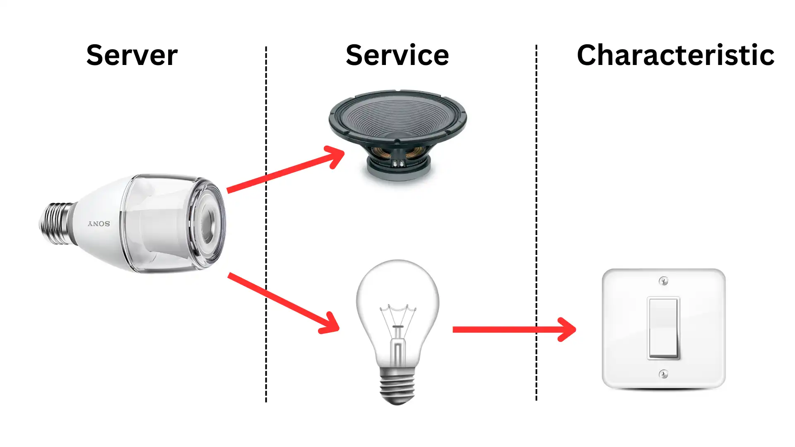
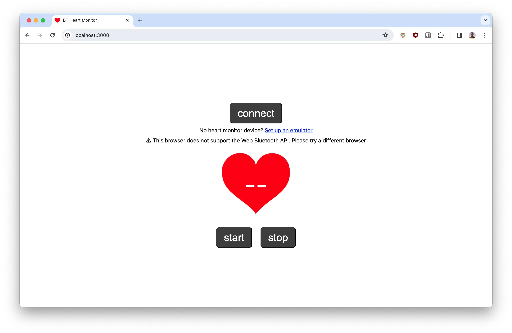
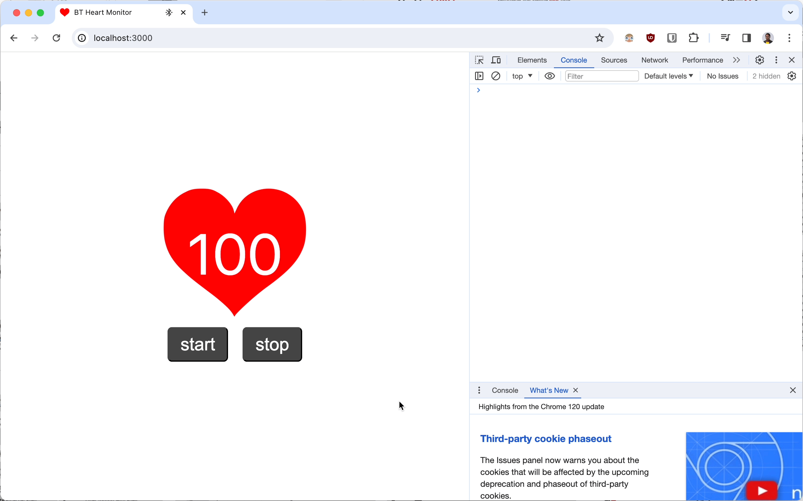

A few weeks ago, I stumbled on a browser API I never knew existed; the web Bluetooth API. It seems to have been in development for about 7+ years, and I’m glad most browsers now support it. I’m a huge fan of ‘build once, run everywhere’, and it’s one of the reasons why Web Bluetooth is exciting. You don’t have to write native applications for Android, iOS, macOS or Windows to interface with Bluetooth peripherals. All you have to do is build for the web, and it runs everywhere, saving you hours of development time.

In this article, I’ll show you how to build using the Web Bluetooth API to interact with Bluetooth peripherals. We’ll specifically build together an app powered by Web Bluetooth to display stats from a Bluetooth enabled heart monitoring device like a smartwatch or a Bluetooth fitness tracker. If you own any of these, get them ready!

> 💡 A live demo of the completed app can be found [here](https://megaconfidence.github.io/bt-heart-monitor/), as well as it's source code [in this GitHub repository](https://github.com/megaconfidence/bt-heart-monitor).

## How Does Web Bluetooth Work?

Like you already guessed, Bluetooth is not a web technology. It doesn’t follow the standard OSI model, nor does it use the TCP/IP protocol. Bluetooth has its own independent model with its unique stack of protocols. The big question is, how is it possible to interact with Bluetooth peripherals from a web browser? How does it all work?


Thanks to the GATT (**Generic ATTribute** Profile) standard, Bluetooth peripherals are able to communicate with other device using a generic data protocol. This standard is supported by modern web browsers, hence the birth of the Web Bluetooth API. GATT makes it possible to describe Bluetooth peripherals as **_servers_**, having a number of **_services_** that are controlled with their **\*characteristics**.\* This fits perfectly into the standard web model i.e clients (web browsers) connect to servers (Bluetooth peripherals) and can utilize services on the servers by making read/write request to the respective characteristics.



To put this in context, think of a Bluetooth enabled smart bulb with an integrated speaker. The peripheral itself is considered a server. In this example, the server has two services; a speaker service and a lamp service. The lamp service has a switch characteristic, making it possible to turn ON and OFF the lamp. Thus, the bulb can be controlled by writing the appropriate data to the switch characteristic.

That was a quick overview of how Web Bluetooth works. Now, let’s put this concept into practice by building a simple heart monitoring app for Bluetooth peripherals like smartwatches and fitness trackers. Let’s go!

## Build A Bluetooth Heart Monitoring App

To demonstrate the concepts discussed so far, and show you how easy it is to build with Web Bluetooth, let’s build a fun app together. You’ll need a basic grasp of JavaScript and also a Bluetooth peripheral with a heart rate sensor. Most smartwatches or fitness trackers have these features, but if you don’t have these handy, [you can set up an emulator using your smartphone](https://github.com/megaconfidence/bt-heart-monitor#set-up-a-heart-monitor-emulator).

> 💡 See [this guide](https://github.com/megaconfidence/bt-heart-monitor#set-up-a-heart-monitor-emulator) to set up a Bluetooth emulator using a smartphone.

To keep things simple, I’m providing a starter code in [this zip folder](https://raw.githubusercontent.com/megaconfidence/bt-heart-monitor/main/bt-heart-monitor-starter.zip), which contains the base UI for the app. The `index.js` file is mostly empty, as we’ll build it out together. To serve the files, you may a static web server like [Live Server](https://marketplace.visualstudio.com/items?itemName=ritwickdey.LiveServer) if you use VScode, or by using Python’s built-in HTTP server. To use this, run the following command in the project’s directory:

```bash
python3 -m http.server 3000
```

Then fire up a browser. However, at the time of writing, Firefox doesn’t have support for Web Bluetooth.



Now that we have the basics up and running. Before moving on, open up the `index.html` file and a `hide` class to the `div` with class `error` and also the `div` with class `ui`. With that taken care of, let start coding!

### Connecting To A Bluetooth Peripheral

With Web Bluetooth, connecting to a peripheral is a two-step process. We need to request for the device and then connect to it. While requesting for a device, we need to describe devices supported by our app through a config object. Since our app needs to interface with heart monitoring devices, we’ll need to request for a Bluetooth peripheral with a `heart_rate` service:

```jsx
let device; //global variable to cache connected device
let heartRateChar; //global variable to cache heart rate characteristic

async function requestDevice() {
  const config = {
    acceptAllDevices: true,
    optionalServices: ["heart_rate"],
  };

  device = await navigator.bluetooth.requestDevice(config);
  device.addEventListener("gattserverdisconnected", connectDevice); //auto re-connect
}
```

Then, we connect to the devices using the logic below. After connecting to the device, we need to get access to its `heart_rate` service, and then the `heart_rate_measurement` characteristic. The heart rate data can be read by _subscribing_ to this characteristic. To capture this data, we add an event listener for `characteristicvaluechanged`. Later on, we’ll come back to write a function that parses the value and updates the UI.

```jsx
async function connectDevice() {
  if (device.gatt.connected) return; //quit if connection already exists

  const server = await device.gatt.connect();
  const service = await server.getPrimaryService("heart_rate");

  heartRateChar = await service.getCharacteristic("heart_rate_measurement");
  heartRateChar.addEventListener("characteristicvaluechanged", (event) => {
    //handle heart rate change i.e display updates on UI
    //console logging for now...
    console.log(event.target.value);
  });
}
```

To receive updates on `characteristicvaluechanged`, we need to _subscribe_ to its _notifications_. The start monitoring function below does exactly that. Additionally, it plays the heart-beat audio effect and starts the heart beat animation on the UI:

```jsx
async function startMonitoring() {
  await heartRateChar.startNotifications();
  beatAudio.play();
  heartUI.classList.remove("pause-animation");
}
```

Now we create an `init` function to trigger the flow when the connect button on the UI is clicked on. Here’s the code for it:

```jsx
async function init() {
  //check if browser supports web bluetooth
  if (!navigator.bluetooth) return errorTxt.classList.remove("hide");

  await requestDevice();
  connectBTN.textContent = "connecting...";

  await connectDevice();
  connectUI.classList.add("hide");
  appUI.classList.remove("hide");

  await startMonitoring();
}

connectBTN.addEventListener("click", init);
```

Save the file, head back to the browser and reload. Clicking on the connect button should open up a modal to select nearby Bluetooth peripherals. After connecting to an appropriate device, you should see the logs of data from its heart monitoring sensor in the console. Sweet!



### Parsing And Displaying Hear Rate Data

As you likely noticed, the data returned from the sensor wasn’t decimal like you expected. This is normal for Bluetooth peripherals, as they communicate in binary. The output on the console is an interface called a `DataView`, which wraps around an `ArrayBuffer`, the actual value sent by the Bluetooth device. These terms may be new to you, but they aren’t all that complicated. Let’s take a closer look.

An ArrayBuffer is simply an array of bytes (i.e 8 bits make a byte). For instance, `[00000001, 00000000, 01100010]` is an ArrayBuffer with three elements. The first element at index 0 is a decimal 1, then at index 1 is a decimal 0, and at index 2 is a deciaml 98. But ArrayBuffers cannot be used directly in JavaScript and that’s where DataViews come in. DataViews wrap around ArrayBuffers, so that they can be read or written to. That’s the whole story in a nutshell, easy right?

Since the data returned from the Bluetooth peripheral is already in a DataView, parsing it becomes a bit easier. That said, we’ll need to check if the device encodes its data in 16-bits or 8-bit by checking the _flag byte_. The flag byte is the first item in the ArrayBuffer (i.e index 0). The last bit (LSB) in the flag byte indicates if the data is in 16-bits or 8-bits i.e:

```
ArrayBuffer1 = [00000001, 00000000, 01100010]
                |      |  |                |
                |      |  |                |
                {---▼--}  |                |
                flag byte. LSB = 1; Data in 16-bits
                          |                |
                          |                |
                          {--------▼-------}
                          convert next 16-bits to decimal


ArrayBuffer2 = [00000000, 01100010]
                |      |  |      |
                |      |  |      |
                {---▼--}  |      |
                flag byte. LSB = 0; Data in 8-bits
                            |      |
                            |      |
                            {---▼--}
                            convert next 8-bits to decimal
```

Let’s write a function to parse the heart rate, while checking if the data is encoded in 16 or 8-bits. Then we can display the results in the UI by replacing the console-log we wrote earlier with a new `handleRateChange` function. The code sample is shown below:

```jsx
function parseHeartRate(value) {
  const is16Bits = value.getUint8(0) & 0x1; //check if last bit in flag byte is 1
  if (is16Bits) return value.getUint16(1, true);
  return value.getUint8(1);
}

function handleRateChange(event) {
  bpmTxt.textContent = parseHeartRate(event.target.value); //display in UI
}

async function connectDevice() {
  //...previous code here
  //use handleRateChange as handler function
  heartRateChar.addEventListener(
    "characteristicvaluechanged",
    handleRateChange
  );
}
```

Head back to the browser to test the changes. It works!


### Stop Monitoring Heart Rate

Let’s add one more feature to the app. It'd be great if users can start/stop monitoring. This can be implemented simply by _unsubscribing_ from heart rate notifications, pausing the audio effect and the animation:

```jsx
async function stopMonitoring() {
  await heartRateChar.stopNotifications();
  beatAudio.pause();
  heartUI.classList.add("pause-animation");
}
```

Now we can run this function when the `stop` button is clicked. We also hook up the `startMonitoring` function to the `start` button:

```jsx
stopBTN.addEventListener("click", stopMonitoring);
startBTN.addEventListener("click", startMonitoring);
```

Save and reload. With that, we’re good to go. You did it!


## Conclusion

Web Bluetooth opens up a host of new capabilities for the web, and I’m excited to see how far developers and hardware manufacture push it. I’d love to see the next cool project you build with Web Bluetooth, so please share it.

If you love all things Web, [follow me on Twitter](https://twitter.com/megaconfidence) for more. Cheers, have a good one!

