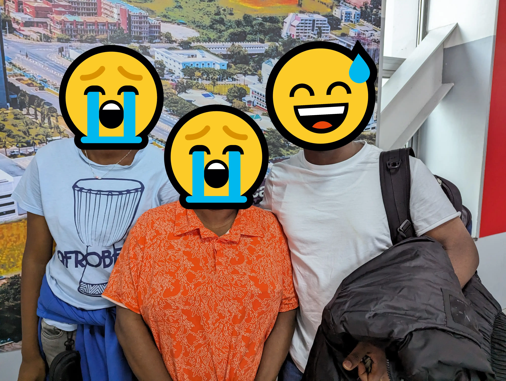

Hi, I wanted to do something a bit unusual—write about myself. Funny as that sounds, this is the first time I'm writing about personal stuff on my blog. As some of you know, I recently relocated to England from Nigeria. It's been a wonderful journey, but not without challenges. So I wanted to document and share a summary of the journey with you all for posterity. I hope to keep this post short and hope you enjoy reading it as much as I did living it.

## How It Started

One evening a few months ago, I got a message from a neighbour how rarely texts. He's a tech bro, but the super-friendly and convivial type. He texted to introduce me to another friend who shared an awesome opportunity with me. Lucky me, right?

For a few years now, the United Kingdom has been offering a special type of skilled worker visa know as Global Talent visa (a.k.a. Tech Nation visa) without the limitations of the regular skilled worker visa. The thing is, most people don't know about it (on average only 200 visas are issued yearly), or at least don't know how to go about it. Fortunately, my new friend was a sage at it, and he walked me through the process until I secured the visa.

The process was rigorous yet delicate. I had the support of my family (yes uncle, ain't skipping you this time) and friends along the way. It took months to complete and required a lot of work and luck. But it paid off nicely when I got the message that I've been granted a visa. But more importantly, it taught me how much of an asset good friends are. I wouldn't be here without them.

I also met a few people who were wilfully unhelpful. You always do. But thanks to them also, I made it.

## The Move

Around the time I got the visa, I also got a new job at a top technology company. Double lucky! That meant I had to prepare for my relocation as well as the new job at the same time. Fortunately, I got enough time for to plan for the move and that was vastly helpful. So plan I did.

I'm the kind of dude who likes to plan out every detail. So it took a while to come up with a good game-plan that accounted for all the variables influencing the move. I'm happy to report that most things went according to plan, and even some setbacks turned out to be for the best—the great mystery of life is that things _somehow_ work out in the end.



> Things go a little bit better when you plan it - Khalid (Location)

So I split my move into two stages to reduce culture-shock. Yes, it's real. I travelled first to get myself acquainted with the city I planned to stay, and made a few other necessary preparations. Then I came back after having sorted the important bits, packed my bags, kissed my loved ones goodbye and was on to start the adventure.

I made them cry really hard 😅.

## Embracing Change

The hardest part of relocating is all the _change_ associate with it. You get exposed to so many new things at the same time. The people are different, the food is different, everything is different. Not to mention, the support system you've built over the years to cope with life's big changes is left back home. So, how do you cope? You embrace it all.

Illustrating how to embrace changes with the analogy of rubber tyres, Dale Carnegie once wrote:

> Manufacturers tried to make a tyre that would resist the shocks of the road. It was soon cut to ribbons. Then they made a tyre that would absorb the shocks of the road. That tyre could "take it." You and I will last longer, and enjoy smoother riding, if we learn to do the same.

The best way to deal with changes associated with a move is to embrace it, just like rubber tyres. It means making the new place home, learning to try new food and embracing the culture. Also, don't isolate yourself—only bad things happen when you do. Go out, meet people, make new friends and explore the city. Keep in touch with loved ones back home every day, they're just a phone call away.

It's been my experience that most locals are empathetic toward the relocating newbie. They know it can be overwhelming at first. So if you need help settling in, please ask and they'll be more than ready to help.

## Conclusion

That's it. It's been a wonderful experience. I know more is to come, so I'll probably write about it or perhaps start a vlog YouTube channel—like, share, subscribe. I'd like to close off by saying _bye bye._ It's used here a lot more than goodbye. It sounds a bit silly, but I think it's pretty cute.

See you in the next one. Bye bye!
