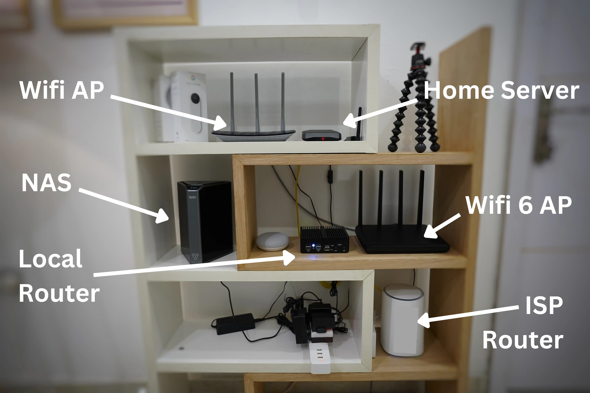
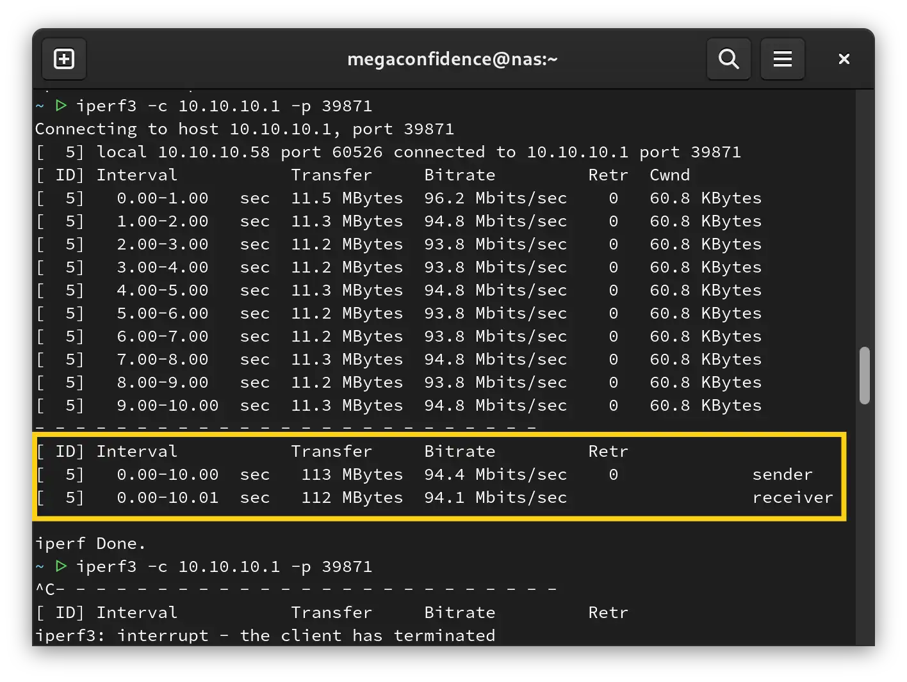
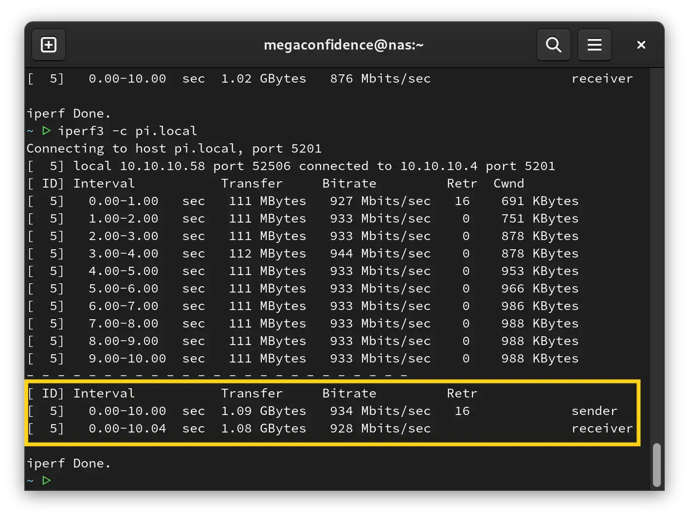
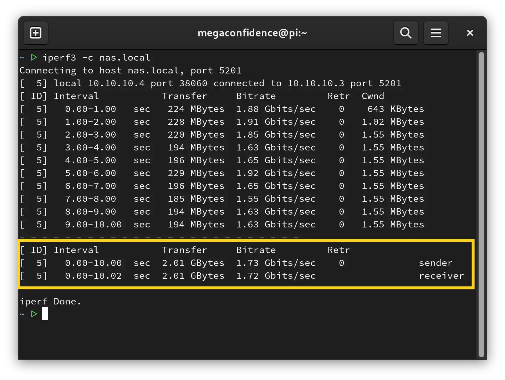

About two months ago I share a blog post detailing my plan to upgrade my home network bandwidth. The max speed I could get out of my old hardware was 100Mb/s which would have been fine if it were 1999, but I needed more speed. So I did my research and realized it wouldn’t cost so much to upgrade my network’s bandwidth to 2500Mb/s (2.5Gb/s). I did some more research, concluded what hardware to buy, and [documented my thoughts in this article](https://confidence.sh/blog/project-gigabit-upgrading-my-home-network-bandwidth-to-25-gigabits/).

>💡 Don’t forget to check out [part 1](https://confidence.sh/blog/project-gigabit-upgrading-my-home-network-bandwidth-to-25-gigabits/) of this series if you haven’t done so

All items were delivered quickly and I finished the setup using the architecture detailed in the first article. After completing the setup process, I’ve been tweaking the hardware and software side of things to get as much performance as I can. Here’s a quick look at my networking shelf (a huge upgrade from my TV closet)

The best part is I can steam 4k mkv files over WiFi with zero buffering, I bet I could also edit videos over WiFi but haven’t gotten around to it yet. Okay, I’ve been keeping you waiting, so let’s look at the benchmarks! 

## Benchmarks

My local router’s network bandwidth is a max of 2500mb per second. I’m yet to hit that limit but various attempts of tweaking have gotten me close to that number, but still not there yet. I use [Iperf3](https://iperf.fr/iperf-download.php) for my benchmarks and have it installed on my router, NAS, and main server. You should check it out, it’s really cool!

First benchmark with no software/hardware massaging:

In case you didn’t get the gist, it’s pretty pathetic. At this point, I was only hitting 95Mb/s out of 2500Mb/s. To put things in perspective, it’s 3.8% of my network's actual capacity. After some debugging, I discovered that the CAT5e cable I used was the bottleneck. I swapped it out for a CAT6 cable and things started to look better:



Finally! We’re reaching gigabit speeds at 934Mb/s, approximately 40% of my network's max bandwidth. This was expected because the Raspberry Pi’s Ethernet bus can only switch a max of 1 gigabit per second(1000Mb/s). I overcame this bottleneck by [getting an Ethernet to USB adapter](https://confidence.sh/blog/project-gigabit-upgrading-my-home-network-bandwidth-to-25-gigabits/#4-home-server) so I could bypass the Ethernet bus, and use the USB bus which has a much faster bandwidth. I followed the steps on [Jiri’s blog](https://www.jiribrejcha.net/2022/07/plugable-2-5-gigabit-ethernet-to-usb-3-0-multigigabit-adapter/) to install the drivers and the results don’t lie:



Superb, now we’re above the gigabit limit at 1.73Gb/s, which is 70% of my network's max bandwidth. It’s not quite at 100%, but I’m pleased with the results for now and I’ll be making more tweaks in the coming months to get as close as possible to 2.5Gb/s.

I stumbled into a forum that suggested enabling jumbo frames on and overclocking the Pi to reach the desired 2.5Gb/s speed. I’m yet to set it up but feel free to take a look [here](https://forums.raspberrypi.com/viewtopic.php?t=278985#p1787271) if you’re interested.

## Lessons Learned

This has been a really hands-on project and I’ve learned a lot. I practically had no networking experience before this, but through the magic of the internet, I can *almost* call myself a network engineer 😅.

A few takeaways (and opinions) from my experience working on this project are:

- Stay away from x86 machines. They are expensive, hot, slow, and power-hungry. My main server and NAS are Raspberry Pi 4s with ARM CPUs and are absolutely efficient. My local router is an x86 mini PC and runs very hot. I couldn’t get an ARM equivalent pc with 2.5Gb/s networking and 4 LAN ports, so I had to go with this one. Things could change soon and I’ll replace it.
- Cooling is very important. The cooler your devices are, the faster they run. I previously had my home lab in a TV closet (which was fine while it lasted), but I had to move my gear to a shelf because I’m running more powerful hardware that requires proper cooling to maintain efficiency. So, don’t forget to always keep em cool.
- Every inch of hardware (and software) of your networking infrastructure is important, so don’t try to be cheap when buying Ethernet cables as I did. As I showed in the first benchmark above, bad cables could be a serious bottleneck, and the same goes for every other hardware or software accessory you choose to go with.
- Always optimize to get better results. So know your hardware’s max bandwidth and constantly make optimizations to get as close to the lab results as possible. This sometimes involves buying enhancement hardware i.e a USB to Ethernet adapter or new cables etc. Some optimizations could also be software base, such as installing up-to-date drivers for your networking interfaces, etc. My advice: reach for the stars, or get as close as you can to them.

## Conclusion

Awesome! I hope you learned something helpful from this article. If you’d love to keep up with my adventures, connect with me on [Twitter](https://twitter.com/megaconfidence), and feel free to send a DM if you have questions. See you next time!
