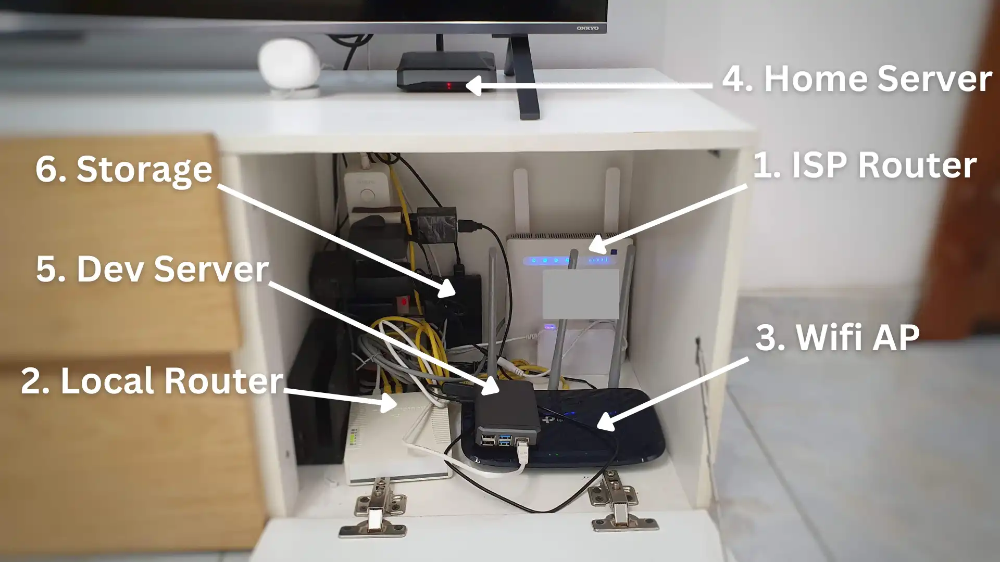
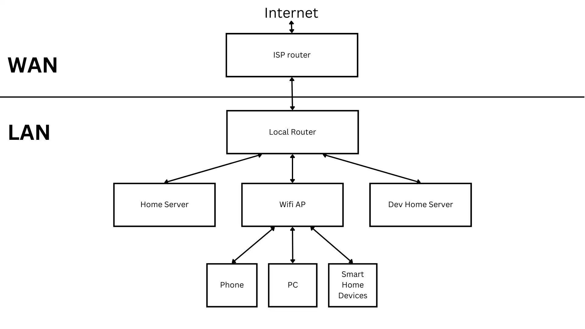
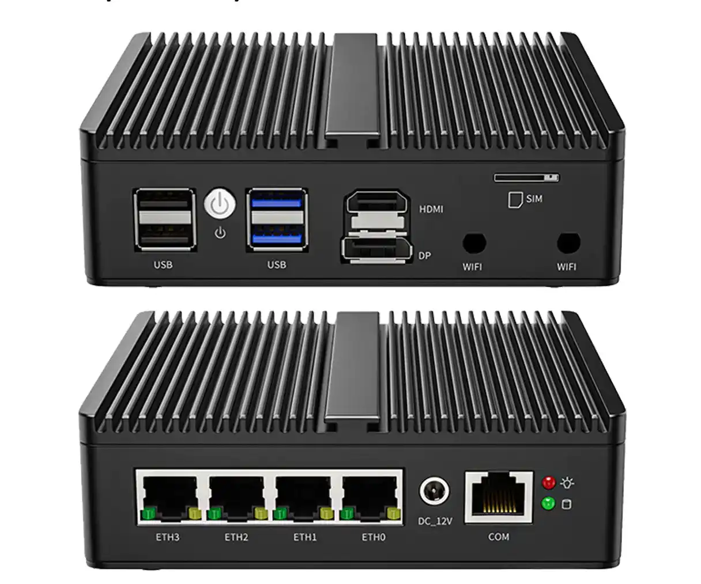
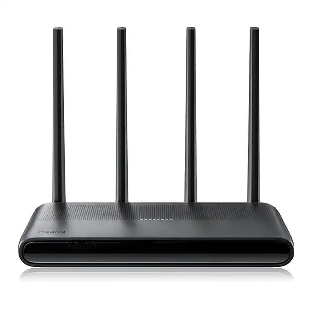
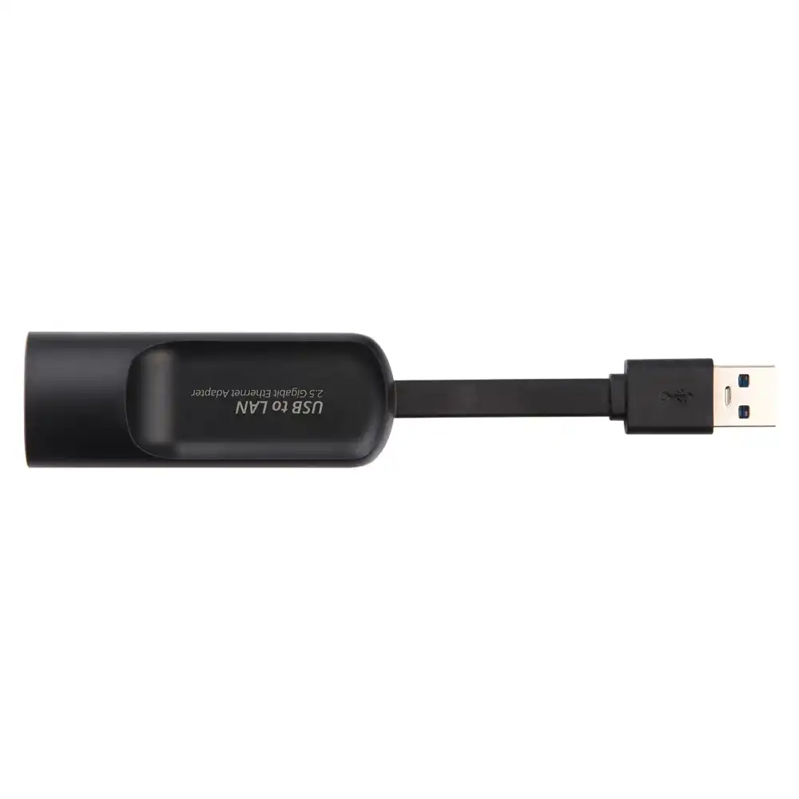
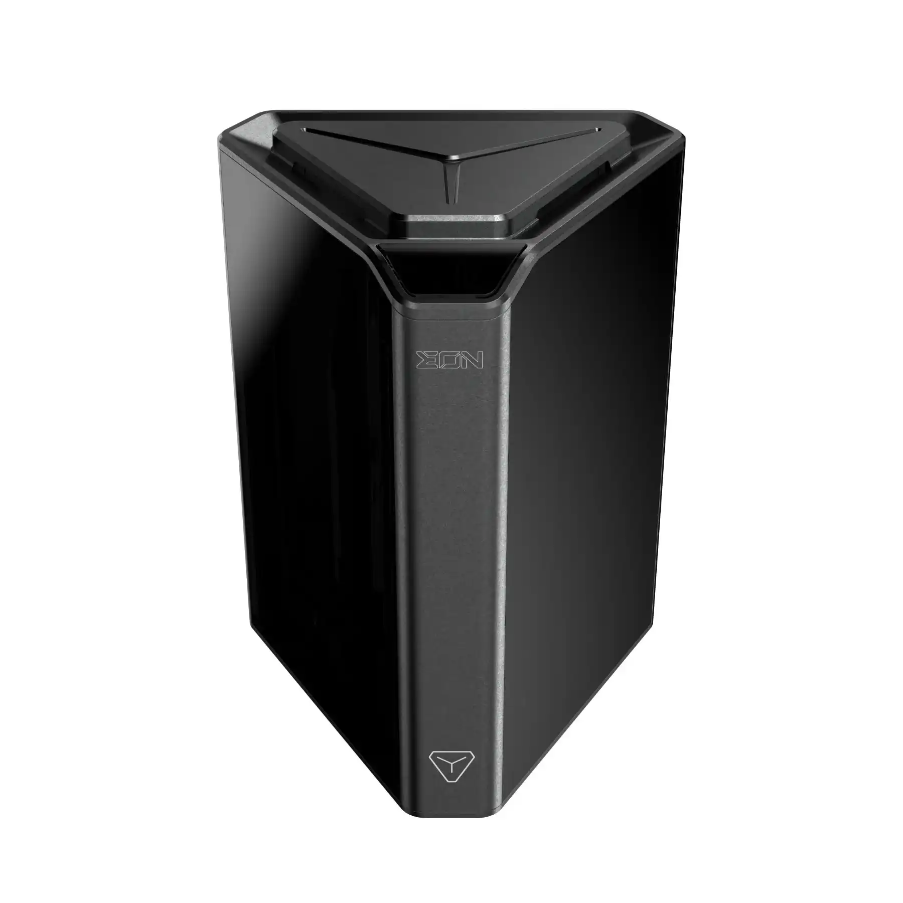
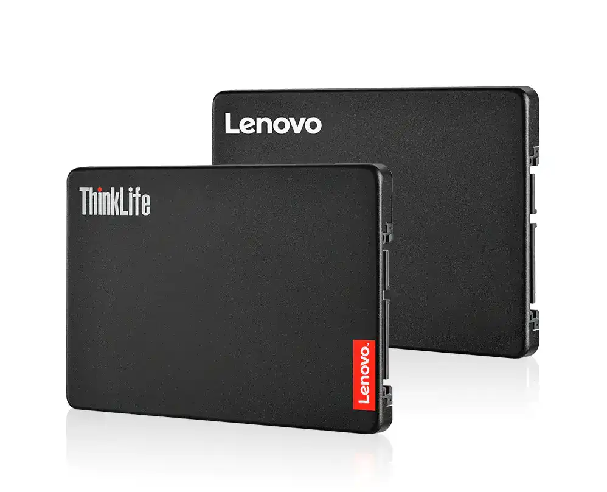

I have been playing with smart home automation for a couple of months now, and it’s been a fun project. To run a home-automation platform, you need to have a local network, and whether you realize it or not, you already have a local network (i.e, devices connected to WiFi). Your local network coordinates traffic like the request to fetch this blog page and sends the page data to the requesting device.

The exciting thing about local networks is that connected devices can cross communicate i.e, you can visit a web server running on your PC on a mobile device on the same WiFi network just by typing in the local IP of your PC and the port the server is on (give it a try if you haven’t done so already). Home automation platforms, like [Home Assistant](https://www.home-assistant.io/), leverage local networks to coordinate connected devices without needing to talk to the cloud.

That said, designing a good local network is very important because there’s so much you can do with it. For example, I hooked up my 1TB drive to my home network, and every connected device has access to it (think local Google drive without the “Google” part). You can also control your smart devices even when your internet goes out and do so much more.

In this article, I’ll share my current home network gear & architecture and the plans I have to upgrade it to a 2.5 Gigabit network (don’t worry, I’ll explain what that means too!). Also, this could give you some inspiration if you're planning an upgrade too. Let me know in the comments.

## My Current Networking Gear

Okay, I’ll be honest with you, this part sucks, and that's why there’s going to be an upgrade. But it has gotten me this far, and I’m sharing it here to underscore the importance of always starting with whatever you already have. I’ve owned most of the devices for about 4 years, and I’m only upgrading them because I have a good reason to. I got these devices from previous ISP providers, so I didn’t buy them separately.

Before getting in, I’d like to explain what a 2.5 Gigabit network is. It’s the volume or data bandwidth that a given network has. So a 2.5 Gigabit network can transfer a data volume of 2.5 Gigabits per second (or 2500Mb/s with a small ‘b’) from one device to another. Since a byte is 8 bits, we can do some quick conversion, and this turn out to be 0.3125 Gigabytes per second (or 312.5MB/s with a capital ‘B’). The higher a network’s bandwidth, the faster it is. My current home network speed is 100Mb/s, which is pretty slow.

Okay, so let’s talk about my current gear. Here’s a pic of my single-closet networking gear:

Current Networking Gear

**1\. ISP router**: Provides internet connection to my house. I get an average of 40Mb/s (5MB/s) internet upload/download speed which is not too bad, but I wouldn’t go into the hardware specs because your ISP is most likely going to be different from mine.

**2\. Local router (**[**MikroTik RouterBoard 951Ui-2HnD**](https://mikrotik.com/product/RB951Ui-2HnD)**)**: This is an old/budget router from MikroTik. It has a built-in 2.4GHz WiFi modem that can pull a max of 300Mb/s (37.5MB/s). It has a decent number of 5 ethernet ports, but they can only pull a max of 100Mb/s (10MB/s), which is quite poor. Although ethernet seems slower, my home servers and WiFi AP are connected via ethernet because it’s more stable than WiFi. This router has a cool os called [Router OS](https://mikrotik.com/software).

**3\. WiFi AP (**[**TP-Link Archer C20**](https://www.tp-link.com/us/home-networking/wifi-router/archer-c20/#specifications)**)**: It has very similar specs to the RouterBoard, the only difference in hardware is that it has an additional 5GHz WiFi card that can pull a max of 433Mb/s (54MB/s), which is better but still slow. This TP-Link router doesn’t have the best software, but It can be configured to act as an AP, which is good enough. All other devices in my home are connected to this AP via WiFi.

**4\. Home Server (**[**Raspberry Pi 4**](https://www.raspberrypi.com/products/raspberry-pi-4-model-b/specifications/)**)**: My home server is an 8GB RAM Raspberry Pi 4 with a 128GB SD card. It has a 1Gigabit (1000Mb/s) ethernet port which I can’t take full advantage of because my router is a bottleneck and can only support a max bandwidth of 100Mb/s. It runs my local DNS and home automation software, as well as other services I that I self-host. I self-host quite a bunch, so I might share more info in a future blog.

**5\. Dev Home Server**: This is also an 8GB RAM Raspberry Pi 4. I do all of my testing and experimental stuff here. I also use it as my test bed for tutorials I share on my [YouTube channel](youtube.com/@megaconfidence).

**6\. Storage (**[**WD 1TB Mypassport HDD**](https://www.amazon.com/Western-Digital-Passport-Portable-External/dp/B01LQQHI8I)**)**: I’ve had this drive for years. It’s connected to my home server and exposed to my network via SMB. I use it as a central storage for backups and for sharing files with other devices on my network. Since it’s a magnetic drive, I can only get a max of 1200Mb/s (150MB/s) read speeds, which is slow but quite faster than my current networking bandwidth.

Now, let’s talk about something slightly more interesting.

## My Network Architecture

A network architecture in this context refers to how my networking devices are structured to meet my design requirements for moving data across devices. This is a big topic, so I’m only scratching the surface here. Also, I’m only going to talk about my hardware architecture, as software architecture is a broad topic. I’d cover this in a separate article or video.

I started with a simple home network setup (because I was a complete noob) and kept on optimizing it. Like you probably do, I had a home WiFi router, and that was sufficient for a while until I started hitting some dead ends. I need to expand my networking capacity, and I had some non-negotiable design requirements:

1.  To be able to connect more than 32 devices simultaneously. Most stock ISP routers max out at 32.
    
2.  Wanted better control over how local IPs were assigned. I also needed a custom DNS server so I could create ‘fake’ local domains for services on I self-host. This eliminates the need to remember the myriad port numbers for the various services I’m running,
    
3.  I wanted my local network (LAN) to be as loosely coupled as possible with my wide area network (WAN) or internet provided by my ISP. This way, I can swap out ISP providers without having to reconfigure everything from scratch on my local network.
    
4.  I wanted all my devices to be small and power efficient. They should all fit in my console closet, as I don’t have a server rack yet.
    
5.  Lastly, I just wanted to cosplay as a network engineer. It’s fun!
    

To meet these requirements, I had to design my network layout. After experimenting a bit, I settled on this architecture, and I’m quite happy with it. Here’s a block diagram of my current network architecture:

As shown in the diagram, this architecture has two main pieces, the WAN (wide area network) i.e above the horizontal line, and the LAN (local area network) i.e below the horizontal line. WAN is basically what connects my home to the internet i.e, the router provided by my ISP. Everything below the horizontal line is my LAN network, which I have complete control over.

I have all of my home devices connected to my local router. Devices with Ethernet hardware are connected directly to my local router i.e, my home servers and WiFi AP. Other wireless devices are connected via WiFi through the WiFi AP. The local router is, in turn, connected to my ISP router, which gives internet access to all devices in my home. This means I have a central connection point, which makes things a lot easier to manage.

A lot went into this setup, especially the software side of things, so I’ll be covering it in more detail in a future article or video.

## My Upcoming Network Gear

As I mentioned earlier, while my network layout is solid, it’s not as fast as I need it to be. So I’ll be upgrading my entire networking hardware to optimize for speed and ensure it meets my requirements and budget. I wouldn’t be changing my network architecture because it still works well, but I’ll be replacing some of my older devices with faster ones.

I’ll be doing an entire network upgrade from 100Mbit/s to 2500Mbit/s (or 2.5Gigabit/s), so my network speed is going to be 25x faster. This will mean upgrading most of my gear, including my beloved HDD because they’re starting to show their age. That said, not everything will have to change. My ISP router will still stay the same, and I wouldn’t need to upgrade my home servers because they’re fast enough, but I’ll be upgrading them a bit to make them even faster.

### 1\. ISP router

As told you, this is not going to change. I might switch to a faster network in the future, though, who knows?

### 2\. Local Router

I’ll be replacing my current router with a much faster mini PC that has four 2.5 Gigabit ports (2500Mbit/s), which is insanely fast compared to the previous router. I’ll be able to pull 312MB/s as opposed to 12.5MB/s from the previous gear. [I settled on this Intel Celeron PC from Aliexpress](https://www.aliexpress.com/item/1005004302428997.html). I’m yet to decide what router software to run on it, though. Spec summary: Intel Celeron N5105 mini PC with 8GB of DDR4 and 128GB NVMe SSD. It’s gonna be wicked fast!

Intel Celeron Mini PC

### 3\. WiFi AP

I’ll be going with a much faster wireless router for my access point WiFi. [Xiaomi has a new WiFi 6 router](https://www.aliexpress.com/item/1005004141044323.html) that can reach max speeds of 1148Mb/s on the 2.4GHz band and 4804Mb/s on 5GHz. That’s about 4x more speed on 2.4G and 10x more on 5G compared to my current WiFi AP. Sweet! The best part is that I can install OpenWRT on this hardware and tweak the life out of this device.

Xiaomi Redmi AX6000 Router

### 4\. Home Server

My home server is still going to be my current Raspberry Pi (because it’s power efficient), but I didn’t want to make it feel jealous, so I’ll be upgrading a few bits and pieces, starting with networking. As I mentioned earlier, the Pi comes with a 1Gigabit ethernet port which is quite okay, but with this new upgrade, the Pi is going to be the slowest device on my network. I have to fix that!

I plan on fixing that by using a [2.5Gigabit/s ethernet adapter](https://www.aliexpress.com/item/1005003432693810.html) (with Realtek RTL8156 card) to even things up. This way, the Pi is going to be as fast as other devices on my network. I’ll also be upgrading the case to this cool NAS [case from Argon 40](https://www.argon40.com/products/argon-eon-pi-nas) with four SATA bays so that I can upgrade my storage capacity and speed too. Here are some pics:

Realtek Ethernet Adapter

Argon Eon NAS Case

### 5\. Dev Home Server

This is mostly going to remain the same. I bought extra ethernet adapters just in case I feel like upgrading the networking later on.

### 6\. Storage

I came across these cheap [SSDs from Lenovo](https://www.aliexpress.com/item/1005004321003575.html). They have a max read speed of 500MB/s, which is 3x faster than my current drive. Sure, I can get much faster storage [like this 3,500MB/s SSD from Samsung](https://www.samsung.com/us/computing/memory-storage/solid-state-drives/ssd-970-evo-nvme-m2-2tb-mz-v7e2t0bw/), but they are 4x more expensive and consume way more power than I’d like for my little closet setup. Also, I wouldn’t be able to saturate the drive’s speed with a 2.5Gbit network, so there’s no use getting them.

Lenovo SSDs

## Conclusion

So this was a quick rundown of my current home network configuration and the plans I have to upgrade it. But I have a question for you, can you guess how much it costs to increase my home network speed by 25x? Everything totaled $620 (including shipping), and I could get 200 bucks off if I didn’t go for the NAS case. Not a bad deal when you consider the speed gains!

I plan to make a video when the devices arrive, so you can [subscribe to my YouTube channel](https://youtube.com/@megaconfidence) to get notified. Also, this was just the hardware setup, and I’ll need to make do some software setup to make things run smoothly too. So stay tuned for an additional article or video.

Till we meet next time, I’m Confidence Okoghenun.
