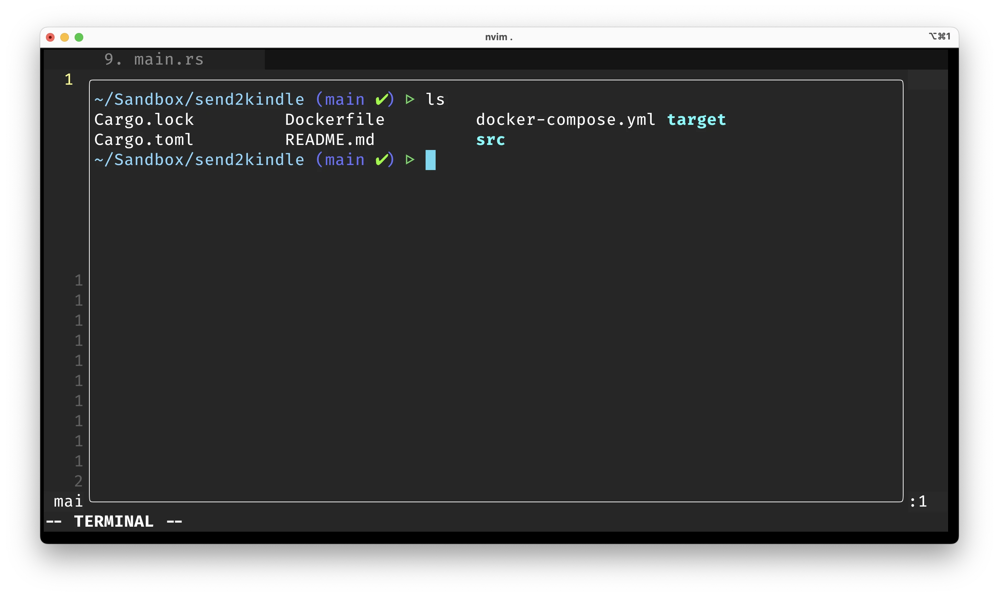

There are various options to choose from when shopping for a good terminal emulator for your Vim/Neovim configuration. I’ve tried a few of these over the last few months with varying results, but recently, I stumbled on a flow that perfectly meets my needs. This article shares some possible setups you can try, with their pros and cons to go in tow. You decide what works best for you!

Before we begin, it’s nice to let you know both Vim and Neovim are identical in the context of this article, so I shall be referring to both tools simply as Vim to keep this articles’ word count to a minimum (yes, I’m a lazy programmer just like you). With that out of the way, let’s dive in.

## Vim Terminal Buffers

You probably didn’t know Vim comes with an integrated terminal that you can open with the `:terminal` or `:ter` (for short) command. They behave like regular Vim buffers and all the usual Vim keybindings work as expected. I’d say the best part is you can immediately pass a command to be executed in the terminal i.e try running `:ter ls -l` (it prints folders in the current directory to a new buffer). This can be extremely useful for running quick tests, or build commands.

Compiling a Rust project within Vim’s terminal with `:ter cargo build --release`

If you do go with this solution, you’ll quickly notice that always having to type the `:terminal` command isn’t exactly elegant, on the contrary, it becomes a pain to work with, particularly when you need several terminals across different windows and split views. The good news is, several plugins exist in the Vim ecosystem to help you efficiently manage complex terminal workflows.

## Using Vim Terminal Plugins

If you prefer using the Vim integrated terminal but want a better experience while managing several terminals, you can choose from a variety of terminal plugins for Vim. They truly take the experience of using the integrated terminal to the next level by adding keyboard shortcuts to toggle the terminal, create multiple terminal instances, vertical/horizontal splits and more.

Personally, I have tried [Toggle Term](https://github.com/akinsho/toggleterm.nvim) and really liked it. I get a terminal whenever I hit the shortcut `Ctrl+\` and I can create more by passing a count. There are other excellent terminal plugins you could also try for yourself, so I’ll leave a link here to a repo where you can find the most popular ones. Here is a [link to the repo](https://github.com/rockerBOO/awesome-neovim#terminal-integration), and each project contains documentation to help you set it up.

A floating terminal with Toggle Term

Using the integrated terminal with a Vim plugin might be a good solution for most people, as it covers 90% of the use cases. But this too has its own limitations. For instance, you lose your terminal sessions when Vim restarts, managing more than 4 terminals becomes a hassle, plugins may sometimes break etc. This is expected because these plugins rely on Vim’s integrated terminal, but If you’re willing to take your game to the next level, then there’s something more you can try.

## A Better Way With Tmux

If you’ve never used Tmux, it’s going to sound crazy when I tell you that your overall CLI experience will be highly augmented just by using it. Tmux is a terminal multiplexer that enables you to run several programs at once. A close analogy to Tmux is the windowing system you’re using right now on your computer. It enables you to run multiple GUI programs at the same time, while enabling you to switch between them and close programs you no longer need. That is what Tmux is, but for the CLI.

Tmux by itself is an awesome program, but forms a dynamic duo when used with Vim. To illustrate, here’s a short screencast showing how Tmux can be used with Vim. As you can see, you not only get several terminal emulators on command, but Tmux can restore all running programs if your computer restarts. How cool is that?



The best part is Tmux is highly intuitive, and you can [learn the basics](https://tmuxcheatsheet.com/) quickly with. You only need a few Tmux plugins ([Tmux Resurrect](https://github.com/tmux-plugins/tmux-resurrect) and [Tmux Continuum](https://github.com/tmux-plugins/tmux-continuum)) and just one Vim plugin ([Auto Session](https://github.com/rmagatti/auto-session)) to replicate my entire setup. But there’s a lot you can automate with a Vim and Tmux setup, and I encourage you to look up more information on the internet. Give Tmux a try, you’ll never look back.

## Conclusion

Awesome, you made it this far. These are a few terminal emulator setups you can try with your Vim/Neovim config. If you’d like to see a detailed walk-through of my Vim setup, let me know in the comments. I usually write on nerdy topics, feel free to [connect on Twitter](https://twitter.com/megaconfidence) for more.

Till next time, see ya!
