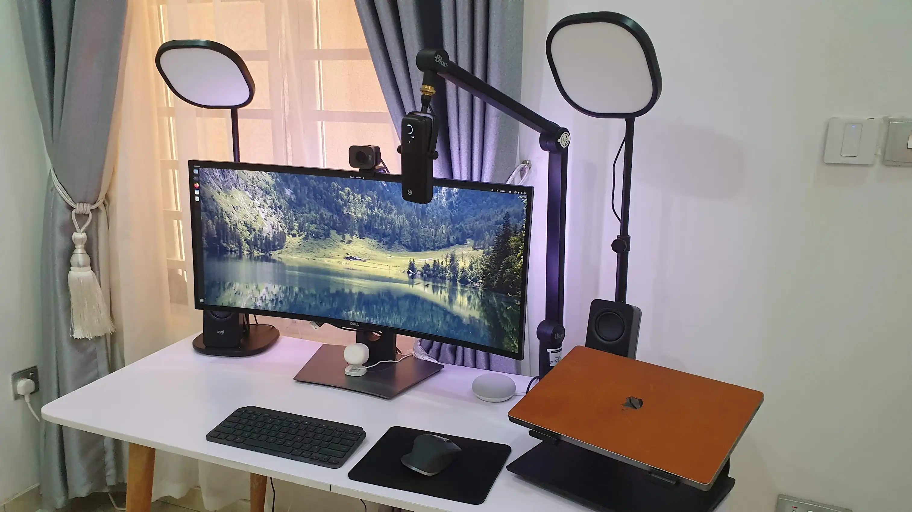

2022 has been a fun year for working remotely, and some of us (me included) finally gave attention to our home office to get work done as efficiently as possible. That said, a few others might still be shopping for some work-from-home gear, and this post should inspire you if you fall into this category.

For some context, I’m a developer and also create video content on YouTube, so my setup is geared toward programming and video production. I previously [shared an article](https://blog.megaconfidence.me/what-software-do-you-use-for-making-programming-youtube-videos) just in case you’re interested in what software I use for making videos.

I’ve kept you waiting long enough. Here’s a quick pic:

Now that that’s out of the way, let’s get into business.



## 🖥️Monitor

Let's kick off with the elephant in the room (or rather on the table). I’m using a 34” Dell U3419W monitor. It’s a curved-ultrawide monitor, and it’s absolutely stunning. It seemed too large when I got it at first, and I felt it was a waste of money, but I was wrong, it turned out to be a really good investment. One of the many good things about this monitor is that it’s [loaded with specs](https://www.displayspecifications.com/en/model/4ad414fb). It also had a built-in thunderbolt dock, so I never spent the extra cash buying a dock for my Mac. The screen real estate of the monitor also became very useful when I started creating YouTube content as it allows me to open up to five windows.

If you don’t use an ultra-wide monitor, I’d encourage you to get one. It will be a valuable investment as you *grow into it*.

## 💻Laptop(s)

I have a personal laptop and a work laptop. My personal laptop is a [6th gen X1 Carbon](https://www.windowscentral.com/lenovo-x1-carbon-2018-review). Owning a Thinkpad has been my dream for a long time because they are feather-light, durable, very powerful, and slick ultrabooks. I was happy when I got this laptop. I run Linux on this bad boy, and fun fact, I uninstalled Windows the same day I got this device, and it felt good. My model is a 16GB RAM variant with a 500GB SSD.

On the other hand, my work laptop is a 16” M1 Pro Mac. I previously used the 2019 Intel-based 16” Mac, and I didn’t like them. They ran hot and got noisy under load. Then M1 happened and made Macs great again. I upgraded, and this turned out to be so much better. I got the 16” because I do a lot of video editing and need something with better airflow than the 14” Mac. Battery life is also good too. My model is a 16GB RAM variant with a 1TB SSD. I have a leather Dbrand skin on it,

## ⌨️Keyboard

Keyboards can be a very controversial topic, so I’ll tread carefully (okay I’ll be honest, I don’t like mechanical keyboards). I use a [Logitech MX Keys Mini](https://www.logitech.com/en-us/products/keyboards/mx-keys-mini.html) keyboard, an upgrade (or perhaps a downgrade?) from the full-size Mx Keys keyboard. I prefer this to its full-size sibling because I don’t use the number keypad, and I like the symmetrical form factor. It’s a backlit keyboard and charges via USB-C. The variant I have can be used with multiple OSes, so be sure to only go for the Mac-specific version if you intend only to use it with Apple devices. This keyboard can be paired with three devices.

## 🖱️Mouse

My mouse of choice is the Logitech MX Master 3 mouse. It has a really good ergonomic design, making it impossible to go back to using a regular mouse once you get used to it. A few other things I like about it are: it has a very precise vertical scroll wheel, a horizontal scroll wheel, lots of navigation and gesture buttons (for Mission Contro/virtual desktop switching, etc), and is highly customizable. It also has a soft-touch material, making it pleasant to use for long periods. Unfortunately, this model is discontinued in favor of a slightly upgraded [MX Master 3S](https://www.logitech.com/en-us/products/mice/mx-master-3s.910-006556.html), but it should still be available on Amazon or eBay if you’re die-hard.

## 📷Webcam

I resisted getting a dedicated webcam for the longest time and always used my laptop's camera for calls and stuff. It worked well for some time, but the quality of a 720p built-in webcam sucks. So I put on my ‘grown-up man’ pants and bought a webcam. I got the [Logitech Streamcam](https://www.logitech.com/en-us/products/webcams/streamcam.960-001286.html) and have been very happy with it. It’s a 1080p camera (unlike most which are 720p) that connects via USB-C and has outstanding image quality. The built-in mic is excellent too. If you’re looking for something more adventurous, check out the [Opal C1](https://opalcamera.com/), it’s a beast!

## 🎙️Microphone

You should skip this if you don’t create video content. While researching what mic to get for making videos, I came across the [Elgato Wave 3](https://www.elgato.com/en/wave-3) mic. It has a solid design (most mics look awful), a built-in pop filter, physical gain control and mute buttons, and a cardioid condenser mic. I have it mounted on a [Blue Compas Mic Arm](https://www.bluemic.com/en-us/products/compass/), which has worked well for me since I got it. The only issue I’ve had with this mic is that it picks up a lot of esses, so that’s something to be wary of.

## 🔦Lights(s)

I have two [Elgato Key Light Air](https://www.elgato.com/en/key-light-air) lights on my desk, and they’ve been amazing. I use them for video recording and sometimes for important Zoom calls that happen to be at night time. They have really good brightness and color controls. They are also energy-efficient lights, and the best part is that you can turn them into smart lamps by hooking them up to a home automation platform, as [I did here](https://youtu.be/rp2P0_kK_ZM?list=PL7hqpH4wyVAa7jiKdIcH-w5h9lRNY-zD2&t=545). They’ve been very good, and I quite like them.

Behind my monitor is a [Yeelight Light Strip](https://yeelight.net.au/products/yeelight-lightstrip-1s-2m) which gives off a nice ambiance glow. It does all the RGB colors and can even do pulsing/breathing animations if you’re into that too. 

## 📢Speaker(s)

I have a smart speaker and a pair of Bluetooth speakers. I use a [Google Nest Mini](https://store.google.com/us/product/google_nest_mini?hl=en-US) smart speaker for checking the weather, reminders, and doorbell notifications. Then I have a pair of Bluetooth speakers hooked up to my monitor’s built-in dock, and they sound amazing. They are a pair of [Logitech Z207 Speakers](https://www.logitech.com/en-us/products/speakers/z207-stereo-speakers-bluetooth.980-001294.html) and look as good as they sound. They can connect up to four devices, three wirelessly, and the fourth through the AUX cable.

## Conclusion

Awesome, this was a quick look at my home office gear, and I hope it gave you some new ideas. By the way, the small white device at the base of my monitor is a presence detector. I use it to automatically turn off devices in my office when I’m away for more than 10 minutes to cut down power consumption.

I’m curious to see your home office setup. Please share a pic in the comments, I’d love to see it!

Till our paths cross again, *adios amigo*.
