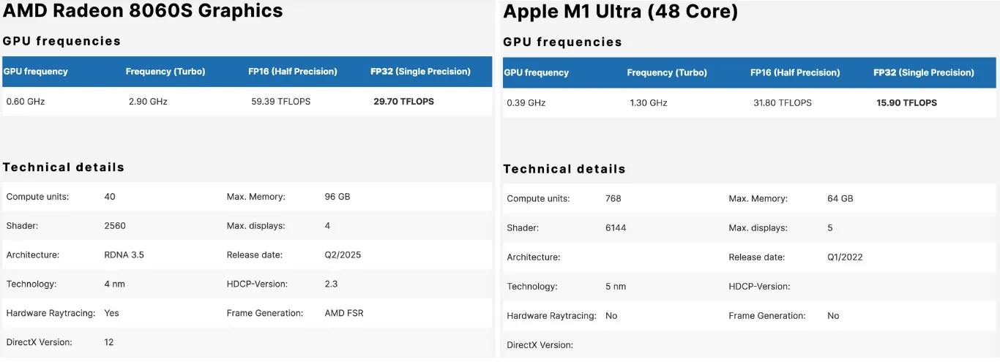
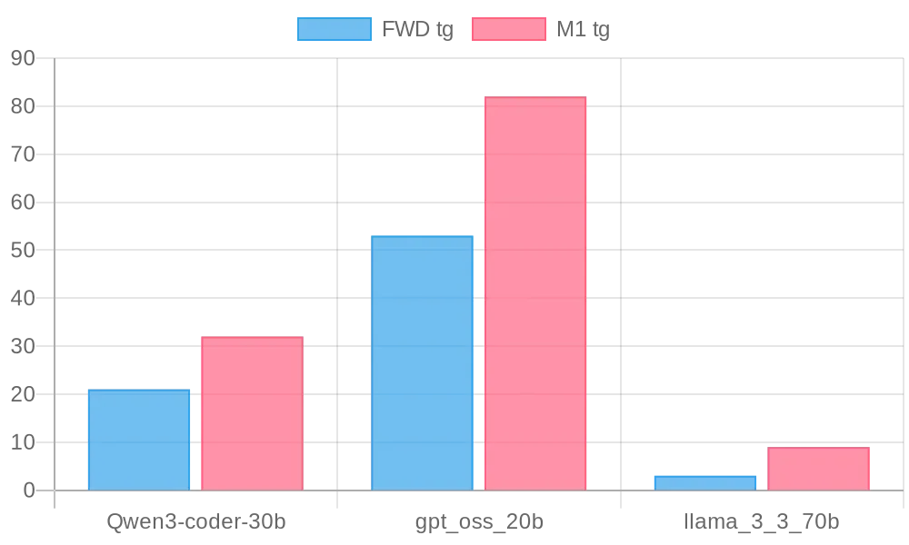
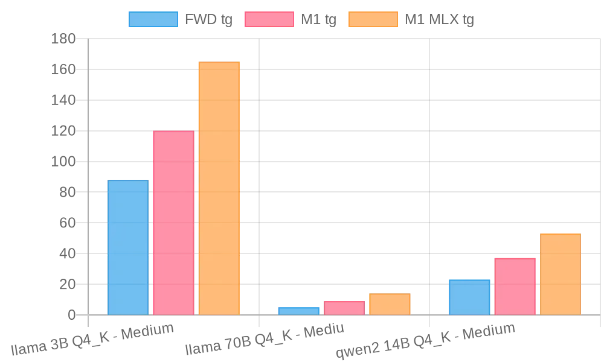

Framework announced the Framework Desktop (FWD) a few months back, and it’s been making waves. It packs 128GB of RAM, which is rare in the PC market, with speeds reaching up to 256GB/s (10x of typical PC RAM speed). This enables the GPU and CPU to utilise a shared memory pool, making it a cost-efficient way to obtain substantial GPU vRAM for AI workloads.

As a quirk of this architecture, the CPU, GPU and memory are unupgradable. It’s a departure from Framework’s mission and the general idea of a desktop computer, but a good trade-off for efficiency and cost-saving gains. For context, an Nvidia Blackwell graphics card with 96GB of vRAM costs over £8,000 (you’ll also need to buy the other components). The FWD is just under £2,500 with a lot more vRAM, albeit a less powerful GPU. Definitely seems like a good deal.

No surprise, I preordered the 128GB spec. They take a while to ship (about three months). Since preordering, others have gotten their hands on the FWD and run AI benchmarks. The results have been good, given its price and its uniqueness in the PC market. But I did some more digging and found out that the M-series Macs may actually be a better value. I know, I don’t like Apple too, but hear me out.

## Framework Desktop vs M1 Ultra Mac Studio

A couple of things stood out during my research: for AI inference, memory is king. Memory (vRAM) is the most important resource, followed by GPU compute. The larger the memory you have, the better. It means you can load and run larger models. Just as important is the speed or bandwidth of the memory. The speed at which data can be accessed from memory affects the performance of AI models. Bandwidth can be a real bottleneck for AI inference and should be taken into account.

I got my hands on a 48-core GPU M1 Ultra Mac Studio (M1) with 128GB RAM. It has a similar memory architecture to the FWD, which means the CPU and GPU can share the same memory pool. So they can both run similarly sized models. But the M1 Ultra is an older 5nm SoC from 2022, and the spec sheet shows that the Radeon 8060S GPU in the FWD is 2x faster. See below:

Source [https://www.cpu-monkey.com](https://www.cpu-monkey.com/)

Since I had access to the M1, I thought it wouldn’t hurt to run some AI benchmarks. At the very least, I expected the M1 to perform between 30-50% worse than the FWD. Jeff Geerling (our tech daddy) did a comprehensive AI inference benchmark on the FWD and published his results on [GitHub](https://github.com/geerlingguy/ollama-benchmark/issues/21#issuecomment-3164568218). So I installed Llama.cpp (llama-bench), downloaded the same models and ran the benchmarks with the same config. The results were shocking:

Benchmark details [here](https://gist.github.com/megaconfidence/4733a0dfe7aa716deeaa15374be8a031#comparison-with-jeff-geerlings-benchmarks). Summary:

| model                   | FWD pp | M1 pp | % diff (pp) | FWD tg | M1 tg | % diff (tg) |
| ----------------------- | ------ | ----- | ----------- | ------ | ----- | ----------- |
| llama 3B Q4_K ‑ Medium  | 1581   | 1652  | **+4.5 %**  | 88     | 121   | **+37.5 %** |
| llama 70B Q4_K ‑ Medium | 34     | 63    | **+85.3 %** | 5      | 9     | **+80.0 %** |
| qwen2 14B Q4_K ‑ Medium | 321    | 391   | **+21.8 %** | 23     | 37    | **+60.9 %** |

The M1 beats the FWD at tokens generated per second (tg i.e the model response speed) and input prompt processing (pp i.e time taken to process the prompt). I did some more digging and found [this other repo](https://github.com/lhl/strix-halo-testing/tree/main/llm-bench) benchmarking the FWD. So I downloaded the same models on the M1 and ran the benchmarks. This repo had several runs for the FWD with various tweaks. So to keep things simple, I’m only using the highest numbers for the FWD from each batch:

Benchmark details [here](https://gist.github.com/megaconfidence/4733a0dfe7aa716deeaa15374be8a031#comparison-with-leonards-benchmarks). Summary:

| model                                | **FWD pp** | **M1 pp** | **% diff (pp)** | **FWD tg** | **M1 tg** | **% diff (tg)** |
| ------------------------------------ | ---------- | --------- | --------------- | ---------- | --------- | --------------- |
| llama 7B Q4_0                        | 1 294      | 886       | **‑31.5 %**     | 52         | 95        | **+82.7 %**     |
| gpt‑oss 120B F16                     | 476        | 748       | **+57.1 %**     | 34         | 59        | **+73.5 %**     |
| llama4 17Bx16E (Scout) Q4_K ‑ Medium | 306        | 275       | **‑10.1 %**     | 19         | 29        | **+52.6 %**     |

Here, we still see the M1 blowing out FWD on token generation. FWD leads in prompt processing here, although not by much. I think it’s because of the llama-bench tweaks used in the repo (they seemed too advanced for me to reproduce on the M1, and I was too lazy to dig further). I wanted to find one last set of benchmark runs to compare the M1 and FWD. Alexander Ziskind has a popular YouTube channel and has also benchmarked the FWD. He uses LM Studio for his setup, so I downloaded it and benchmarked on the M1. Here are the results:

Benchmark details [here](https://gist.github.com/megaconfidence/4733a0dfe7aa716deeaa15374be8a031#comparison-with-alexander-ziskinds-benchmarks). Summary:

| model           | **FWD tg** | **M1 tg** | **% diff (tg)** |
| --------------- | ---------- | --------- | --------------- |
| Qwen3‑coder‑30b | 21         | 32        | **+52.4 %**     |
| gpt_oss_20b     | 53         | 82        | **+54.7 %**     |
| llama_3_3_70b   | 3          | 9         | **+200.0 %**    |

Again, the M1 beats the FWD. It begs the question, why? The FWD’s GPU is 2x faster, so why does the 3-year-old M1 Ultra outperform it at AI inference? It goes back to memory. Although having the same memory capacity, the M1 Ultra has over 3x the memory bandwidth of the FWD at 800 GB/s, while the FWD has 256 GB/s. The FWD has a faster GPU but is bottlenecked by the memory speed, and you can clearly see its impact on the performance.

## Conclusion

You could even squeeze out more performance from the M1 chip by running MLX models. They're specifically optimised for Apple’s hardware and make it go voom. This gives the models an average boost of 40% compared to the (regular) GUFF models.

| model                   | FWD tg | M1 tg | M1 MLX tg | **% diff (M1 vs FWD)** | **% diff (MLX vs FWD)** | **% diff (MLX vs M1)** |
| ----------------------- | ------ | ----- | --------- | ---------------------- | ----------------------- | ---------------------- |
| llama 3B Q4_K ‑ Medium  | 88     | 120   | 165       | **+36.4 %**            | **+87.5 %**             | **+37.5 %**            |
| llama 70B Q4_K ‑ Medium | 5      | 9     | 14        | **+80.0 %**            | **+180.0 %**            | **+55.6 %**            |
| qwen2 14B Q4_K ‑ Medium | 23     | 37    | 53        | **+60.9 %**            | **+130.4 %**            | **+43.2 %**            |

I’m cancelling my FWD preorder because Apple’s hardware with the faster memory is clearly a better value. You could pick up a used M1 Ultra on eBay or Facebook Marketplace for significantly less than the FWD. If you choose to go for the newer M2 Ultra or M3 Ultra chips, then expect much better performance. The Framework Desktop is a cute little mini-PC with respectable performance and value. But if AI inference is all you care about, M-series Macs are a better value.

I’m Confidence. I write about tech, so follow me on [Twitter](https://x.com/megaconfidence) or [LinkedIn](https://www.linkedin.com/in/megaconfidence/) to stay updated. See you next time.
