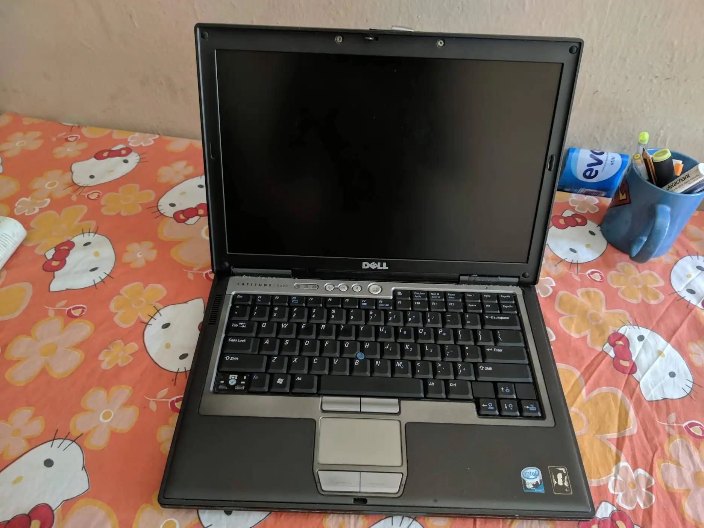
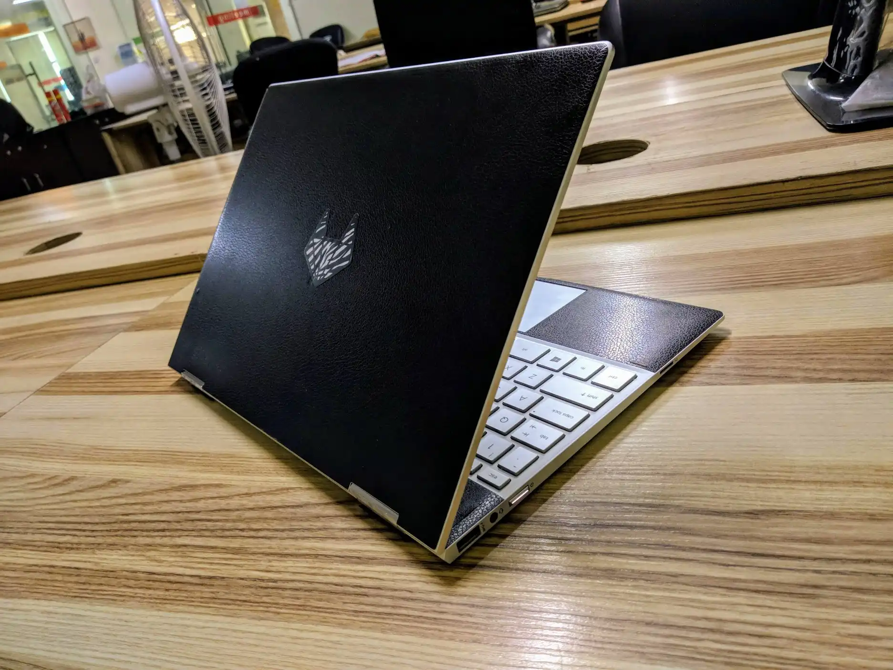
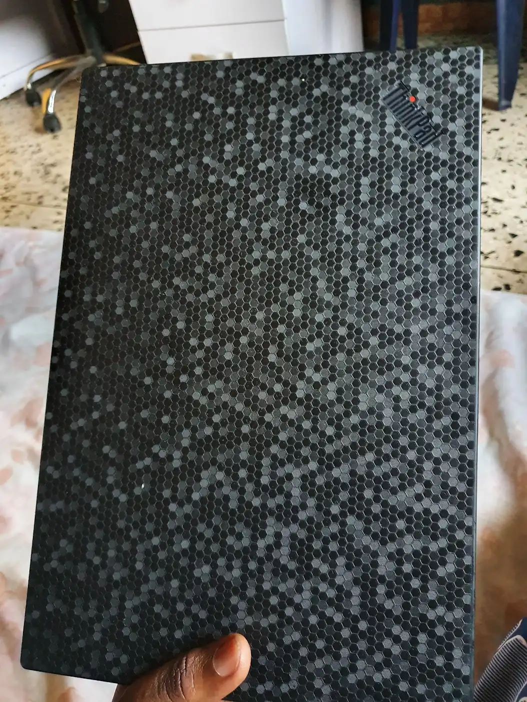
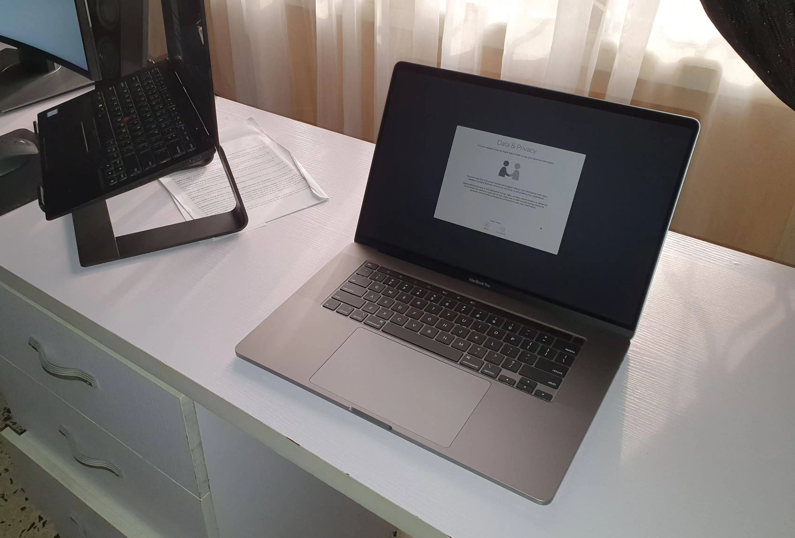
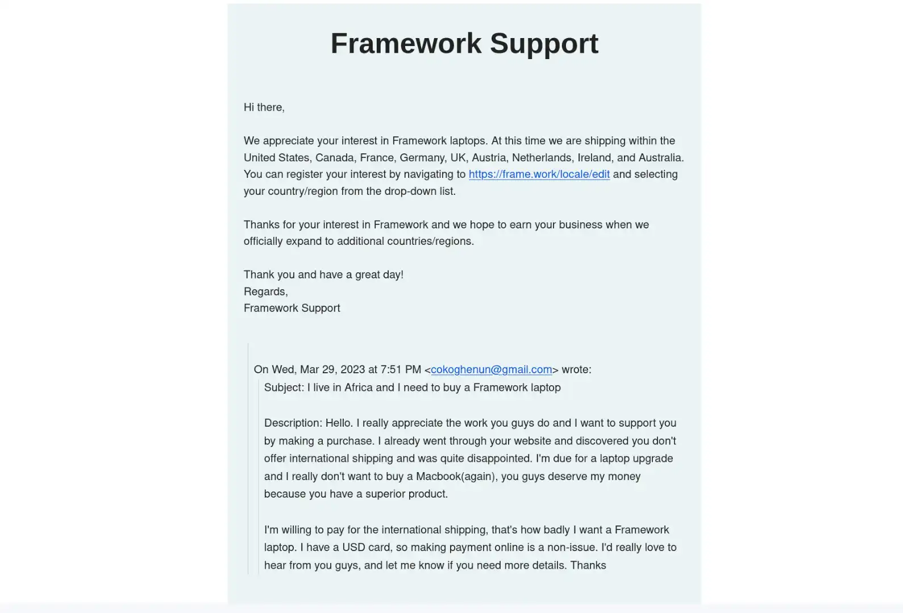
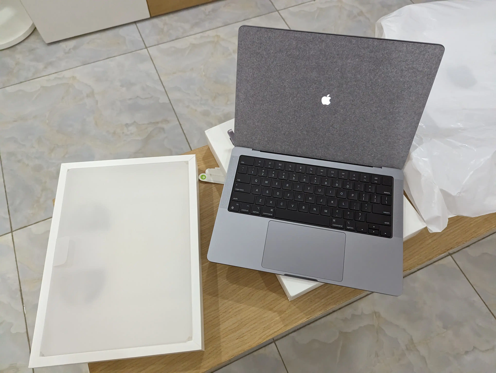

My first experience with a Mac was the stuff of nightmares. It was so bad, I swore to never buy a Mac. I got a 16” 2019 MacBook Pro from the office, and it was the worst laptop money can buy. It ran hot, the fan noise got really loud (to the point other people could hear it on a Zoom call), it was heavy, sluggish and macOS was just - macOS. Fast-forward to today, I can tell you I feel positive about buying a Mac for personal use. So what changed? Let me explain.

## My History With Computers

Like most people, the first PC I used had an Intel processor, a Core 2 Duo processor to be precise, and I quite liked the laptop. It was a Dell Latitude D630 and was gifted to me (after being thoroughly used) by a relative. One of the first things I did was install Linux, which made the laptop noticeably faster than on Windows. It was a wonderful first Laptop experience and I miss the little guy.

After using this Laptop, I got more powerful ones with faster processors and more RAM/storage configuration. If I recall correctly, the next laptop I picked up was a Lenovo IdeaPad 110 with a 4th gen Intel Celeron processor and a whopping 4GB RAM. It was also a big boy laptop, with a 15” screen and a battery life to match. I ran Linux on this computer and started my programming career on this laptop. 

Then I got a Chromebook, a Lenovo IdeaPad Flex 3, and it was a disaster. It had an excellent battery life and performance, but I couldn’t get the apps I needed because it had an ARM processor. Sure, I knew it ran Chrome OS before buying, so I planned to run Linux on it. That didn’t turn out well, because the bootloader was locked, so I couldn’t get Linux installed like on a regular PC. Thankfully, [methods](https://github.com/dnschneid/crouton) existed to virtualize Linux. The worst part about it was at the time, many Linux apps weren’t compiled for ARM processors, so after going through the huddle of getting Linux to run, you couldn’t run any apps because they weren’t just available. Sure, I could have compiled from source, but younger me just didn’t know that was a thing. It was a solid laptop with a nice 360 touch screen, but the lack of software support for ARM at the time made it a bad buy.

After a while, I got my first flagship laptop, an HP Spectre X360 13 (2018). It was sleek, it could do the whole 360 shenanigans (which I only used once), and had a way powerful processor and a killer SSD storage. Although it was an aluminum body laptop, the build quality was subpar. There were a lot of flex and creeks when using the laptop, and I learned the hard way that HP has poor quality control. The laptop was also plagued with various perceptible miss alignments. I loved the flagship performance, but wasn’t happy using the laptop. I don’t think I’ll ever buy an HP laptop if they can’t guarantee product quality on their flagship devices.

Then I got my dream laptop, a Lenovo  X1 Carbon (6th gen) ThinkPad, and It excelled at everything the HP Specter failed at. It had an excellent build quality and no hardware flaws whatsoever. It was a bigger device at 14” but turned out to be much lighter than the HP Specter. It also had a QHD screen and I loved (and sometimes halted, hello fractional scaling). I still daily this laptop, in fact, I’m typing up this post on it legendary keyboard. I honestly have nothing bad to say about this Laptop, except for the fact that it’s processor is starting to age. Oh, I got this cool Dbrand skin for it:

Now let’s get back to the story.

## I Hated Macs

About two years ago, I got sent a Mac from the office. It was a 16” 2019 MacBook, and it felt like a premium device (it’s only redeeming quality). As you already deduced from my history with computers, I’ve never owned an Apple product, and this was a first-hand opportunity to form my opinions about the company. So the Mac came in and was well-built like my ThinkPad. Build quality check! But it felt 5X heavier because it was a slightly larger device with an aluminum build, but I convinced myself I could forgive the weight if using the Mac turned out to be a better overall experience. It didn’t.

macOS for the most part is similar to the Linux desktop environment I used on the ThinkPad, so I didn’t relearn much. Installing and updating packages on the Mac was a pain because macOS doesn’t have a package manager. On Linux, I could perform app updates and even OS upgrades with a single command, but on macOS, you had to open apps individually and perform manual upgrades. Thankfully, software wasn’t a huge dealbreaker because use open-source apps, which were available in some form on macOS.

Like I said, software wasn’t the main issue because Linux and Unix are quite similar, but the problem was the hardware. Compared to my ThinkPad, It had an arguably better hardware on paper, spotting a 6 core Intel processor, with an AMD Radeon GPU. But in reality, the performance was way worse than my ThinkPad. It got really hot while doing simple tasks like web browsing or a Zoom call. The fan noise was annoying. All round performance was way below my expectations because this was a machine that costs twice as much as my ThinkPad and managed to perform worse than it. After having using this Mac, I couldn’t understand why people paid top dollar for it when cheaper and better products existed.  Of course, people are free to do whatever they want with their money, so for my part, I concluded never buy a Mac.

## Then Came The M1

I saw the announcement of the M1 family of processors, and like you, I couldn’t believe my eye. The benchmarks were amazing, and Apple had performed a small miracle, because just like that, they seemed to have fixed the most annoying issue I had with the Macs. But they weren’t out of the woods yet because their revolutional processor was an ARM based CPU. Don’t forget, I previously used an ARM based device (the Chromebook) and it turned out to be a nightmare because devs weren’t just building for ARM. So I waited to play it safe, and see how the events turned out.

Spoiler alert, the transition to Apple’s ARM CPUs went better than I expected. Sometimes, people criticize Apple because they have a monopoly over their ecosystem, and I do too, but it’s also one of the reasons I respect them. In less than a year, many apps ran smoothly on M1, and Apple (through some dark magic) was able to coerce developers into rebuilding their already functional apps (which worked just fine on Intel) for the new M1 chip. No other company could pull this off, Microsoft and Google have tried and failed in the past. Also, Apple created Rosetta, an emulation layer to run apps built for x86 on M1, such that they could continue to work on macOS even if the developers were unwilling to rebuild for ARM. As it turns out, older apps running through this emulation layer happened to run faster on M1 compared to their native x86 environment. That was crazy!

But again, these were all stories flying around the internet. It was time to see if the M1 could hold up, so I got an upgrade from the office to a 16” M1 pro MacBook. Although sill being very heavy, I can say it’s the best productivity computer I’ve ever used. Nothing compares when it comes to performance, and the battery life is out of this world. I haven’t heard the fan of the device kick-in since I got it, even when under load. It was a truly magical experience, and I was shocked at how quickly my contempt for Apple disappeared.

## I Needed A Laptop Upgrade

At this point, my ThinkPad (aka the perfect laptop), was growing old and slow. I’ve been dailying this device for over two years, and that’s such a long time if you’re in tech. So I started researching what device to upgrade to. Mind you, I still wanted to run Linux on a fairly open hardware, so I kinda leaned toward Linux PC manufactures, but every google search landed me on an M2 Mac from Apple. Was God trying to tell me something?

Then I came across the Framework laptop (again). Framework is popular for making modular laptops, and that’s something you don’t see these days. It gets even better, the icing on the cake is they now have AMD options, which means better performance and battery life compared to an Intel CPU. This wasn’t my first time hearing about Framework, but I got particularly interested because they offer upgradable CPUs. This means you can swap out your old CPU for a newer one without buying a new Laptop, and the best part is, you can use your old CPU as a desktop computer. I was completely sold!



Framework doesn’t ship to Africa, so I reached out to them via email and offered to make extra payment for international shipping. They turned me down, as you can tell from the email thread. So I said screw it, I’ll buy a Mac.

## Conclusion: The M2 Mac Came To Me

I got pissed off by Framework’s response (coupled with the fact that PC manufactures weren’t just making products that could compete with Apple’s devices), and decided to buy a Mac. I know, right, how quickly humans change their mind. A few months ago I swore to never buy a Mac, and here I am doing the complete opposite. I ended up getting the 14” M2 pro MacBook, and it’s a cute computer compared to its chunky 16” brethren. Also, it has Wifi 6E baked in, which I desperately need to take advantage of [my superfast home network](https://confidence.sh/blog/project-gigabit-benchmarks-and-lessons-learned/).

So there you have it, that’s how I went from being an Apple hatter to using their product, and surprisingly loving it. In my opinion, they have the best laptop hardware right now, and we’re yet to see how other manufactures respond. Regarding software, macOS is full of its quirks, but it can be overlooked considering how much performance and battery life you can squeeze out of these devices. 


 💡 Fun fact, this article was actually completed on the Mac


In the end, I got initiated into the cult of Mac. I hope to get out soon, but I’ll enjoy it while it lasts.
