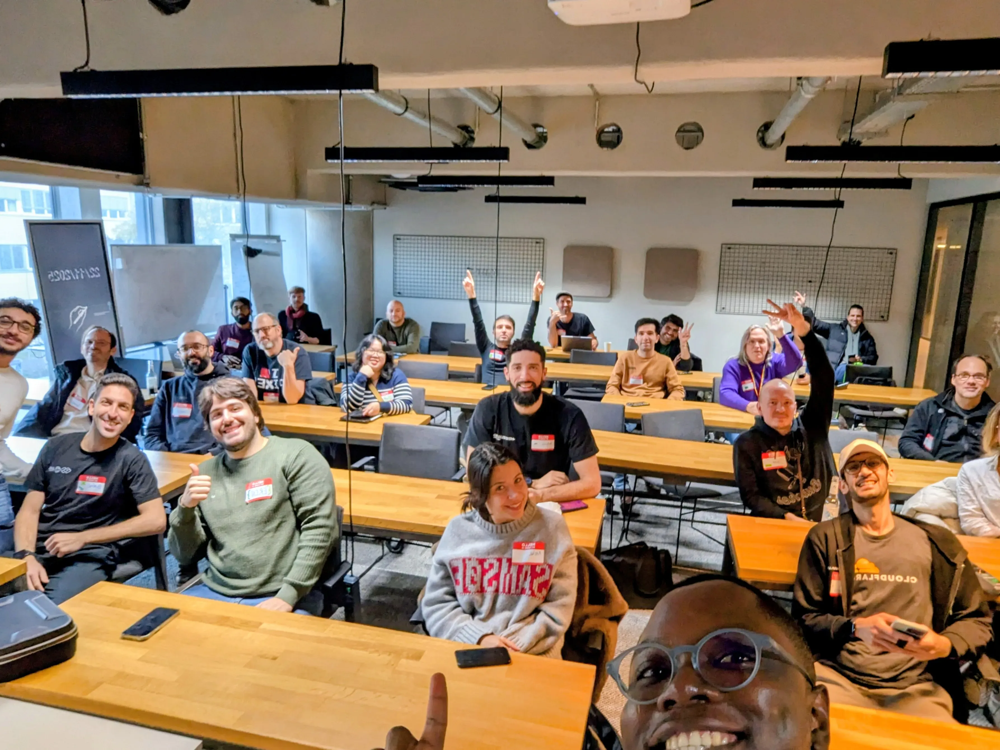

It's Google Devfest season for 2025 and I got the chance to give this talk
across two Devfest cities in Europe; Birmingham and Berlin, on the same weekend.
It was an epic marathon.

Here's my deck:


🔗 Link to presentation


Recording of the talk:



Here are some jpgs ...from my talk in Birmingham 🇬🇧

...and Berlin 🇩🇪

