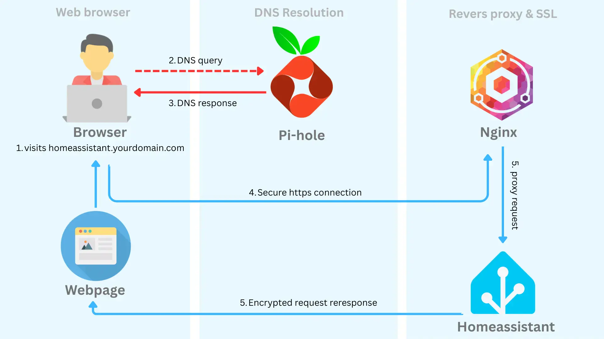
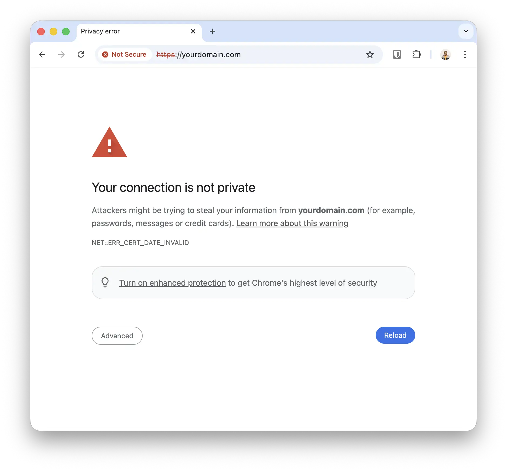
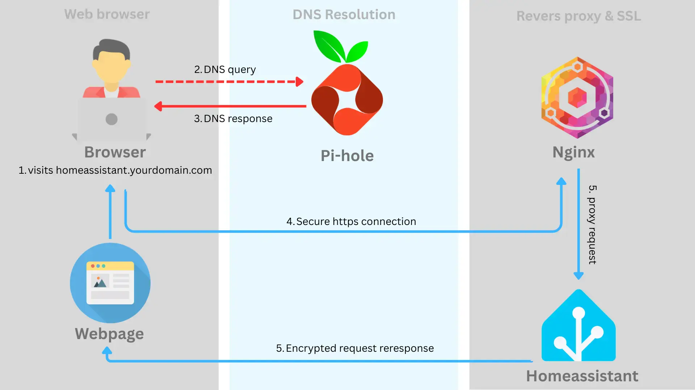
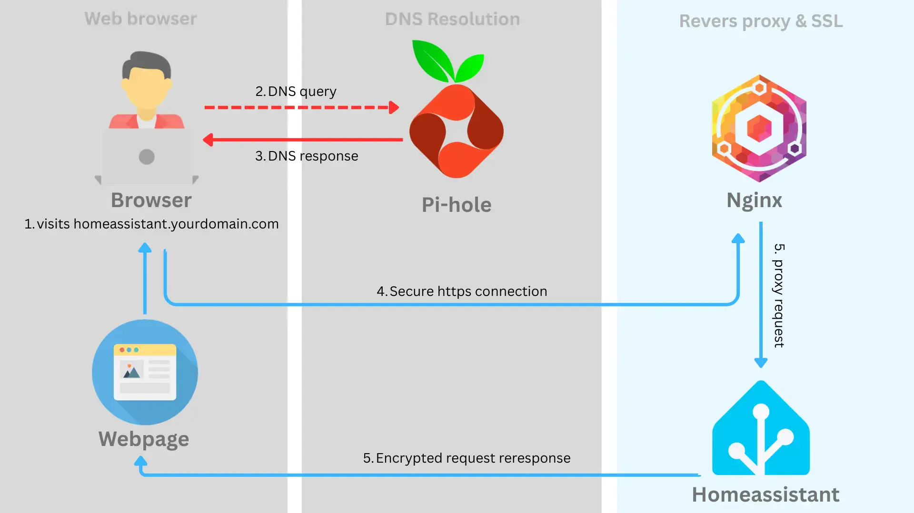
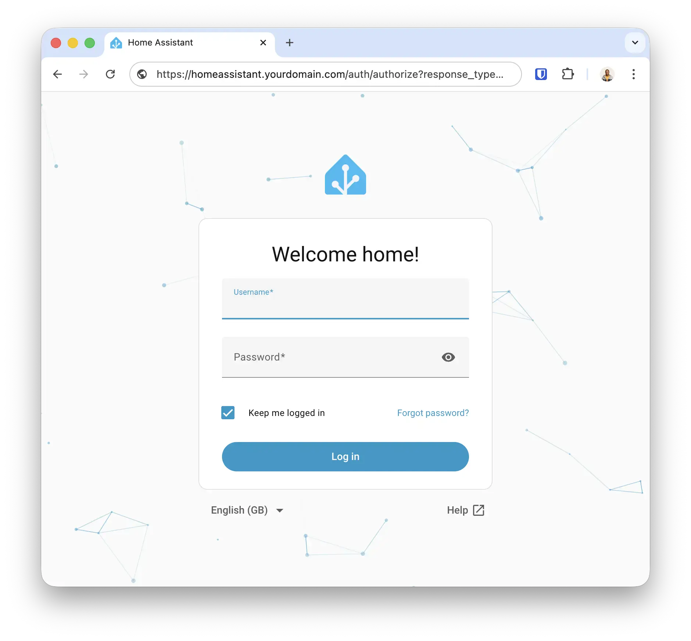

---

title: "How To Create A Custom Local Domain With SSL"
pubDate: 2026-03-20
description: "Stop using accessing local services with IP address and port
number"
tags: ["homelab", "networking"]
heroImage: "./feature.webp"
---

> This article was handwritten and not AI generated

I run a homelab, and each time I show it off, I always get asked how I set up my local domain. I haven’t really given good answers in the past, as it’s quite complicated (you’ll see shortly). So I’m fixing it today with this detailed article. This is the ultimate guide to creating a local domain for your homelab.



To follow along, you’ll need basic Docker familiarity. Anyway, I assume you already know that stuff if you’re reading this article. Also, you’ll need about $15 to buy a custom domain name. This is optional, but I strongly recommend it. I’ll explain why later on. Completing all the steps should take about 1 hour, so get yourself a nice drink and settle in. Now, let’s start with step one.

## Buy a domain name for HTTPS/SSL (optional)

This is the first step. You’ll need to buy a domain name, which may cost about $15. This is optional, but I highly recommend it. The reason is that you don’t want to have HTTP warnings in the browser after completing the setup. Also, this will break services using browser APIs that rely on SSL. These APIs include Web Crypto, Bluetooth, USB, Geolocation, etc.



With a custom domain, you could also have a really nice double DNS setup. A single domain resolves differently depending on the network you’re on i.e homeassistant.yourdomain.com resolves to a local IP while on your home wifi. On a public network, it resolves to a public IP (i.e homeassistant exposed publicly via a Cloudflare tunnel). This way, you’ll have super-fast local traffic routing when at home. And when not home, you'll have the convenience of accessing your service via the same domain. This is an advanced setup, and I plan to cover it in a future article. Let me know in the comments if you’d like to see an article.

I’ll recommend buying a custom [domain from Cloudflare](https://domains.cloudflare.com/). I’m biased. Also, you won’t need to change your nameservers to Cloudflare, as we’ll use Cloudflare for the DNS-01 challenge later on. You could check out https://www.dynadot.com for slightly cheaper domains, but you’ll need to [set up Cloudflare to resolve your domain](https://developers.cloudflare.com/dns/zone-setups/full-setup/setup/). Now let’s move on to the next step.

## Set up Pi-hole as a DNS server



Step two is installing Pi-hole. Pi-hole does a lot, including network-wide ad blocking and acting as a NTP or DHCP server. For this setup, we’ll use it as a DNS server. This means Pi-hole will resolve DNS queries for your local services i.e homeassistant.yourdomain.com, to the IP address of the machine homeassistant is running on, say 192.168.1.20. Let’s walk through the setup.

Create a folder for Pi-hole and write the following docker-compose file. Then run the service with `docker compose up -d`. Notice the password to access the admin dashboard on http://yourip:82/admin/login is `password`.

```yaml
# pihole/docker-compose.yml

services:
  pihole:
    container_name: pihole
    image: pihole/pihole:latest
    ports:
      - 53:53/tcp
      - 53:53/udp
      - 82:80/tcp
    environment:
      TZ: "Europe/London"
      FTLCONF_webserver_api_password: "password"
    volumes:
      - "./etc-pihole:/etc/pihole"
      - "./etc-dnsmasq.d:/etc/dnsmasq.d"
    restart: unless-stopped
```

In the admin dashboard, go to Settings> DNS > Upstream DNS Servers. I prefer to use Cloudflare, but use whatever DNS servers you like. Select your preferred provider and save. Then go to Settings > System > Enable Expert Mode (top-right corner). Then go to Settings > All Settings > Miscellaneous > misc.etc_dnsmasq_d > click enable and save.

Now we’ll set up a wildcard DNS record to resolve any subdomain i.e \*.yourdomain.com, to the IP address of the machine where [Nginx Proxy Manager](https://nginxproxymanager.com/) (NPM) is running. Don’t worry, I’ll show you how to set up NPM soon. Go back to Pi-hole’s docker-compose directory and create a new file in ``etc-dnsmasq.d/99-myserver.com.conf` with the following content:

> Update the domain to your actual domain. Also, update the IP address to of the machine you’ll run NPM on.

```
server=/yourdomain.com/#
address=/.yourdomain.com/192.168.1.2
```

Restart Pi-hole i.e `docker compose down` and `docker compose up -d`. Now Pi-hole will always resolve yourdomain.com and any subdomain \*.yourdomain.com to the IP address of NPM. We’ll set up NPM as a reverse proxy soon. That’s all we need to configure on Pi-hole. Next, we need to tell your local router to use Pi-hole as its DNS server.

## Configure your router to use Pi-hole as a DNS server

This is the third step. When you visit a domain i.e google.com, your router queries a DNS server to resolve the IP of google.com, then it sends network traffic to that IP. We’ve set up Pi-hole as a local DNS server, so we need to tell your router to use it. This is great because Pi-hole can resolve local domains i.e yourdomain.com, and even upstream ones like google.com.

It’s hard to give exact guidance here because every router is different. But I’ll provide general steps you could follow to set this up on your router. Log in to the admin panel of your router (most are hosted on a default 192.168.1.1 or 192.168.0.1 IP), find the `network settings` and then find `DNS servers`. Set the first DNS server address to the IP of your Pi-hole machine i.e 192.168.1.2, and the second DNS server address to an upstream service so you don’t lose internet connectivity if Pi-hole goes down. I’ve set mine to Cloudflare’s DNS server 1.1.1.1. Save and reboot your router.

Now, when you visit any website via a domain name i.e google.com, your router uses Pi-hole to resolve the domain to a public IP (while blocking ads on the website). When you visit a local domain i.e yourdomain.com, Pi-hole resolves it to a local IP i.e NPM’s IP. That’s great, now let’s go set up NPM.

## Configure a proxy server



This is the fourth step. You’ll need to set up a proxy server to receive your service request at homeassistant.yourdomain.com and proxy it to the local IP and port the service is running. The proxy server also needs to serve the SSL certificates for yourdomain.com to prevent HTTP warnings. We’ll use [Nginx Proxy Manager](https://nginxproxymanager.com/) (NPM) for this.

In your server, create a folder for NPM i.e `nginx/docker-compose.yml` and put the following content. Then run the container with `docker compose up -d`:

```yaml
# nginx/docker-compose.yml

services:
  app:
    container_name: nginx-proxy-manager
    image: "jc21/nginx-proxy-manager:latest"
    restart: unless-stopped
    ports:
      - "80:80"
      - "81:81"
      - "443:443"
    volumes:
      - ./data:/data
      - ./letsencrypt:/etc/letsencrypt
```

Open up the admin dashboard at http://yourip:81 and create a new admin user. The default username and password are `admin@example.com` and `changeme`.

On the dashboard, go to Certificates > Add Certificate > Let’s Encrypt via DNS. Then add your domain, and its wildcard subdomain (i.e yourdomain.com and \*.yourdomain.com). Set the DNS Provider to Cloudflare. Then head over to your Cloudflare dashboard and [create an API token with the Edit Zone DNS template](https://developers.cloudflare.com/fundamentals/api/get-started/create-token/). Under `Zone Resources`, select the specific domain you’d like to use. Then paste the generated API token back into NPM’s `Credentials File Content`. Then click save. This will then use [DNS-01 challenge](https://letsencrypt.org/docs/challenge-types/#dns-01-challenge) to verify you own the domain and generate SSL certificates.

The final step is creating a proxy host entry to your local service i.e homeassistant. On NPM, go to Hosts > Proxy Hosts > Add Proxy Host. Type in the full domain you’d like to use i.e homeassistant.yourdomain.com, set the local scheme (usually just HTTP), IP and port. Then enable Websockets Support. In the SSL tab, select the SSL certificate generated earlier, and enable Force SSL and HTTP/2 support. Click save.

Now you could visit homeassistant.yourdomain.com in your browser. This is all resolved locally with HTTPS enabled. Sweet!



Now you can create more subdomains for as many services as you like by creating proxy hosts.

## Conclusion

Woohoo! I feel so good that this article is finally out. Yeah, so that’s how to create a local domain for your homelab, and I hope you found this article helpful. Leave a like below to let me know. I plan to write a follow-up guide on the double DNS setup, so you could use the same domain name to access your services either from a public or private network.

I post a lot about tech and random things I find interesting on [Twitter](https://x.com/megaconfidence) and [LinkedIn](https://www.linkedin.com/in/megaconfidence/), so follow me to stay updated. Until next time, Jaane.

