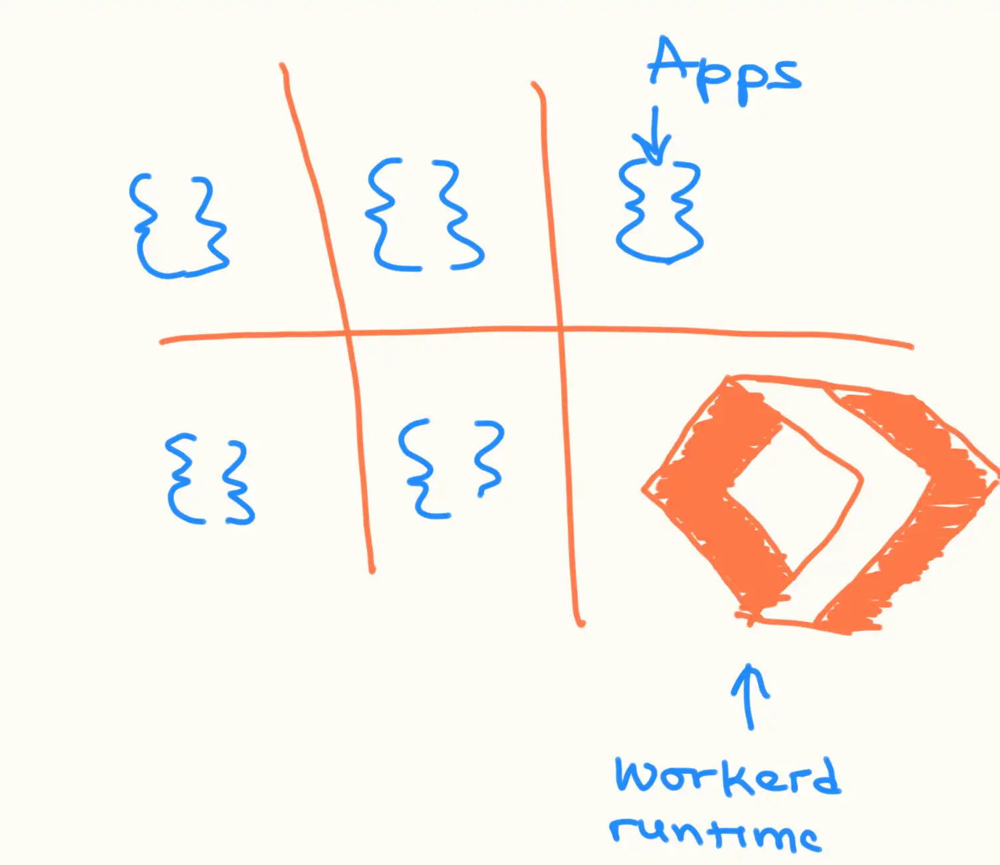
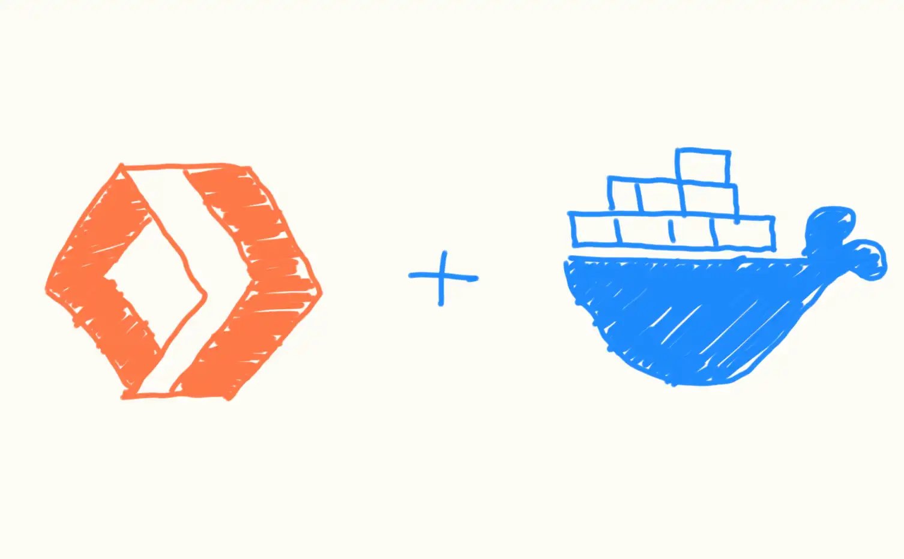

Cloudflare offers several products for developers to build modern apps on the edge. Some of my favourites include Pages (an alternative to Netlify—this blog is hosted on Pages), Workers (an alternative to AWS Lamda), KV (an alternative to Redis), and R2 (an alternative to S3). There are many other interesting technologies, and I’m sure you have your picks.

Developers I've interacted with love these products. It's no surprise I keep getting the question ‘how do I host product X or Y on my server?’. I am sharing this article to answer the question and show you how to host Cloudflare’s stack on your infrastructure.

## Workerd Runtime

[Workerd](https://github.com/cloudflare/workerd) is a JavaScript & WebAssembly-based runtime that powers Cloudflare Workers and other related technologies. You can think of it like the Node.js runtime used to execute JavaScript files. [Workerd has its differences from Node.js](https://blog.cloudflare.com/workerd-open-source-workers-runtime/), however, you can self-host it on any machine.



The rest of this article focuses on containerizing Workerd with Docker. Then I’ll show you how to run a hello-world app in a Workerd container.

## Containerizing Workerd

You’ll need Docker installed to follow the steps required to containerize Workerd. If you don’t already have docker installed, you can find [a guide to do so here](https://docs.docker.com/engine/install/). You’ll also need [Node.js](https://volta.sh/) installed to run the [CLI tools](https://docs-workerd.cloudflare-docs-7ou.pages.dev/workers/wrangler/install-and-update/) we’ll use to compile the hello-world app later on.



To build a container image for Workerd, we a Dockerfile with the image's recipe. The image includes the latest Workerd binary and glibc (C standard library). Here’s a Dockerfile that builds the specified image:

```docker
#build image
FROM ubuntu:latest AS builder

ARG TARGETARCH

WORKDIR /workdir

RUN apt-get update && apt-get install -y curl

#downloads latest workerd release
RUN curl -LO \
    $(curl -s https://api.github.com/repos/cloudflare/workerd/releases/latest \
    | grep -wo "https.*linux-$([ $TARGETARCH = "arm64" ] && echo "arm64" || echo "64").gz")

RUN ls -la && gunzip workerd*.gz && mv workerd* workerd && chmod +x workerd

#copies runtime libraries
RUN mkdir lib && \
    cp /lib/*-linux-gnu/libdl.so.2 lib/libdl.so.2 && \
    cp /lib/*-linux-gnu/librt.so.1 lib/librt.so.1

#container image
FROM busybox:glibc

COPY --from=builder /workdir/workerd /usr/bin/workerd
COPY --from=builder /workdir/lib /usr/lib

WORKDIR /worker

ENTRYPOINT [ "workerd" ]
```

You’ll note from the Dockerfile that the path `/worker` is the directory where compiled apps can be served. This is where we’ll put the hello-world (more on this later).

To build the image, run the following command in the Dockerfile directory:

```bash
docker build . -t workerd
```

If the build was successful, a quick `docker image ls` shows a new image named `workerd` is created:

```bash
$ docker image ls

REPOSITORY               TAG       IMAGE ID       CREATED      SIZE
workerd                  latest    154e4613e479   1 hour ago   140MB
```

With the image created, you can run local containers and [publish the image to Docker hub](https://docs.docker.com/guides/workshop/04_sharing_app/) if you’d like.

## Run A Hello-World Container


Let’s make a hello-world app to test the image we’ve built. To bootstrap a hello-world app With [Wrangler](https://docs-workerd.cloudflare-docs-7ou.pages.dev/workers/wrangler/install-and-update/), run the following command:

```bash
npm create cloudflare@latest hello-world -- --type=hello-world --ts=false --git=false --deploy=false
```

Then `cd` into the project directory i.e `hello-world` and run this command to compile the app:

```bash
npx wrangler deploy --dry-run --outdir .wrangler/dist
```

The compiled app is emitted to `.wrangler/dist/index.js`. Now we can create a Workerd container to run the JavaScript code.

But before that, we need to configure how we want Workerd to run. That’s done with a capnp configuration file. Some options include the JS bundle path, the transport protocol, the port to run the service etc.

Create a `config.capnp` file in the hello-world directory with the following contents:

```bash
using Workerd = import "/workerd/workerd.capnp";

const config :Workerd.Config = (
    services = [
        (name = "main", worker = .worker),
    ],
    sockets = [
        (service = "main", name = "http", address = "*:8080", http = ()),
    ]
);

const worker :Workerd.Worker = (
    modules = [
        (name = "worker", esModule = embed ".wrangler/dist/index.js"),
    ],
    compatibilityDate = "2024-02-19",
);
```

Then run this command in the same directory to serve the hello-world app in a Workerd container:

```bash
docker run -d --rm -v $(pwd):/worker -p 8080:8080 workerd serve config.capnp
```

You can view the app in your browser by visiting [http://localhost:8080/](http://localhost:8080/).


## Conclusion

That’s how easy it is to self-host the Cloudflare stack on your own servers. Feel free to use this guide as a base to build your own custom Workerd image. If you’d love to stay up to date with the latest trends in serverless, let’s connect over on [Linkedin](https://www.linkedin.com/in/megaconfidence/) and [Twitter](https://x.com/megaconfidence).

Until we meet again on the internet, bye!
