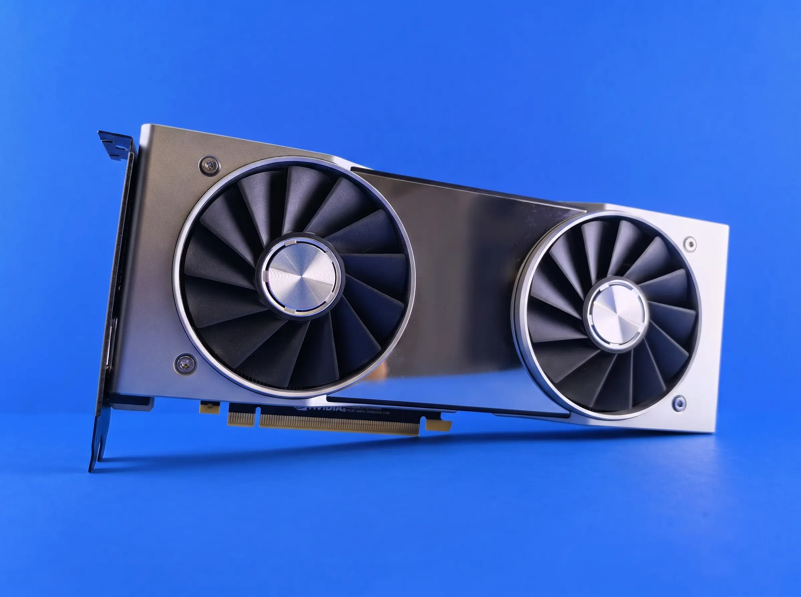
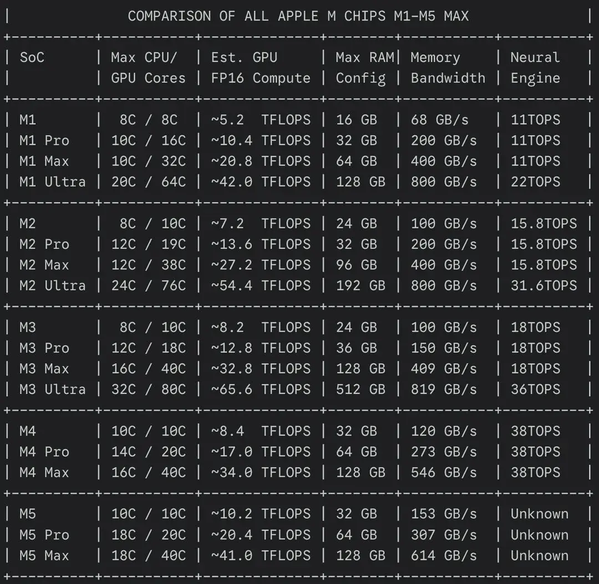
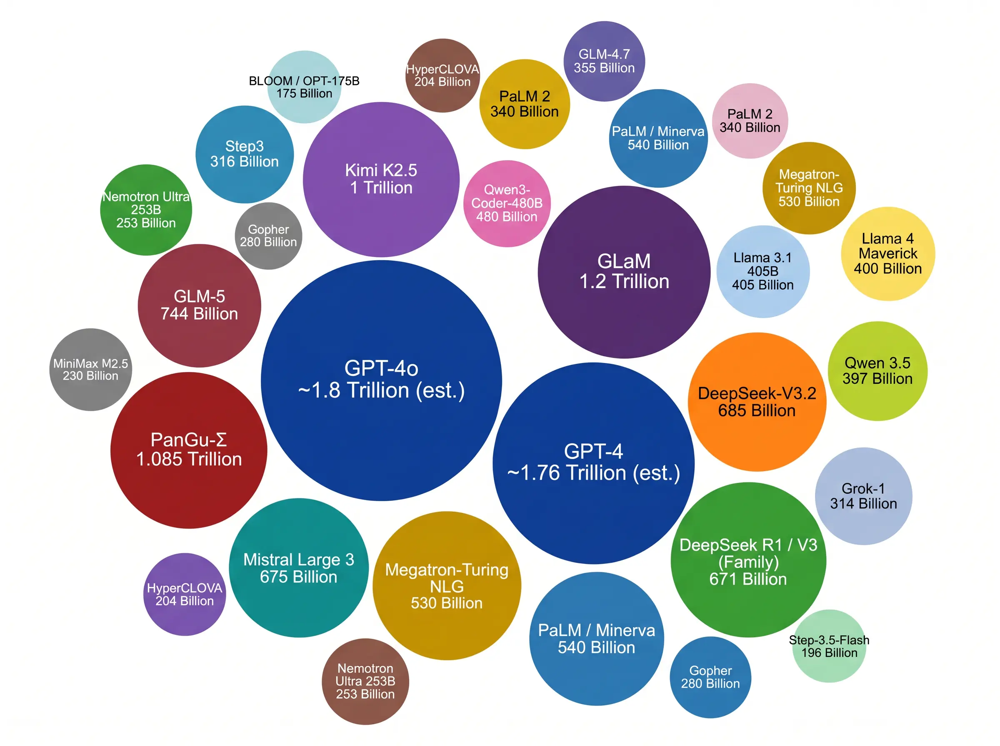
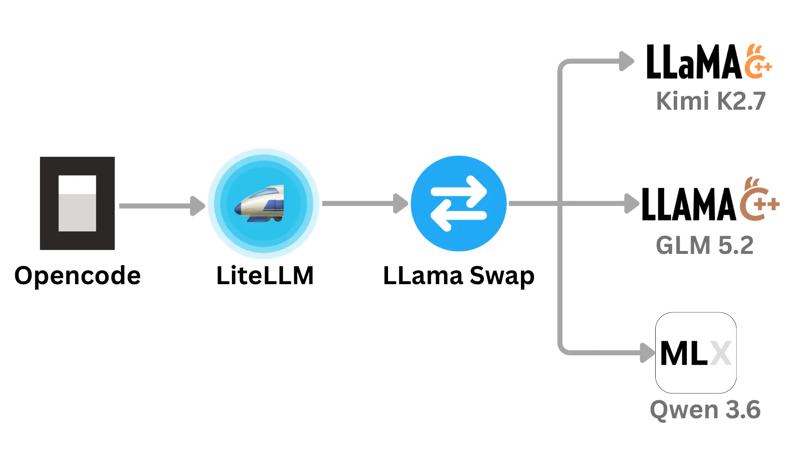

Running local LLMs has never been more exciting. The new open weight models are totally crushing it and giving proprietary LLMs a run for their money. Across the board, the new models are smaller, smarter and faster. And not just that, they’re also completely private. Your data doesn’t leave your hardware to be used for AI training or ads.

That said, figuring out how to locally host your inference stack could be confusing. There are a myriad hardware options to choose from Nvidia, AMD, Apple, etc. Then you’ll have to pick what inference backend to run. Then choose the right quantization level for the model you’d like to use, etc. There’s a lot to think about and I wanted to share some guidance on the topic through this article. Let’s dive head first.

## Choosing the right GPU

You’ll need a good GPU to run your model, and thankfully there are a number of options to choose from. The popular ones are made by Nvidia, AMD and Apple. Intel has some good GPUs too. More recently, a few new players have popped up in the space with some really interesting hardware. [Taalas](https://taalas.com/) builds GPUs with the models ‘burned’ into the hardware. As a result, models run at insanely high speed reaching [over 17k tokens/s](https://chatjimmy.ai/). Then there’s [Tiiny](https://tiiny.ai/), making portable AI accelerators you could connect to your existing computer.

There are lots of options but GPUs aren’t cheap, so how do you pick the right one? Look for these three things: large vRAM, high memory bandwidth, and raw GPU compute. Those are the most important things to look for. Large vRAM means you can fit larger models and longer context windows. GPU memory bandwidth is also really important because it dictates the LLM’s token generation speed. Given two GPUs with the same vRAM size, always go with the [one with a higher memory bandwidth](https://confidence.sh/blog/why-im-cancelling-my-framework-desktop-preorder/). Finally, raw compute influences the prompt processing speeds of the LLM. This is really important for agent workflows, i.e. coding agents where the model needs to process 1000s of files in a codebase to generate its output.

So what GPU will I recommend? I wouldn’t recommend getting a discrete GPU — while they tend to have the best performance, they are super expensive and consume lots of power. The cutting-edge GPUs like Taalas and Tiiny are, well, too cutting-edge. They have some serious limitations. The best balance of price to performance is Apple's M series Ultra chips. The M3 Ultra goes up to 500GB vRAM at 800GB/s speed and 65 TFLOPS of compute. Best part is you could get a really good deal buying used.

credits: [https://www.reddit.com/user/1ordlugo/](https://www.reddit.com/user/1ordlugo/)

## Choosing the right inference backend

The next thing you’d have to figure out is what inference engine to go with. Unlike deciding what GPU to go with, this is much simpler. You have three options to choose from: easy, medium and hard mode. Of course, these come with different tradeoffs, but I’ll explain which inference stack is right for you. The major players here are [Ollama](https://ollama.com/), [Llama.cpp](https://github.com/ggml-org/llama.cpp) and [vLLM](https://vllm.ai/).

If you want a super easy inference setup, go with [Ollama](https://ollama.com/). It’s a super simplified inference engine that’s modeled after Docker. You simply `ollama pull` to download a new model and `ollama run` to run the model. The UX is really awesome, but with some tradeoffs. Ollama uses Llama.cpp under the hood but with a 20-30% performance overhead. Also, it takes a while for new models to become available on Ollama. Lastly, not all models are available to run locally — some require a cloud subscription even if you have the hardware capacity to run them. Ollama is great for beginners, but if you want better performance and control it may not be for you.

Llama.cpp is the middle ground and you could go hard-core on it if you really want. Llama.cpp is the inference engine used by Ollama and you could just use it directly. You get significant performance gains and a lot of customization options. You can run any open weight model from day 1 release, run any quantisation level you want, use any hardware you have, use a multi-GPU setup, partially offload model to CPU or system RAM, tweak inference flags, and so much more. I run Llama.cpp myself and I think it’s a great option for squeezing the most performance from your hardware while having all the customization options.

Finally, go with vLLM if you’re running a production-level inference stack or just want to go full hard-core. It has stricter hardware requirements but it’s designed for maximum throughput and efficient hardware utilisation. It scales beyond Llama.cpp but is inherently more complex and best suited for production workloads. If you have a big GPU cluster, then it’s worth looking into vLLM as you’ll get the best performance from it. Otherwise Llama.cpp is great at everything else.

If you choose to go with Apple, you may want to look at [MLX LM](https://github.com/ml-explore/mlx-lm), built on Apple's MLX framework optimised for the M series Macs. These MLX models typically outperform their GGUF counterparts by a significant margin. So if you go with Apple’s hardware, it’s worth running MLX-optimised models with the MLX LM backend.

## Choosing the right model size and quantisation level

Choosing the ‘right’ model size is a bit complicated because there are several variables at play here. You have to consider how much vRAM you have — this single factor determines how large a model you can run. Whatever model you choose must fit in the available vRAM with enough memory left for KV cache or context. So if you have 16GB of vRAM, you’d want to go with a model that’s less than 14GB in size. Ideally, you’d want a bit more headroom for KV cache, etc.

As a general rule of thumb, the larger the model is, the smarter it is because it has more knowledge stored within it. So, for instance, the Qwen 3.5 family has models ranging from 397B to 0.8B in size. So the 397B model is smarter than the 122B, which is smarter than the 27B, and so on. Of course this correlates with model size — the smarter the model, the larger it is. So pick the largest model you can fit within your vRAM.

You may also be curious about what quantisation level to go for. Full precision BF16 is likely too large for most setups. To make these models more accessible, they are ‘compressed’ or quantised to lower precision, which significantly reduces the vRAM requirement to run the model. This comes with a quality tradeoff, but when done right, the quality difference is trivial. [Unsloth](https://unsloth.ai/) makes really good model quants that retain most of their accuracy, so I’ll recommend checking them out.

## Choosing an orchestrator layer

You may want to run several models locally even if they may not all fit in vRAM at the same time. Your setup may look something like this: GLM for design, Kimi for coding, Qwen for everything else. But you don’t have enough vRAM to run all three at the same time. It makes sense to have an orchestrator layer that hot swaps models automatically from the list when an inference request comes in.

[Llama-swap](https://github.com/mostlygeek/llama-swap/) does this brilliantly. When an inference request for a particular model comes in, it unloads the previous models, then loads and runs the inference on the desired model. It does more than swapping though. You can run multiple models simultaneously if they can all fit in vRAM, or pin certain models to stay loaded while others swap. It’s a really cool piece of software and I’ve written a bit about how I personally use it [here](https://confidence.sh/blog/the-local-ai-stack-opencode-qwen/#step-4-optional-run-multiple-models-with-llama-swap). I may write more on it because there are so many fun things you could do with it.

Llama-swap simply orchestrates between your Llama.cpp servers so you don’t pay any performance penalties. Llama-swap also provides basic analytics and performance monitoring. You don’t need to have a multi-GPU setup to run several models, just Llama-swap them.

## Choosing an AI Gateway

This is the final layer of your inference stack and provides a clean surface to connect your AI apps to it. You’ll need an AI gateway to create and manage unique API keys for apps like Openclaw, Opencode, Openwebui, etc. It also makes it easy to manage access when you need to share your inference stack with friends, family or colleagues.

Other than security and access control, observability is another big reason you’d want to use an AI gateway. You’d want to know which apps are using the most inference. You’d also want to know what the top used models are so you could remove unused ones. Like me, you may want to create model aliases, i.e. mini, pro, max, so you can safely upgrade or switch the underlying model without needing to update every application where the original model name is used. Other than that, most gateways also provide prompt caching, connection pooling and other performance features.

There are several self-hosted options to choose from including [Kong](https://developer.konghq.com/ai-gateway/), [Bifrost](https://www.getmaxim.ai/bifrost) and [LiteLLM](https://www.litellm.ai/). I went with LiteLLM because it’s stable, has a large community behind it and has better provider support including a custom/generic provider, which is suitable for a self-hosted inference stack. Bifrost has a cool name and claims to be 50x faster — I may switch at some point, but you can’t go wrong with any of the three.

## Conclusion

There's so much that goes into optimizing your setup for local inference and I hope this article was helpful for navigating some of the decisions you’ll have to make. There’s a lot more I didn’t cover here like speculative decoding, Multi-Token Prediction (MTP) and others. I wanted to provide a solid base that we could build on in future articles.

If you enjoy reading about self-hosting AI and other technologies, follow me on [Twitter](https://x.com/megaconfidence) or [LinkedIn](https://www.linkedin.com/in/megaconfidence/) to see what I’m tinkering with. Cheers, I’ll see you in the next one.

