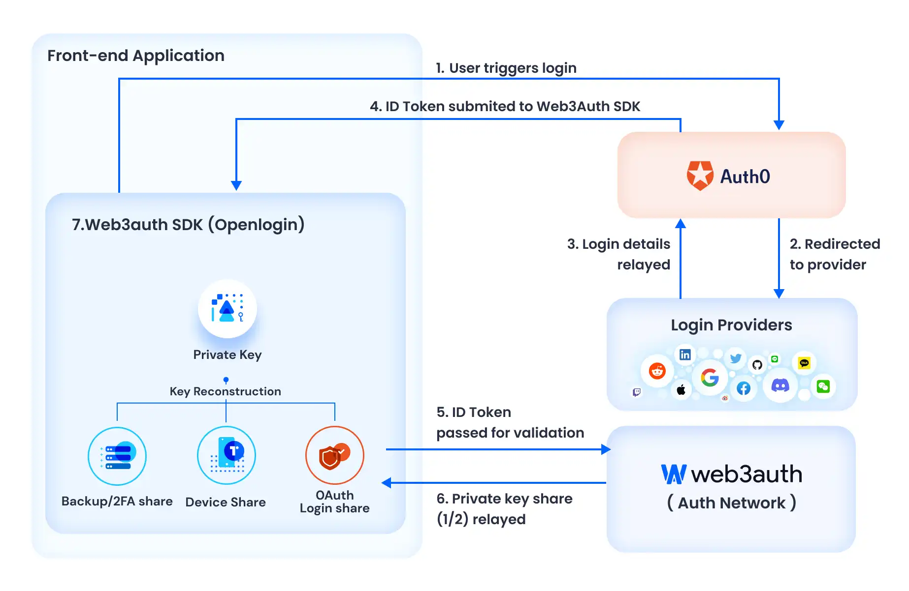
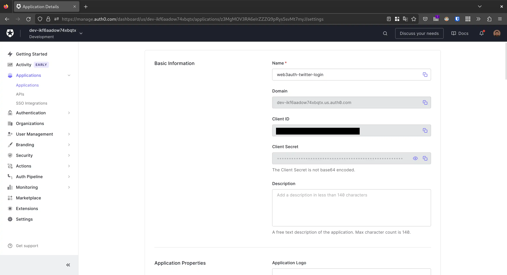
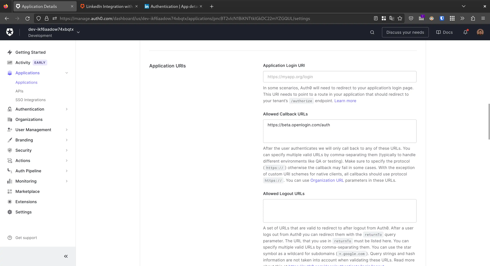
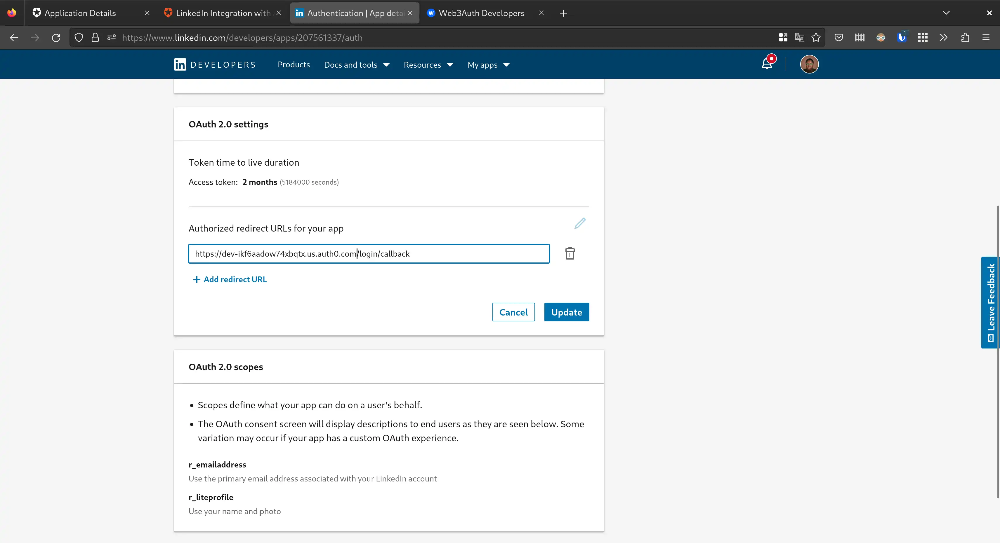
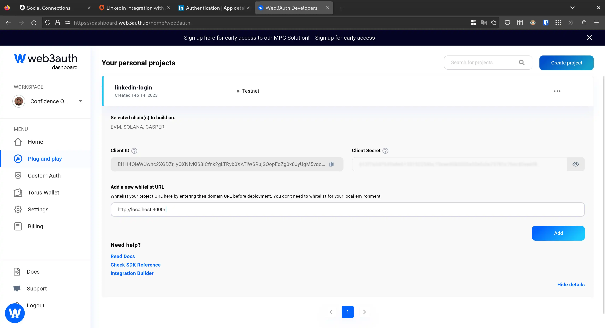

This guide will cover the basics of how to set up your Web3Auth SDK and LinkedIn Login for custom authentication and provide you with the steps to develop a basic web application on the Ethereum blockchain.

Since Web3Auth doesn’t yet have a native provider for LinkedIn, we will use the Auth0 provider and set up LinkedIn social authentication through Auth0.

<!-- Live Demo: [https://web3auth-linkedin-login.vercel.app/](https://web3auth-linkedin-login.vercel.app/) -->

## Quick Start

```bash
git clone https://github.com/megaconfidence/web3auth-linkedin-login.git
cd web3auth-linkedin-login
npm install
npm run start
```

## How It Works

The process of integrating LinkedIn login via Auth0 into a Web3Auth app looks like this:



- When a user logs in with LinkedIn via Auth0, Auth0 sends a JWT `id_token` to the app. This JWT token is sent to the Web3Auth SDK's login function
- Finally, on successful validation of the JWT token, Web3Auth SDK will generate a private key for the user, in a self-custodial way, resulting in easy onboarding for your user to the application

## Prerequisites

- For Web Apps: A basic knowledge of JavaScript is required to use Web3Auth SDK
- For Mobile Apps: The Web3Auth Mobile SDK provides you an option to choose between iOS, Android, React Native & Flutter for mobile integration. Please refer to the [Web3Auth SDK Reference](https://web3auth.io/docs/sdk) for more information
- Create a Web3Auth account on the [Web3Auth Dashboard](https://dashboard.web3auth.io/)
- Create an Auth0 tenant and configure a Single Page Web Application (SPA for Web) or Native (for Mobile) from the [Auth0 Console](https://manage.auth0.com/)
- A LinkedIn [developer account](https://developer.linkedin.com/)
- Please note that regular web apps are also supported, however for this guide, we’re preferring SPA since it requires very little setup

## Setup

### Setup Your LinkedIn App

> 💡 You may need to create a LinkedIn company page if you do not already have one

1. Follow the prompts to create an app on the [LinkedIn developer account](https://developer.linkedin.com)
2. After creating the app, select **Sign in with LinkedIn** on the products page
3. Before leaving, make a note of your `Client ID` and `Client Secret` as they will be used later on
    
    
    

### Setup Your Auth0 Tenant

1. Login to Auth0 and create a new application, setting its type to **Single Page Web Application**
2. In the **Settings** tab, take note of your `Domain` and `Client ID`
    
    
    
3. Under the **Application URIs** section, paste the following URLs into the **Allowed Callback URLs** field, and click the **Save** button
    1. [https://beta.openlogin.com/auth](https://beta.openlogin.com/auth) (for Web3Auth Testnet used in demo applications)
    2. [https://app.openlogin.com/auth](https://app.openlogin.com/auth) (for Web3Auth Mainnet used in production applications)
        
        
        
4. Click on the **Authentication** menu on the sidebar, click on **Social**, then click on the **Create Connection** button and search for LinkedIn
5. Enter your `Client ID` and `Client Secret` from LinkedIn into the `API Key` and `Secret Key` fields respectively
    
    
    
6. In the **Applications** tab, make sure the application created in Step 1 is enabled
7. Head back to the LinkedIn developer portal and set the **Authorized redirect URLs** for your app to your Auth0 app domain obtained from Step 2. Don’t forget to prepend the domain with `https://` 
    
    
    

### Setup Your Web3Auth Dashboard

1. Create a Project from the **Plug and Play** section of the [Web3Auth developer dashboard](https://dashboard.web3auth.io/)
    1. Set the environment to Testnet. We recommend creating a project in the Tesnet network during development. And while moving to a production environment, make sure to convert your project to Mainnet, Aqua, Celeste or Cyan network, otherwise, you'll end up losing users and keys
    2. Select the blockchain(s) you'll be building this project on. For interoperability with Torus Wallet, you have an option of allowing the user's private key to be used in other applications using Torus Wallet. We currently have this option across EVM, Solana, and Casper blockchains
        
        
        
2. Once the project is created, go on to whitelist the domains where your web app be hosted on. Also, take note of your `Client ID`
    
    
    
3. Create a Verifier from the **Custom Auth** section of the dashboard with following configurations:
    1. Select an environment. We’ll be going with Testnet
    2. Select the Auth0 login provider
    3. Set LinkedIn as the authentication type
    4. Paste in your Auth0 `Client ID` and `Domain`. Don’t forget to prepend the domain with `https://` 
        
        
        
4. Click on the **************Create************** button and your verifier will be deployed to the selected environment within 10 minutes
5. Take note of your verifier identifier as it will be needed later on

## Using The Web3Auth SDK

To use the Web3Auth SDK, you need to add the dependency of the respective platform SDK of Web3Auth to your project. To know more about the available SDKs, please have a look at this [documentation page](https://web3auth.io/docs/sdk).

In this guide, we will be using [Web3Auth Plug and Play Core SDK](https://web3auth.io/docs/sdk/web/core) and the [OpenLogin Provider](https://web3auth.io/docs/sdk/web/openlogin) to enable Custom Authentication through LinkedIn Login.

### Setting Up Your Base Project For Using Web3 Libraries

If you are starting from scratch, you’ll need to create a base Web application, where you can install the required dependencies. However, setting up Web3 requires a little extra configuration because certain packages are not available in the browser environment, and we need to polyfill them. You can follow [this documentation](https://web3auth.io/docs/troubleshooting/webpack-issues) where we have mentioned the configuration changes required for some popular frameworks.

### Installation

You’ll need to install the following dependencies in your project

```bash
npm install --save @web3auth/core @web3auth/openlogin-adapter @web3auth/base web3
```

Understanding the dependencies

| Dependencies | Description |
| --- | --- |
| @web3auth/core | This is the core package that contains the Web3Auth SDK |
| @web3auth/openlogin-adapter | For using custom authentication, we need to use the OpenLogin Adapter, where we can initialize the authentication details |
| @web3auth/base (optional) | The base package is optional and provides types of definitions if used in a typescript project |
| web3 | This is the library that communicates with the underlying EVM-compatible blockchain |

### Initialization

Once installed, your Web3Auth application needs to be initialized. Initialization is a four-step process where we add all the configuration details for Web3Auth:

1. Instantiation
2. Configuration of Adapters
3. Configuration of Plugins
4. Initialization of the Web3Auth

Please make sure this setup is in your application constructor, as this ensures that Web3Auth is initialized when your application starts up. We’ll be doing this in a `useEffect` hook in our React app.

This guide will focus only on instantiation, configuration (of the Openlogin adapter), and initialization of the Web3Auth SDK. To know more about the other things you can do with Web3Auth, check out our [SDK Reference](https://web3auth.io/docs/sdk/web/core).

### Instantiate Web3Auth And OpenLogin Adapter

First, you’ll need to import the libraries installed earlier

```jsx
import Web3 from 'web3';
import { useEffect, useState } from 'react';
import { Web3AuthCore } from "@web3auth/core";
import { OpenloginAdapter } from "@web3auth/openlogin-adapter";
import { WALLET_ADAPTERS, CHAIN_NAMESPACES } from "@web3auth/base";
```

Then, in a `useEffect` hook, we can create an `init` function that will be executed once when the app starts up. This will instantiate both the Web3Auth SDK and OpenLogin adapter.

But just before this, we need setup state management

```jsx
const [display, setDisplay] = useState(null);
const [web3Auth, setWeb3Auth] = useState(null);
const [provider, setProvider] = useState(null);
```

And finally, the `init` function

```jsx
useEffect(() => {
        const init = async () => {
            try {
                const authCore = new Web3AuthCore({
										web3AuthNetwork: "testnet",
                    clientId: "YOUR_WEB3AUTH_CLIENT_ID",
                    chainConfig: {
                        chainId: "0x1",
                        chainNamespace: CHAIN_NAMESPACES.EIP155,
                    },
                });

                const openloginAdapter = new OpenloginAdapter({
                    adapterSettings: {
												uxMode: "popup",
                        clientId: "YOUR_WEB3AUTH_CLIENT_ID",
                        loginConfig: {
                            jwt: {
                                typeOfLogin: "jwt",
                                verifier: "YOUR_VERIFIER_NAME_ON_WEB3AUTH_DASHBOARD",
                                clientId: "YOUR_CLIENTID_FROM_AUTH0",
                            },
                        },
                    },
                });

                authCore.configureAdapter(openloginAdapter);
                setWeb3Auth(authCore);
                await authCore.init();
                if (authCore.provider) setProvider(authCore.provider);
            } catch (error) {
                console.log({ error });
            }
        };

        init();
    }, []);
```

And with that, we’re good to go. The rest of this guide will focus on operations you can perform with the Web3Auth SDK.

### Authentication

For authentication, the following actions are supported:

- User login
- User logout
- Retrieving the user profile

These actions are illustrated in their respective functions as shown below

```jsx
const login = async () => {
    if (!web3Auth) return console.log("web3auth not initialized");
    const authProvider = await web3Auth.connectTo(WALLET_ADAPTERS.OPENLOGIN, {
        loginProvider: "jwt",
        extraLoginOptions: {
            domain: "YOUR_AUTH0_DOMAIN", // Dont forget to add https://
            verifierIdField: "sub",
        },
    });
    setProvider(authProvider);
};

const logout = async () => {
    if (!web3Auth) return console.log("web3auth not initialized");
    await web3Auth.logout();
    setProvider(null);
};

const getProfile = async () => {
    if (!web3Auth) return console.log("web3auth not initialized");
    const user = await web3Auth.getUserInfo();
    setDisplay(user)
};
```

### Interacting With The Blockchain

For communication with the blockchain, the following actions are supported:

- Getting the user account
- Getting the user’s balance
- Signing a message
- Signing a transaction
- Sending a transaction

These actions are illustrated in their respective functions as shown below

```jsx
const getAccounts = async () => {
    if (!provider) return console.log("provider not initialized yet");
    const web3 = new Web3(provider);
    const userAccounts = await web3.eth.getAccounts();
    setDisplay(userAccounts);
}

const getBalance = async () => {
    if (!provider) return console.log("provider not initialized yet");
    const web3 = new Web3(provider);
    const accounts = await web3.eth.getAccounts();
    const balance = await web3.eth.getBalance(accounts[0]);
    setDisplay(web3.utils.fromWei(balance));
}

const signMessage = async () => {
    if (!provider) return console.log("provider not initialized yet");
    const web3 = new Web3(provider);
    const account = (await web3.eth.getAccounts())[0];
    const message = "Hello World!";
    const typedMessage = [
        {
            type: "string",
            name: "message",
            value: message,
        },
    ];
    const params = [JSON.stringify(typedMessage), account];
    const method = "eth_signTypedData";

    const signedMessage = await provider.request({
        method,
        params,
    });
    setDisplay(signedMessage);
}

const signTransaction = async () => {
    if (!provider) return console.log("provider not initialized yet");
    const web3 = new Web3(provider);
    const accounts = await web3.eth.getAccounts();

    const txRes = await web3.eth.signTransaction({
        from: accounts[0],
        to: accounts[0],
        value: web3.utils.toWei('0.0001'),
        chainId: 1, // change it to your specific chain id
    });
    setDisplay(txRes);
}

const sendTransaction = async () => {
    if (!provider) return console.log("provider not initialized yet");
    const web3 = new Web3(provider);
    const accounts = await web3.eth.getAccounts();

    const txRes = await web3.eth.sendTransaction({
        from: accounts[0],
        to: accounts[0],
        value: web3.utils.toWei('0.0001'),
        chainId: 1, // change it to your specific chain id
    });
    setDisplay(txRes);
}
```

You can optionally create UI widgets to call these functions and display the outputs on the UI by reading the `display` state. Please refer to the example code for a complete reference.

## Example Code

The full code for this sample application can be found in this [GitHub repository](https://github.com/megaconfidence/web3auth-linkedin-login). Check it out and try running it locally yourself! 

## Questions/Feedback

Feel free to ask any questions you may have on [Web3Auth's GitHub Discussion Board](https://github.com/orgs/Web3Auth/discussions).
