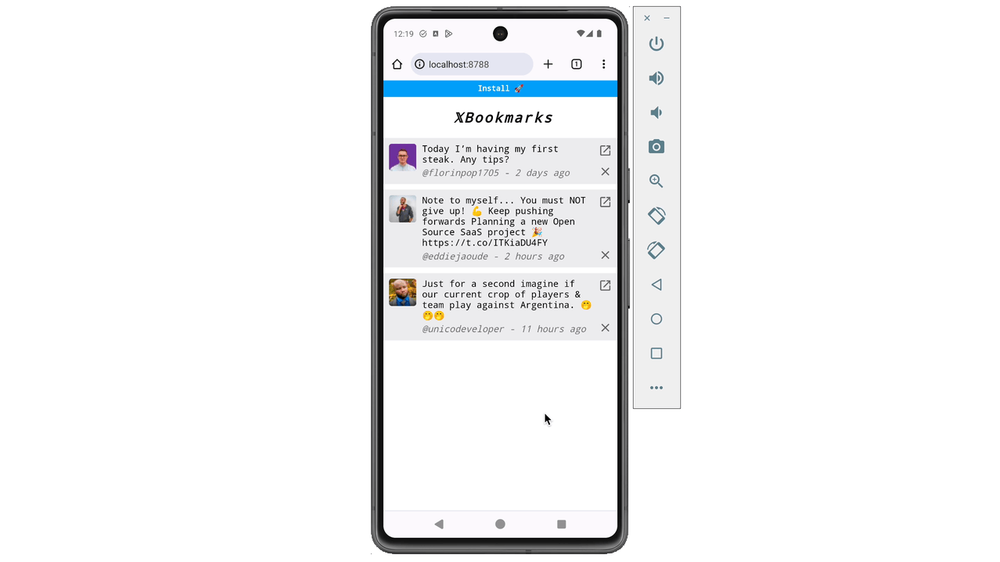
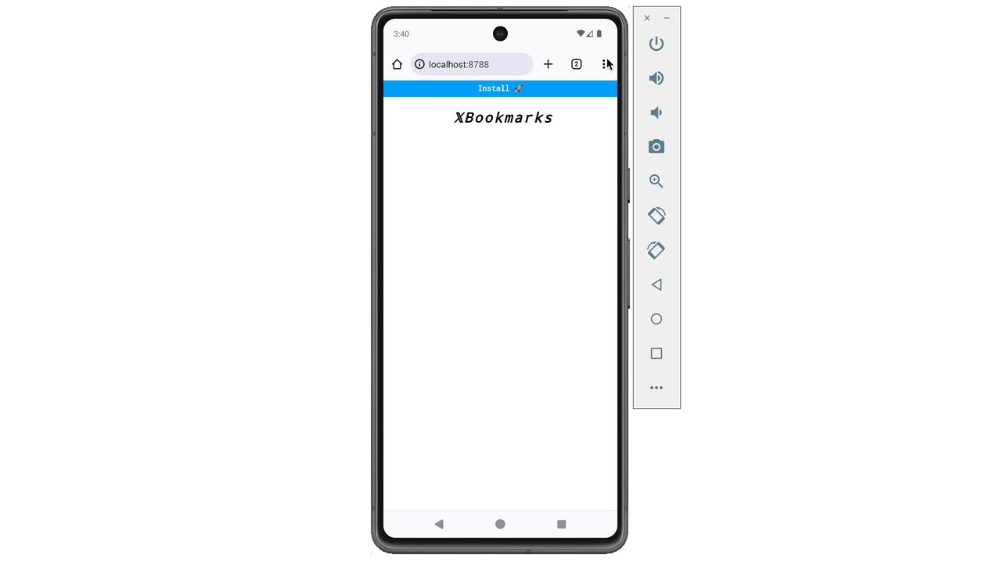
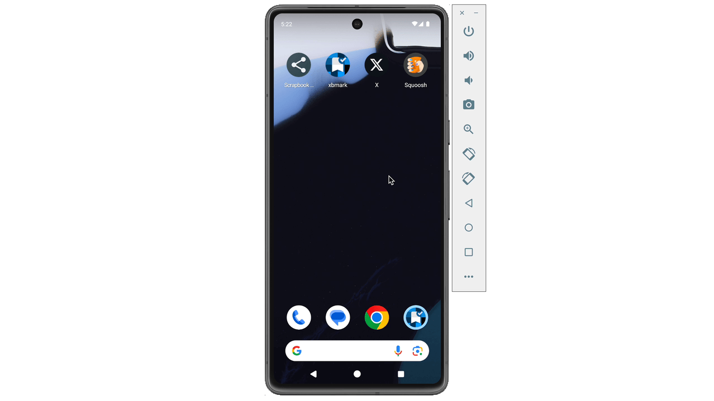

The [web has so many awesome APIs](https://confidence.sh/tags/fugu/) that blur the line between native and web apps. That’s great because you can leverage the low entry barrier of web apps, with these APIs to deliver awesome experiences to your users. Perhaps, at some point, every app becomes a web app as these native APIs become more common.

In this article, we’ll take a look at a new native API that’s now available on the web—the web share target API. We’ll build a fun X/Twitter bookmark progressive web app (PWA) in this tutorial. This will help solidify the concepts and show how to use the web share target API in production.

## What’s The Web Share Target API

Let’s start by discussing what the web share target API is not. You’ve probably encountered the [web share API](https://developer.mozilla.org/en-US/docs/Web/API/Web_Share_API) if you’ve worked on an in-app share feature. This uses `navigator.share()`, allowing your web app to share text, URLs, or files **_with the operating system_**. This enables your web app to share data with other apps via the native share drawer.

The web share target API does the opposite. It **_registers your web app as a share target with the operating system_** and allows _sharing data from other apps to your web app_. This unlocks really cool workflows for web apps. Imagine this; I take a photo with my camera, then share it to a web photo editing app, and finally share the edited photo to Instagram. How cool is that?


Workflow using the web share target API

The web share target API reminds me of piping in Unix. Sharing content with web apps is a game changer and expands their use cases.

To prevent abuse of this API, web apps must meet a few requirements to have this capability. [Your web app must be installable](https://web.dev/articles/install-criteria), and the user must have your app installed. These requirements prevent sites from randomly adding themselves to the OS share drawer. Also, this ensures the users specifically want to share with your app.

## How To Use The Web Share Target API: Build A Twitter Bookmark App

To see the web share target API in action, let’s build a simple but fun and useful project together. My X/Twitter feed occasionally has cool tweets I’d like to save for later. It would be great to have a stand-alone app where I can bookmark tweets (yeah, I know X has built-in bookmarking. Just play along okay?).



> Full app [live URL](https://xbmark.pages.dev/) (installable), and source code on [Github](https://github.com/megaconfidence/xbmark).

If you’d love to code along, here’s a link to [grab the starter code](https://github.com/megaconfidence/xbmark/raw/main/xbmark-starter.zip). Also, here’s [the completed app’s Github repo](https://github.com/megaconfidence/xbmark/tree/main) just in case. This is a JAM stack app and is hosted on Cloudflare Pages. So go ahead, download the starter code, and run a quick `npm install` in the project directory. To start a local dev server, run `npm start` and open the browser to [http://localhost:8788/](http://localhost:8788/).

### Make The App Installable (PWA)

The first requirement to use the web share target API is making the app installable, in other words, a PWA. PWAs aren’t so difficult to set up, as you’ll mostly need to create a `manifest.json` file. It’s also important to note that your app must be served through https in production.

Open up `manifest.json` and add the following config to the file. The app icons used here were generated with [Icon Kitchen](https://icon.kitchen/).

```json
{
  "name": "xbmark",
  "short_name": "xbmark",
  "description": "Bookmark your fav X posts",
  "scope": "/",
  "start_url": "/",
  "display": "standalone",
  "theme_color": "#3367D6",
  "background_color": "#3367D6",
  "icons": [
    { "src": "images/favicon.ico", "type": "images/x-icon", "sizes": "32x32" },
    { "src": "images/icon-192.png", "type": "images/png", "sizes": "192x192" },
    { "src": "images/icon-512.png", "type": "images/png", "sizes": "512x512" },
    {
      "src": "images/icon-192-maskable.png",
      "type": "images/png",
      "sizes": "192x192",
      "purpose": "maskable"
    },
    {
      "src": "/images/icon-512-maskable.png",
      "type": "images/png",
      "sizes": "512x512",
      "purpose": "maskable"
    }
  ]
}
```

…And the app is installable. Using the browser menu, users can click on ‘Add to home screen’ to install the app. But we can provide a better install experience with a few lines of JavaScript. Let’s make a custom in-app banner that seamlessly prompts the user to install the app.

To do that, add the following lines to `index.js`:

```jsx
let deferredPrompt;
const appHeader = document.querySelector("h2");
const installBtn = document.querySelector("button");

//auto-fired if app has a valid manifest.json
window.addEventListener("beforeinstallprompt", (e) => {
  e.preventDefault();
  deferredPrompt = e; //cache install prompt
  installBtn.classList.remove("hide"); //show install banner
  appHeader.classList.remove("fancy"); //only show basic app header UI
});

//when install banner is clicked...
installBtn.addEventListener("click", async () => {
  deferredPrompt.prompt(); //prompt user for installation
  const { outcome } = await deferredPrompt.userChoice; //did user install?
  if (outcome == "accepted") deferredPrompt = null; //delete cached prompt if installed
});
```

Save the files after editing and open up a browser tab to give this a test. You’ll notice users now have a nicer install experience. That’s awesome!



### Register As A Share Target

Great job on the work so far. Now the app meets all requirements to use the web share target API. To get things rolling, we need to register the app as a share target with the operating system. Luckily, that’s pretty easy to do also.

Open up `manifest.json` and add the lines below:

```json
	"share_target": {
		"action": "/",
		"method": "GET",
		"enctype": "application/x-www-form-urlencoded",
		"params": {
			"title": "title",
			"text": "text",
			"url": "url"
		}
	}
```

This tells the operating system that the app accepts basic data such as links and text. The data is passed to the app as a `GET` request at the `action` path. Data shared from the source app is passed via query params through the `title`, `text`, and `url` keys. For instance, sharing a tweet from X, opens the app at the root path and appends the tweet link to the `text` query param.

```
http://localhost:8788/?text=https://x.com/supabase/status/1800310892942487626
```

> Note: If the app doesn’t show up the in the share menu, uninstall and re-install

Now with some JavaScript magic, we can grab the tweet link from the URL query and add it as a bookmark on the app. But before moving on, it’s good to note the web share target API supports more than just text data. You can [accept shared files like images](https://developer.mozilla.org/en-US/docs/Web/Manifest/share_target#receiving_share_data_using_post) with a few tweaks to the manifest.

### Retrieve Shared Content

Parsing the shared tweet link should be easy, as it’s appended as a `text` query param. So a rough napkin plan could look like this:

1. Wait for the app to load and parse the tweet URL from the query param.
2. Fetch the actual tweet info (i.e. tweet text and user image). This step requires a server.
3. Store the fetched tweet locally.
4. And, display the tweet on the UI.

Coding up this plan in the `index.js` file:

```jsx
//step 1
window.addEventListener("DOMContentLoaded", async () => {
  const url = new URL(window.location);
  const urlText = url.searchParams.get("text");
  if (!urlText) return;
  const [id, tweet] = await fetchTweet(urlText); //step 2
  const tweets = saveTweet(id, tweet); //step 3
  buildTweetsUI(tweets); //step 4
});

//step 2
async function fetchTweet(url) {
  const id = url.match(/[0-9]{19}/)[0];
  const res = await fetch(`/tweet/?id=${id}`); //⚠️⚠️⚠️ requires backend server. More info later...
  const tweet = await res.json();
  return [String(id), tweet];
}

//step 3
function saveTweet(id, tweet) {
  let tweets = JSON.parse(localStorage.getItem("tweets")) || {};
  tweets[id] = tweet;
  tweets = Object.fromEntries(
    Object.entries(tweets).filter(([_, v]) => v != null)
  );
  localStorage.setItem("tweets", JSON.stringify(tweets));
  return tweets;
}

//step 4
function buildTweetsUI(tweets) {
  const list = [];
  for (let id in tweets) {
    const t = tweets[id];
    list.push(`
        <li>
            <div class="image"></div>
            <div class="content">
                <p>${t.text}</p>
                <p class="username">@${t.name} - ${time(new Date(t.date))}</p>
            </div>
            <div class="control">
                <a href="${t.url}"></a>
                
            </div>
        </li>
    `);
  }
  document.querySelector("ul").innerHTML = list.length
    ? list.join("")
    : `<p class="nobmarks">👀 Looks like your don't have any bookmarks yet. Share tweets to this app to get going!</p>`;
}
```

Fetching the tweet payload requires using X’s API. Cross-origin requests to this API are blocked from browsers, but work fine if made by a server. Luckily, [Cloudflare Pages supports server-side code](https://developers.cloudflare.com/pages/functions/advanced-mode/), allowing us to build full-stack apps. This means we don’t need to deploy a separate backend for this app.

Open up `_worker.js` file and replace its content with the following:

```jsx
export default {
  async fetch(request, env) {
    const url = new URL(request.url);

    switch (url.pathname) {
      case "/tweet/": //fetch to the tweet endpoint
        const id = url.searchParams.get("id"); //grab tweet id
        if (!id) return;

        //make fetch request to Twitter API
        const tweet = await fetch(
          `https://cdn.syndication.twimg.com/tweet-result?id=${id}&token=0`,
          {
            headers: { "User-Agent": "Chrome/125" },
          }
        ).then((r) => r.json());

        //return custom payload
        return Response.json({
          text: tweet.text,
          name: tweet.user.screen_name,
          date: tweet.created_at,
          img: tweet.user.profile_image_url_https,
          url: `https://x.com/${tweet.user.screen_name}/status/${id}`,
        });

      default: //else respond with static assets in public/
        return env.ASSETS.fetch(request);
    }
  },
};
```

With this, whenever we make a request to `/tweets/` (as we did in step 2), this hits our serverless backend. Then, information about the tweet is fetched using the official Twitter API. All other requests are treated as calls for static files in the `public` folder.

Now we can start bookmarking tweets like a breeze:



### Final Touches

We’re almost done. Let’s add a few finishing touches.

Right now, saved bookmarks don’t show up when the app is started. Let’s fix that by adding this `onload` function to `index.js`:

```jsx
window.onload = () => {
  const tweets = JSON.parse(localStorage.getItem("tweets")) || {};
  buildTweetsUI(tweets);
};
```

Also, add this function to delete a bookmark:

```jsx
window.deleteTweet = (id) => {
  const tweets = saveTweet(id, null);
  buildTweetsUI(tweets);
};
```

Save, reload and we’re golden! Lastly, you can deploy the app to Cloudflare Pages by running `npm run deploy`. Here’s [my version of the app](https://xbmark.pages.dev/), and also a link to the completed [source code on Github](https://github.com/megaconfidence/xbmark) if you ever need it.

## Conclusion

Made it this far? Cheers mate!

Web share target API is such a cool native API for the web. It makes it possible for web apps to participate in multi-app workflows, and that's awesome. Do you plan to use this API in your next project? I’d love to hear about it in the comments.

If you love all things Web, [follow me on Twitter](https://x.com/megaconfidence) for more. Cheers, have a good one!
