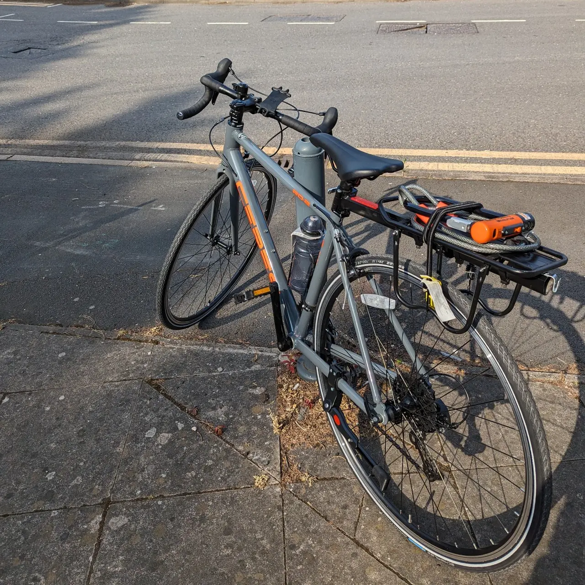
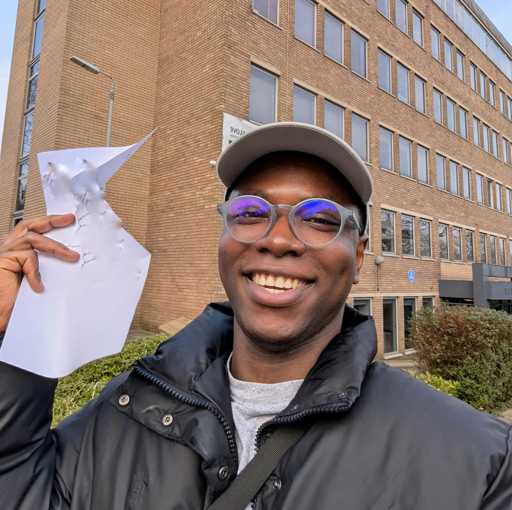

It’s been a while since I wrote a personal life update here, so I’m excited to share this one. Last week I passed my driving test, woohoo! I feel so excited and relieved. To describe it in simple words, it felt like a huge load was lifted from my chest and like I could move on with my life.

I started my application back in 2024, and it took about 17 months to get here. The funny thing is, it felt unnecessarily hard and tedious. I suspect being an immigrant had something to do with it because other immigrants had similar experiences. Also, being Nigerian meant that, unlike folks from the EU, Canada, Japan, Australia etc, I couldn’t exchange my totally valid driver’s license. I had to redo the entire thing. It was annoying.

I’m writing this post to share my experience on the matter. Perhaps this could help you know what to expect if you or someone you know would like to apply for a licence. And I’ll share tips that were helpful to me. Go grab a drink, and let’s get into it.

## I needed a new licence

I relocated to [England early in 2024](https://confidence.sh/blog/my-experience-relocating-to-england/), and there was a lot going on. I was starting a new job in a new country during winter (probably not the best time to relocate, but I survived). I was also figuring out several other things simultaneously. Those took priority, and I kept putting off the driver's license thing. That was a mistake. I should have started sooner. If you’ve been procrastinating on your application, just start now. It takes a really long time, so you’re better off starting early.

> It takes a really long time, so start now.

After settling down a bit, I started looking into the process. I thought it would be easy because I could drive (love to brag about how I learned how to drive in 3 days), and I already had a full license from Nigeria. Given the ties to the UK, I imagined I could easily switch my license or, at most, take a test to prove I could drive. My assumptions were completely wrong, again.

I did some googling and found the [government website](https://www.gov.uk/exchange-nongb-driving-licence) for license exchange, and discovered Nigeria was on the list. Shocker. Then I did some research and asked a bunch of people about it. It became clear I would have to redo the license from scratch. It was annoying, but I came to terms with it. What I didn’t know was that it would take a while and a lot of money.

## It should be easy, right?

On paper, the process seemed straightforward. You pay a £34 fee online to [apply for a provisional license](https://www.gov.uk/apply-first-provisional-driving-licence), then you do some self-study and take the theory test for £23. After that, you could sign up with a driving school or [take lessons with someone](https://www.gov.uk/driving-lessons-learning-to-drive/practising-with-family-or-friends) who’s held a full license for at least 3 years. When you feel confident, you book a [practical test](https://www.gov.uk/driving-test) for £62. Then you take your test and pass. Simple right?

I found the official [DVSA theory test app](https://www.gov.uk/theory-test/revision-and-practice) quite good for theory prep. Keep in mind it costs £5. I have no idea why it’s a paid app, as you’ll still have to pay to take the test. It’s not all bad, though. The app has a mock test feature to practice your theory test. Questions from there get repeated, so spend a lot of time practising. The [hazard perception](https://www.gov.uk/theory-test/hazard-perception-test) test is tricky, so make sure you practice it a lot.

I bought a bike around this time and found that cycling on the road helped to remember some of the theory stuff. It makes it less theoretical. The bike thing may not be useful to you, but I found this helpful and wanted to share it. I took my theory test and passed the second time. I had issues with the hazard perception test at first. I don’t think the mechanics of the current test implementation are good.

## This is where it gets crazy

If you live in a big city, getting an early driving test date is really hard. The wait time could be up to 8 months. And it’s made worse by companies that buy up test slots to resell at an ungodly rate. So book your driving test immediately after passing your theory test, even if you don’t yet feel ready. That’s what I did. The earliest slot I got was six months away. Then I found an instructor, and after a few sessions, I was ready to take my driving test.

As the test date drew close, I got in contact with my instructor to use his car for the test. FYI, you’ll need to bring a car meeting [these requirements](https://www.gov.uk/driving-test/using-your-own-car) to the test. Not all cars can be used, though. So if you’re rich and drive a Polestar 5, you’d be out of luck. I had to pay £150 to use my instructor’s car. I was pretty confident and went in for my test. It went pretty well, and in fact, I had some background music during my test. At the end, I was told I had not passed because I made two mistakes. They never happened, and I just felt the examiner was biased.

I took two more tests and got the same examiner on one of them. I failed with the same faults as my first test. Okay, it wasn’t a feeling any more. I had conversations with friends who recently got their license, and they acknowledged my observations. They experienced the same things, too. That’s the problem with human-graded tests. There’s usually some element of prejudice or bias that may negatively influence their assessment. I hope someday computers get good enough for use in these tests.

I took one more test and failed. But this time with a different examiner, who I felt was unbiased. So here’s what happened. We were turning right at a traffic light with a truck in front of us blocking the lights from my view. The truck moved off when there were no oncoming vehicles, and I made the honest-to-god mistake of attempting to move without checking the lights. The truck completely blocked my view of the lights, and although I moved off cautiously as I was already past the white line, it was a fault because the lights went red while the truck started moving. Totally my fault, and I knew I had made a mistake.

I had to book one more test, but this time I learned a really important hack. I got to know of an app called [TestShift](https://testshift.co.uk/). I paid £18 for the app, but it saved me over 4 months by moving my test date closer. It constantly scans for cancellations or freed-up dates and automatically moves your test date closer. It worked wonderfully for me, and I highly recommend it. My final test was thankfully less eventful. I got a nicer examiner, and it all went smoothly.

<blockquote class="twitter-tweet"><a href="https://twitter.com/megaconfidence/status/2026739046597173557">View tweet by @megaconfidence</a></blockquote>

## Conclusion

Okay, I ranted a bit here but I hope it gave you an idea of what to expect. I’m just going to reiterate the takeaways I want you to remember. The best thing you can do for yourself is to start your application early. The DVSA [theory test app](https://www.gov.uk/theory-test/revision-and-practice) is good, but pay close attention to the hazard perception test. Book your driving test ASAP. Use [TestShift](https://testshift.co.uk/) to move your date closer. And lastly, get a nice examiner. That was a joke.

I write about technical stuff and the occasional life adventures here. So keep in touch on [Twitter](https://x.com/megaconfidence) or [LinkedIn](https://www.linkedin.com/in/megaconfidence/). I’ll catch you next time, Jaane.
