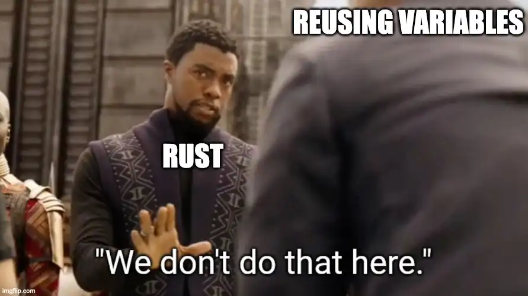
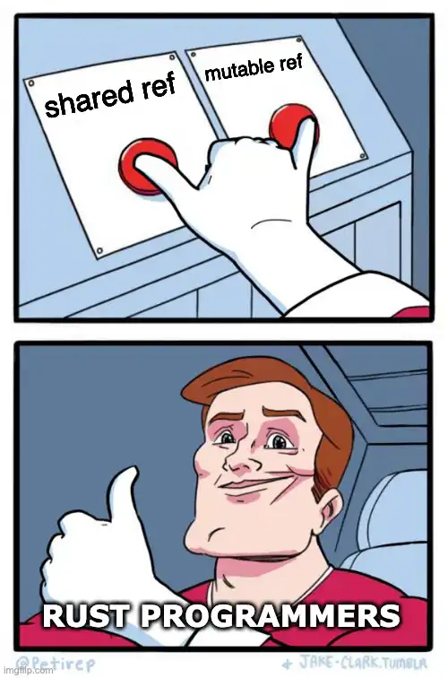

Welcome back! In the [previous article](../rust-memory-management-ownership/), we introduced the concept of ownership in Rust. It's Rust's unique way of guaranteeing memory safety without relying on a garbage collector. If you haven't seen the previous article, I recommend you do so to learn the basics of how memory works in Rust.

In this article, we'll cover other edge cases when passing memory across your program. We'll explore new features built into Rust to help you move memory in a safe and effective way. You'll learn about borrowing, references, and the infamous borrow checker. Let's go!

## The Ownership Gotcha

<div class="youtube-embed"><iframe src="https://www.youtube.com/embed/G0C3rAIoFNU" title="YouTube video" frameborder="0" allow="accelerometer; autoplay; clipboard-write; encrypted-media; gyroscope; picture-in-picture; web-share" allowfullscreen style="aspect-ratio:16/9;width:100%;"></iframe></div>

In the last example from the [previous article](https://dev.to/megaconfidence/beginner-guide-to-memory-management-in-rust-ownership-380p), we had a situation where we needed to use the `numbers` vector twice within the program. From our knowledge of ownership, we know Rust _moves_ the variable to the first call to `sum_numbers` and deallocates it when the function returns. Using the variable a second time causes a compilation error. At this point, `numbers` has been deallocated and is uninitialized, thus Rust prevents us from accessing uninitialized memory and crashes the build.

```rust
fn sum_numbers(numbers: Vec<i8>) -> i8 { //takes ownership of numbers
    let mut total = 0;
    for num in numbers.iter() {
        total += num;
    }
    return total;
} //function is out of scope. Thus, numbers is deallocated

fn main() {
    let numbers = vec![3, 2, 1]; //allocates vector of numbers on heap
    println!("{:?}", sum_numbers(numbers)); //numbers is moved to sum_numbers
    println!("{:?}", sum_numbers(numbers)); //⚠️ numbers is already deallocated. Program does not compile.
}
```

_Code block 1_

Passing data allocated on the heap to a new scope, i.e function call, causes Rust to _move_ that data into the scope. And Rust deallocates it when the scope exits to ensure memory is safely used. So what about using a variable more than once? My guess is you never had to think too much about this while writing other languages, but we aren't in Kansas anymore. The big question is, how do you reuse variables in Rust programs?



One way to get around this quirk of Rust is creating clones of variables. In the example below (Code block 2), we create a clone of `numbers` that is then moved and deallocated after the first call to `set_numbers` returns. Then, the original variable is consumed in the second call. Compiling this program works as expected, but we _needed two copies_ of `numbers` to pull it off. That's pretty inefficient.

```rust
fn sum_numbers(numbers: Vec<i8>) -> i8 {
    let mut total = 0;
    for num in numbers.iter() {
        total += num;
    }
    return total;
}

fn main() {
    let numbers = vec![3, 2, 1];
    println!("{:?}", sum_numbers(numbers.clone())); //a clone of numbers is moved to sum_numbers
    println!("{:?}", sum_numbers(numbers)); //then we can re-use numbers
}
```

_Code block 2_

This workaround has some glaring limitations. Sometimes, the variable in question may be large, and it's unfeasible to create copies. Is there a better way to reuse data in Rust programs? Good news, there is!

## Borrowing & References

To help you share data efficiently, Rust provides a pair of features called borrowing and references. They completely eliminate the need to rely on copies and are easy to use. These concepts may be familiar to you if you've programmed in C or C++, but if not, we'll take a look at it together.

References in Rust allows you to access a variable without affecting its ownership. It's like a pointer that can be followed to access the data stored at the address of the variable, which may be owned by a completely different scope. References in Rust differ from C pointers in that it's guaranteed to point only to valid values, i.e. no null pointers. Thus are no undefined behaviors when using references in Rust.


References come in two flavors. There are _shared references_ and _mutable references._ Shared references allow you to read the value of its referent without modifying it. You can have as many shared references to a variable as you like, as all references point to the same data in memory. To illustrate, a person may be called father by his child, husband by his wife, teacher at work, and still have a name like Confidence. The titles; father, husband, teacher and Confidence all refer to the same person.

Going back to the example we've been considering, we can use shared references to pass data more effectively. As you see below (Code block 3), copy has been removed and replaced with a shared reference to `numbers` written as `&numbers`, where `&` is the reference operator. Also, you'll notice the function argument has been updated to accept references of type `&Vec<i8>`. Within the context of the `sum_numbers` function, `numbers` is said to be _borrowed_, and the program compiles without a hitch.

```rust
fn sum_numbers(numbers: &Vec<i8>) -> i8 { //accepts a shared ref of type &Vec<i8>
    let mut total = 0;
    for num in numbers.iter() {
        total += num;
    }
    return total;
}

fn main() {
    let numbers = vec![3, 2, 1];
    println!("{:?}", sum_numbers(&numbers)); //passes a shared ref to sum_numbers
    println!("{:?}", sum_numbers(&numbers)); //multiple shared refs can be used
}
```

_Code block 3_

You'll notice we didn't explicitly dereference `numbers` within the `sum_numbers` function. Why is that? In Rust, references are frequently used, thus, variables are implicitly dereferenced when their methods are accessed with the dot (`.`) operator. `numbers` was implicitly dereferenced with the call to `.iter()` method. You could also be more explicit by using the dereferencing operator `*` as shown below, but most Rust programmers tend not to.

```rust
fn sum_numbers(numbers: &Vec<i8>) -> i8 { //accepts a shared ref of type &Vec<i8>
    let mut total = 0;
    for num in (*numbers).iter() { //numbers ref explicitly dereferenced
        total += num;
    }
    return total;
}

fn main() {
    let numbers = vec![3, 2, 1];
    println!("{:?}", sum_numbers(&numbers)); //passes a shared ref to sum_numbers
    println!("{:?}", sum_numbers(&numbers)); //multiple shared refs can be used
}
```

_Code block 4_

It's also good to know that shared references are _immutable_. So long there's a shared reference to a variable, no one (not even its owner) can change its value, i.e. no one can modify `numbers` when `sum_numbers` is working on it. Rust uses this rule enforced by the _borrow checker_ to ensure memory safety. Thus, the following program won't compile, because `numbers` is _borrowed_ using an immutable reference in `sum_numbers`.

```rust
fn sum_numbers(numbers: &Vec<i8>) -> i8 { //accepts a shared ref of type &Vec<i8>
    numbers.push(4); //⚠️ mutating a shared ref. Program doesn't compile

		let mut total = 0;
    for num in numbers.iter() {
        total += num;
    }
    return total;
}

fn main() {
    let mut numbers = vec![3, 2, 1];
    println!("{:?}", sum_numbers(&numbers)); //passes a shared ref to sum_numbers
    println!("{:?}", sum_numbers(&numbers)); //multiple shared refs can be used
}
```

_Code block 5_

All fine and good. Now, you must be curious about mutating the values a reference points to, as it's often necessary while building real applications. In other words, how do you mutate `numbers` while it's borrowed within `sum_numbers`? Don't worry, Rust got you.

## Mutable References

_Mutable references_ not only allow you to read its referent's value but also _mutate_ it. But there's a catch. You can't have any other references to the variable when a mutable reference exists. In other words, you can have only one mutable reference or many shared reference to a value at any given moment. This is called the ‘multiple readers or single writer rule'. It might seem limiting at first, but actually covers all use cases and helps you write bug free programs. This rule is also enforced by the borrow checker.

A mutable reference is denoted by the expression `&mut X`, X being the referent variable. Fixing the example in Code block 5 to use mutable references involves updating the reference type that is used, and the function signature of `sum_numbers`. While Rust only allows the use of one mutable reference at a time, there's nothing stopping us from creating another mutable reference after the first goes out of scope.

```rust
fn sum_numbers(numbers: &mut Vec<i8>) -> i8 { //accepts a mutable ref
    numbers.push(4); //program now compiles

		let mut total = 0;
    for num in numbers.iter() {
        total += num;
    }
    return total;
}

fn main() {
    let mut numbers = vec![3, 2, 1];
    println!("{:?}", sum_numbers(&mut numbers)); //passes a mutable ref to sum_numbers
    println!("{:?}", sum_numbers(&mut numbers)); //another mutable ref can be created after the first is consumed
}
```

_Code block 6_

A key takeaway here is you **can't** both use mutable and shared references **_at the same time_** in your program. You have to decide upfront what path you'll choose, and Rust guarantees there'll be no memory leaks provided your program compiles. My advice is not to think too much about what kind of reference to use, as it naturally comes when needed.



## Conclusion

There's still a lot to learn about borrowing and references, but the best way to learn is by doing. So practice as you go and you'll be alright. In the next article, we'll learn about lifetimes and how they affect references in Rust. If you'd love to learn more about Rust, [follow me on Twitter](https://twitter.com/megaconfidence). Awesome, I'll see you in the next one. Cheers!
