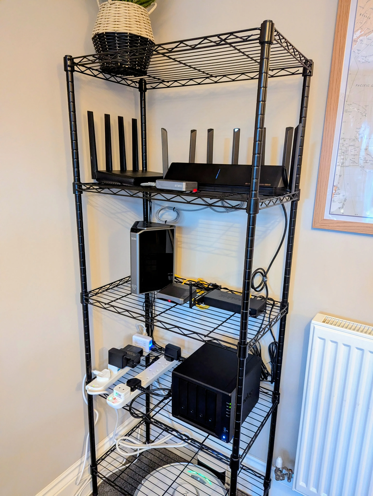

I got started using cloud storage with my Gmail account. At the time, you got a free email address and 15GBs of cloud storage. That was pretty neat. I thought 15GB was way too much storage, and it’ll take forever to exhaust it. I was wrong. Google launched several cool cloud services i.e. Drive, Docs, and Photos, and my storage got exhausted. I had storage anxiety because I couldn’t send or receive emails or back up my files/photos.

When this happens, you’re forced to delete your backups or ‘buy’ more storage. But we all know no one deletes old photos, because they tend to get more valuable as they age. You just have to buy more storage. I did. I got the 100GB sub, and life was good for the next few years. You’ve guessed where this is going: I exhausted the 100GBs, and back to the same point I was before; delete old photos or buy more storage. Interestingly, there’s a third option: host your own cloud storage.

> When you ‘buy’ more storage, you’re simply renting and don’t really own it. This may or may not be a good thing for you.

Hosting your own cloud storage is not a popular option because big tech doesn’t want you to. It kills their business model, and they do everything they can to get you locked into their services. It’s not all bad, though. Cloud storage services are incredibly easy to use and may provide better value for certain use cases. But if you’re a power user, self-hosting is the way to go. I’ll share tips from my experience hosting my own cloud storage to help you decide what to go for.

## DIY Cloud With A DIY NAS

A NAS (Network Attached Storage) could be the perfect solution for your needs. You can have as much storage as you’d like and expand it over time. Also, your data is 100% private, and you have physical access to it. But there are upfront trade-offs. Depending on your storage needs, It’s likely to be more expensive than a monthly sub (at least for the first few years). Self-hosting may require some technical know-how, among other things.

One way to get your own cloud on a NAS for cheap is to build it DIY. There are several guides on how to do this, and I built one myself. For the hardware, I got a Raspberry Pi 4 with 8GBs of RAM, an [Argon EON case](https://argon40.com/products/argon-eon-pi-nas) (a four-bay NAS enclosure), a couple of SATA SSDs, and a [USB to 2.5GB/s ethernet adapter](https://www.aliexpress.com/item/1005003432693810.html) (optional). I also got a four-port [2.5GB/s mini PC](https://www.aliexpress.com/item/1005004302428997.html) to run as a switch and router for my home lab. This is totally optional, and all you really need is the Pi, the NAS enclosure, and SATA drives.

There are several options to choose from in software. You can install a NAS operating system like Open Media Vault, True NAS, or Proxmox, etc. They make it easy to access and manage your drives. Alternatively, you could install any OS you fancy and run a cloud app like Seafile, NextCloud, or OwnCloud. These apps require you to maintain the underlying OS and drives yourself. But they handle the rest i.e GUI clients, syncing & backups, and productivity tools.

I wanted a very lean setup so I went DIY on the software. I chose Debian as my base OS, used [Merger FS](https://github.com/trapexit/mergerfs) to combine the drives into a single pool, and ran apps via containers to access my storage. I run [Filestash](https://www.filestash.app/docs/) as my GUI client, [Samba](https://github.com/dperson/samba) for SMB, [Syncthing](https://www.notion.so/Why-I-Quit-a-450-000-Engineering-Job-at-Netflix-975c0423cb204157adef4f80ed20d2ae?pvs=21) to backup my devices to the NAS, [Pairdrop](https://github.com/linuxserver/docker-pairdrop) for local file sharing (Airdrop alternative), [HomeGallery](https://home-gallery.org/) for photos, [Jellyfin](https://jellyfin.org/docs/) as my media server (with cross-platform clients), [Kavita](https://www.kavitareader.com/) for my book library, and others.

I love this setup so much. The hardware is cheap, quiet, and efficient. The software stack is also good. I think of it as a bowl of soup that contains the exact ingredients I like. If there’s a service I want to add/replace, all I need to do is pull a container. But DIY has its issues (especially maintenance) and it’s not for everyone. What about pre-built solutions?

## Private Cloud With Prebuilt NAS

This is another option to consider if you wish to self-host your cloud storage. There are several reasons why buying a prebuilt NAS is great. You don’t have to build the hardware yourself, and the software stack is usually better polished. Unfortunately, you’ll probably get worse hardware when you buy a prebuilt NAS. It's a huge tradeoff, but the reason most people get a prebuilt NAS for their software.

While my DIY NAS was awesome, I wanted something with a lot more polish. I wanted a complete replacement of Google One (drive, photos, docs, etc) with cross-platform clients. It was all about software this time around. If possible, I also wanted better hardware with an iGPU for hardware transcoding (important for 4k streaming). Synology has objectively the best software, so I went with the [Synology DS425+](https://www.synology.com/en-uk/products/DS425+). Honestly, the hardware is outdated, but the reason you buy a Synology is the software — it just works.

Only Synology drives (both SATA drives and SSDs) are compatible with newer models of their NAS solutions. This is a huge let-down and creates vendor lock-in, so think carefully if you can live with this. There are other awesome prebuilt solutions, though. This days, people love [Ugreen NAS](https://nas-uk.ugreen.com/?from=uk-store-navi) for its great hardware and no compatibility issues. Then there’s [TrueNAS](https://www.truenas.com/truenas-mini/), [Asustor](https://www.asustor.com/en/), [QNap](https://www.qnap.com/en-uk), and others. There are lots of good options in the pre-built space, so pick your poison.

## Concluson

Hosting your own cloud storage may sound daunting, but ultimately, it’s fun. You get to learn a lot about computers and get better value for your money compared to cloud offerings from big tech. I still have a lot to explore (snapshots, file systems, media formats etc) and I’ll be writing about them. Feel free to follow me on [Linkedin](https://www.linkedin.com/in/megaconfidence/) or [Twitter](https://x.com/megaconfidence) for when they drop. See ya next time.
