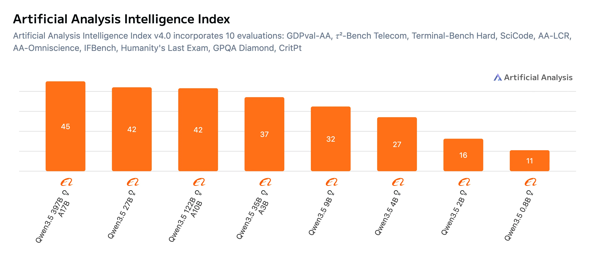
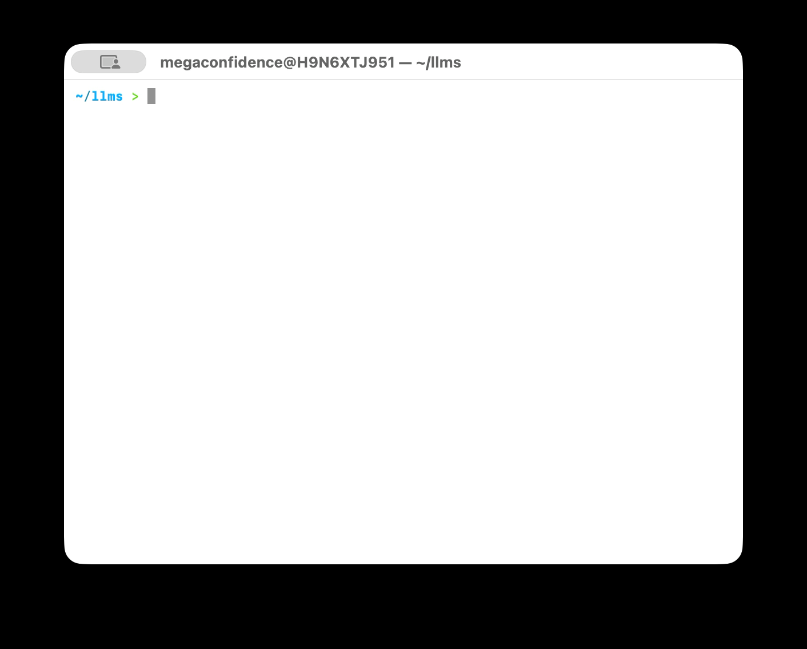

Local models have gotten so good that you may want to reconsider your cloud subscriptions. Qwen 3.6 and Gemma 4 were announced today and are beating out frontier models from AI Labs. They’re multimodal, have a 1M context window, and run locally. That means you don’t need an AI subscription — the models work 100% offline and your conversations are private. So in this post, I’ll walk you through how to run these models locally and use them with a coding agent like Opencode.

Qwen 3.6’s model weights are yet to be released (may be out by the end of the week), so this guide will use Qwen 3.5, which is available now for download. This guide also applies to other models like Gemma 4, and basically any GGUF model you can run with Llama.cpp. Let’s dive in.

## Step 1: Choosing the right model

The Qwen 3.5 family of models has several sizes ranging from 0.8B to 397B parameters. So which model you pick will depend on how much vRAM you have. I think the 9B, 27B, and 35B models are the sweet spot, requiring 5.5GB, 14GB, and 17GB of vRAM, respectively. For reference, here’s a table from Unsloth with vRAM requirements for each model.

| Model size | vRAM requirement (3-bit) |
| :--------- | :----------------------- |
| 0.8B, 2B   | 3GB                      |
| 4B         | 4.5GB                    |
| 9B         | 5.5GB                    |
| 27B        | 14GB                     |
| 35B        | 17GB                     |
| 122B       | 60GB                     |
| 397B       | 180GB                    |

Also, the bigger the model, the smarter it is — more parameters means more stored knowledge. So go for the largest model you can run on your hardware. Here’s a chart from Artificial Analysis comparing the intelligence of the model sizes.



So here’s the verdict. If all you have is 14GB of vRAM, go for the 27B size. If you have up to 17GB, go with the 35B size. To check how much vRAM you have, [install and run nvtop](https://github.com/Syllo/nvtop). For this tutorial though, I’ll go with the 35B model. It’s faster than the 27B, even though the 27B is smarter.

To download the model, install the Hugging Face CLI and create a workspace directory in your home folder e.g. `llms`:

```shell
curl -LsSf https://hf.co/cli/install.sh | bash
mkdir ~/llms && cd ~/llms
```

Then download the model with the following command (model files are downloaded to `~/llms/unsloth/Qwen3.5-35B-A3B-GGUF`)

```shell
hf download unsloth/Qwen3.5-35B-A3B-GGUF \
    --local-dir unsloth/Qwen3.5-35B-A3B-GGUF \
    --include "*mmproj-F16*" \
    --include "*Q3_K_M*"
```

On macOS, about 30-40% of unified memory is reserved as system RAM. To run large models, you may need to tell macOS to allocate more of it to vRAM. 80% of total memory is a good start, and you may go up to 100% to fit larger models. Allocating up to 100% may lead to out-of-memory errors (OOM) when you load really large models, which could cause your system to reboot. I have 36GB of RAM, so I could allocate up to 90% of it, i.e. `36 × 1024 × 0.9 = 33178` MB as vRAM.

Create a privileged `launchd` service to configure the new vRAM limit on boot. Create the file at `/Library/LaunchDaemons/com.local.sysctl.gpu.plist` with the following content:

```xml
<?xml version="1.0" encoding="UTF-8"?>
<!DOCTYPE plist PUBLIC "-//Apple//DTD PLIST 1.0//EN" "http://www.apple.com/DTDs/PropertyList-1.0.dtd">
<plist version="1.0">
<dict>
    <key>Label</key>
    <string>com.local.sysctl.gpu</string>
    <key>ProgramArguments</key>
    <array>
        <string>sysctl</string>
        <string>-w</string>
        <string>iogpu.wired_limit_mb=33178</string>
    </array>
    <key>RunAtLoad</key>
    <true/>
</dict>
</plist>
```

Run `sudo launchctl load -w /Library/LaunchDaemons/com.local.sysctl.gpu.plist` to auto-load this configuration, then reboot. After rebooting, run `sudo sysctl iogpu.wired_limit_mb` to verify the configuration is applied.

## Step 2: Install the inference stack

[Llama.cpp](https://github.com/ggml-org/llama.cpp) is an inference engine with great hardware support. It also has day-0 support for most models and an awesome community of contributors. It’s easy to set up and has plenty of options to tweak inference performance. To install with Homebrew, run the following command:

```shell
brew install llama.cpp
```

Then run the following command to start an OpenAI-compatible LLM server with the model loaded:

```shell
export PORT=8080
export ALIAS="qwen-3.5-35b"
export MMPROJ="/Users/$(whoami)/llms/unsloth/Qwen3.5-35B-A3B-GGUF/mmproj-F16.gguf"
export MODEL="/Users/$(whoami)/llms/unsloth/Qwen3.5-35B-A3B-GGUF/Qwen3.5-35B-A3B-Q3_K_M.gguf"

llama-server --port ${PORT} --model ${MODEL} --alias ${ALIAS} --mmproj ${MMPROJ} \
    --flash-attn on --temp 0.6 --top-p 0.95 --top-k 20 --min-p 0.0 --presence-penalty 0.0 \
    --parallel 5 --jinja --ctx-size 131072 --ctx-checkpoints 128 --timeout 1200 --kv-unified
```

This starts an inference server on port `8080`, and you can view the API on [http://127.0.0.1:8080/v1](http://127.0.0.1:8080/v1). Looking at the server config, it can process up to 5 parallel inference requests and has a context window of `131072` tokens. You could go up to a max of `262144` tokens, but that will consume more memory.

To run this automatically on boot as a background service, we’ll need to create a `launchd` service in `~/Library/LaunchAgents/com.local.llama.server.plist` with the following content. Replace `YOUR_USERNAME` with your actual username:

```xml
<?xml version="1.0" encoding="UTF-8"?>
<!DOCTYPE plist PUBLIC "-//Apple//DTD PLIST 1.0//EN" "http://www.apple.com/DTDs/PropertyList-1.0.dtd">
<plist version="1.0">
<dict>
    <key>Label</key>
    <string>com.local.llama.server</string>
    <key>ProgramArguments</key>
    <array>
        <string>/opt/homebrew/bin/llama-server</string>
        <string>--port</string>
        <string>8080</string>
        <string>--model</string>
        <string>/Users/YOUR_USERNAME/llms/unsloth/Qwen3.5-35B-A3B-GGUF/Qwen3.5-35B-A3B-Q3_K_M.gguf</string>
        <string>--alias</string>
        <string>qwen-3.5-35b</string>
        <string>--mmproj</string>
        <string>/Users/YOUR_USERNAME/llms/unsloth/Qwen3.5-35B-A3B-GGUF/mmproj-F16.gguf</string>
        <string>--flash-attn</string>
        <string>on</string>
        <string>--temp</string>
        <string>0.6</string>
        <string>--top-p</string>
        <string>0.95</string>
        <string>--top-k</string>
        <string>20</string>
        <string>--min-p</string>
        <string>0.0</string>
        <string>--presence-penalty</string>
        <string>0.0</string>
        <string>--parallel</string>
        <string>5</string>
        <string>--jinja</string>
        <string>--ctx-size</string>
        <string>131072</string>
        <string>--ctx-checkpoints</string>
        <string>128</string>
        <string>--timeout</string>
        <string>1200</string>
        <string>--kv-unified</string>
    </array>
    <key>RunAtLoad</key>
    <true/>
    <key>KeepAlive</key>
    <true/>
    <key>StandardOutPath</key>
    <string>/tmp/llama-server.log</string>
    <key>StandardErrorPath</key>
    <string>/tmp/llama-server.err</string>
</dict>
</plist>
```

Run the following command to start the server immediately and set it to run on boot:

```shell
launchctl load ~/Library/LaunchAgents/com.local.llama.server.plist
```

## Step 3: Use the model in Opencode (or Claude Code)

[Opencode](https://opencode.ai/) is an open-source AI coding agent and supports both cloud and local models. It's available as a desktop app, terminal UI, and IDE extension. Feel free to install whichever variant you prefer, but for this tutorial, I’ll install the terminal UI app:

```shell
curl -fsSL https://opencode.ai/install | bash
```

To add the local model to Opencode, open the config at `~/.config/opencode/opencode.json` and add a new custom provider:

```json
{
  "$schema": "https://opencode.ai/config.json",
  "provider": {
    "local-llm": {
      "npm": "@ai-sdk/openai-compatible",
      "name": "local-llm",
      "options": {
        "baseURL": "http://127.0.0.1:8080/v1"
      },
      "models": {
        "qwen-3.5-35b": {
          "name": "qwen-3.5-35b",
          "limit": {
            "context": 131072,
            "output": 65536
          }
        }
      }
    }
  }
}
```

Run Opencode and you should have `qwen-3.5-35b` available as a local model you can use:

<!--  -->


To use the local model with Claude Code, [install Claude Code](https://code.claude.com/docs/en/quickstart#step-1-install-claude-code) and add the following lines to your `~/.bashrc` or `~/.zshrc`:

```shell
export ANTHROPIC_BASE_URL="http://127.0.0.1:8080"
export ANTHROPIC_API_KEY=""
```

Then open `~/.claude/settings.json` and add `"CLAUDE_CODE_ATTRIBUTION_HEADER" : "0"` to the `”env”` section and save. Now you can run Claude Code with your local model:

```shell
claude --model qwen-3.5-35b
```

## Step 4 (Optional): Run multiple models with llama-swap

So far, our setup only serves a single model. [llama-swap](https://github.com/mostlygeek/llama-swap) is a lightweight proxy that sits in front of Llama.cpp and swaps models on demand — it loads a model when you request it and unloads it when you switch to another. So you only need enough vRAM for one model at a time.

To get started, [install llama-swap](https://github.com/mostlygeek/llama-swap?tab=readme-ov-file#installation) and create a config file at `~/llms/llama-swap/config.yaml`. Here's an example with Qwen 3.5 and Gemma 4:

```yaml
startPort: 10001

macros:
  "MODELS_DIR": "${env.HOME}/llms/unsloth"
  "LLAMA_BIN": "/opt/homebrew/bin"

models:
  "qwen-3.5-35b":
    name: "qwen-3.5-35b"
    unlisted: false
    macros:
      "ALIAS": "qwen-3.5-35b"
      "MMPROJ": "${MODELS_DIR}/Qwen3.5-35B-A3B-GGUF/mmproj-F16.gguf"
      "MODEL": "${MODELS_DIR}/Qwen3.5-35B-A3B-GGUF/Qwen3.5-35B-A3B-Q3_K_M.gguf"
    cmd: |
      ${LLAMA_BIN}/llama-server --port ${PORT} --model ${MODEL} --mmproj ${MMPROJ} --alias ${ALIAS}
      --temp 0.6 --top-p 0.95 --top-k 20 --min-p 0.0 --presence-penalty 1.5
      --flash-attn on --parallel 5 --jinja --ctx-size 131072 --ctx-checkpoints 128 --timeout 1200 --kv-unified
  "gemma-4-26b":
    name: "gemma-4-26b"
    unlisted: false
    macros:
      "ALIAS": "gemma-4-26b"
      "MMPROJ": "${MODELS_DIR}/gemma-4-26B-A4B-it-GGUF/mmproj-F16.gguf"
      "MODEL": "${MODELS_DIR}/gemma-4-26B-A4B-it-GGUF/gemma-4-26B-A4B-it-UD-Q3_K_M.gguf"
    cmd: |
      ${LLAMA_BIN}/llama-server --port ${PORT} --model ${MODEL} --mmproj ${MMPROJ} --alias ${ALIAS}
      --temp 1.0 --top-p 0.95 --top-k 64
      --flash-attn on --parallel 5 --jinja --ctx-size 131072 --ctx-checkpoints 128 --timeout 1200 --kv-unified

groups:
  "swappable":
    swap: true
    exclusive: true
    members:
      - "qwen-3.5-35b"
      - "gemma-4-26b"
hooks:
  on_startup:
    preload:
      - "qwen-3.5-35b"
```

Looking at the config, the `models` section defines each model with its own llama-server command and inference settings — basically the same setup from Step 2, just defined per model. The `groups` section with `exclusive: true` ensures only one model is loaded at a time. When you request a different model, llama-swap unloads the current one and loads the new one. The `hooks` section preloads Gemma 4 on startup so it's ready to go.

If you set up the llama-server `launchd` service from Step 2, you'll want to stop it first since llama-swap will manage the servers for you:

```shell
launchctl unload ~/Library/LaunchAgents/com.local.llama.server.plist
```

To run llama-swap automatically on boot as a background service, we'll need to create a `launchd` service in `~/Library/LaunchAgents/com.local.llama.swap.plist` with the following content. Replace `YOUR_USERNAME` with your actual username:

```xml
<?xml version="1.0" encoding="UTF-8"?>
<!DOCTYPE plist PUBLIC "-//Apple//DTD PLIST 1.0//EN" "http://www.apple.com/DTDs/PropertyList-1.0.dtd">
<plist version="1.0">
<dict>
    <key>Label</key>
    <string>com.local.llama.swap</string>
    <key>ProgramArguments</key>
    <array>
        <string>/usr/local/bin/llama-swap</string>
        <string>--config</string>
        <string>/Users/YOUR_USERNAME/llms/llama-swap/config.yaml</string>
        <string>--listen</string>
        <string>localhost:8080</string>
    </array>
    <key>RunAtLoad</key>
    <true/>
    <key>KeepAlive</key>
    <true/>
    <key>StandardOutPath</key>
    <string>/tmp/llama-swap.log</string>
    <key>StandardErrorPath</key>
    <string>/tmp/llama-swap.err</string>
</dict>
</plist>
```

Run the following command to start the service and set it to run on boot:

```shell
launchctl load ~/Library/LaunchAgents/com.local.llama.swap.plist
```

This starts the llama-swap proxy on port `8080`, so the API is still available at [http://127.0.0.1:8080/v1](http://127.0.0.1:8080/v1). Now update your Opencode config to include both models:

```json
{
  "$schema": "https://opencode.ai/config.json",
  "provider": {
    "local-llm": {
      "npm": "@ai-sdk/openai-compatible",
      "name": "local-llm",
      "options": {
        "baseURL": "http://127.0.0.1:8080/v1"
      },
      "models": {
        "qwen-3.5-35b": {
          "name": "qwen-3.5-35b",
          "limit": {
            "context": 131072,
            "output": 65536
          }
        },
        "gemma-4-26b": {
          "name": "gemma-4-26b",
          "limit": {
            "context": 131072,
            "output": 65536
          }
        }
      }
    }
  }
}
```

Now you can switch between models right from Opencode, and llama-swap takes care of the swapping behind the scenes.

## Conclusion

It’s not so difficult to get these models running locally, and I hope this article helps you kick off your own local AI journey. The beauty of this is that you don’t need a cloud AI subscription, and your data stays local without ever leaving your device. Also, this stack works 100% offline, so you don’t need an internet connection to stay productive.

Also, if you have an Apple M-series Mac, consider switching from Llama.cpp to [MLX-LM](https://huggingface.co/mlx-community) for a 20-40% performance boost.

I write about technical stuff and the occasional life adventures here. So keep in touch on [Twitter](https://x.com/megaconfidence) or [LinkedIn](https://www.linkedin.com/in/megaconfidence/). I’ll catch you next time, Jaane.
