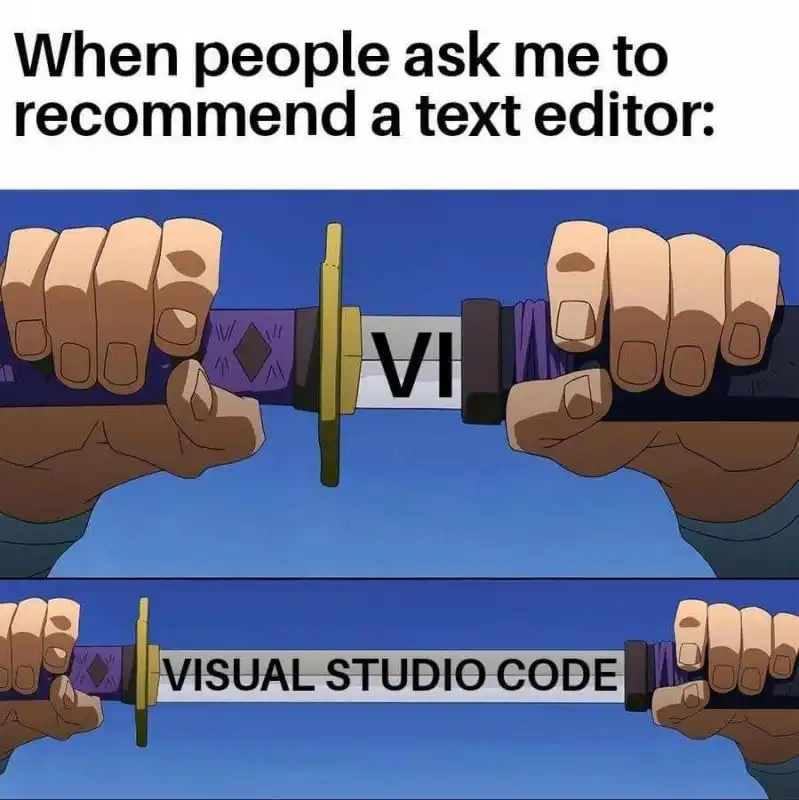
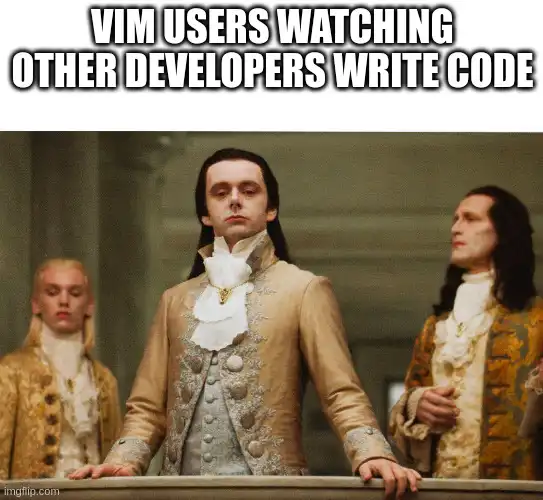

Text editors are special tools in a developer’s tool belt because they facilitate transferring thought into code. Developers spend a lot of time in their editors and are quite reluctant to switch to something new because they’ve spent several hours trying to craft their editors to accelerate their productivity.

Visual Studio Code (Vscode) has been the go-to IDE for many developers, especially those just starting in their development journey. Developers love Vscode for a number of reasons: it is free and open-source, it is available on all major operating systems, it has an excellent built-in debugger, it has a fantastic Git integration, and has a vast extension ecosystem to mention a few. My guess is you already use Vscode for some of these reasons, so there is no need to go in too deep 😁.



But at the other end of the spectrum is Vim. Vim sounds scary, and is notorious for being hard to quit ([this](https://stackoverflow.com/questions/11828270/how-do-i-exit-vim) Stackoverflow thread has over 4k upvotes). Yet so many developers use Vim because they realize it makes them much more productive. Make no mistake, Vim has a steep learning curve, yet developers continue to flock to this text editor that has been around for decades. The logical question is why?


If you already use Vscode and feel very productive, should you consider switching to Vim? What do you stand to gain? How well will it integrate with your existing projects, and how easy will adoption at a team level be? We’ll find the answers to these questions in this article.

## Why Should You Use Vim (Instead Of Vscode)?

Like a musical instrument, Vim can be a bit challenging to master. It differs from most text editors because it offers a unique take on text editing, “The Vim Way”, and can only be used in the command line (so feel free to trash your mouse). Most modern text editors (Vscode included) offer an extension to emulate Vim editing, which underscores the value of Vim-style editing. If you feel comfortable with Vscode, why then should you consider switching to Vim? These reasons might interest you.

### 1. Efficient Editing: Thought To Code At The Speed Of Thought

As a non-GUI text editor, Vim’s approach to text editing is very different from modern editors like Vscode, because the keyboard alone is used for navigation and text input. To make navigation efficient, Vim has a number of modes, of which the most commonly used are the insert mode and the normal mode. The insert mode is used to write text into a file, just like in a regular editor. But Vim starts to shine in the normal mode, allowing users to perform complex navigation with just a few keystrokes.

Here’s how Vscode compares with Vim at refactoring. You can quickly tell Vim is more efficient (4X faster in this example), as using a mouse is generally known to slow down productivity. Take a look!

Refactoring with Vscode:

<div class="youtube-embed"><iframe src="https://www.youtube.com/embed/gR_W9j498yw" title="YouTube video" frameborder="0" allow="accelerometer; autoplay; clipboard-write; encrypted-media; gyroscope; picture-in-picture; web-share" allowfullscreen style="aspect-ratio:16/9;width:100%;"></iframe></div>

Refactoring with Vim:

<div class="youtube-embed"><iframe src="https://www.youtube.com/embed/oZ97gAPkvrQ" title="YouTube video" frameborder="0" allow="accelerometer; autoplay; clipboard-write; encrypted-media; gyroscope; picture-in-picture; web-share" allowfullscreen style="aspect-ratio:16/9;width:100%;"></iframe></div>

### 2. Extremely Lightweight: Low CPU & Memory Usage

Vscode is written with web technologies (HTML, CSS, and JavaScript), which sounds cool, but comes at the cost of compute. As with many Electron-based apps, Vscode has very slow startup times and can [consume up to several gigabytes of RAM](https://code.visualstudio.com/docs/supporting/requirements#_hardware) when used in large projects, which is a real concern when working in constrained environments. Vscode also becomes laggy and unresponsive over time, forcing users to reinstall the application. These are all relatable issues if you’ve used Vscode as a daily driver.

But that’s not the case with Vim. As a super lightweight editor written in C, Vim can run fast on almost any computer hardware, and as a result, is installed by default on most Unix-based operating systems.

> 💡 Try opening up a terminal in your computer and type `Vim` or `Vi` to see if it came preinstalled

Here are a few charts detailing how Vim compares with Vscode when it comes to startup times and memory usage:

Startup time used in seconds to open a 6-megabyte XML file [credits](https://medium.com/commitlog/why-i-still-use-vim-67afd76b4db6):


Memory used in KiB opening a ~60 byte C source file [credits](https://medium.com/commitlog/why-i-still-use-vim-67afd76b4db6):


As clearly seen from the benchmarks, Vim is 82% faster than Vscode, while using 96% less RAM. That's mind-blowing 🤯.

### 3. Vim Is Ubiquitous: Learn Once, Use Everywhere

Vim can run anywhere (remote servers included), on any machine, in the exact same way, every time. This was the main reason I switched to Vim, I just wanted something that works everywhere.

As a programmer, there are high chances you’ll have to work in various environments and with multiple machines. For example, you may have a development machine and a server to which your code is deployed. If you ever need to look up things or edit files in a headless server, you’ll be out of luck using Vscode as it requires a GUI to run.

This is another area where Vim shines. Vim runs in the terminal and can be used in any environment, whether a GUI is present or not. Vim has the same keybinding set across all operating systems, unlike Vscode, which has [different shortcuts for Linux, Mac, and Windows](https://code.visualstudio.com/docs/getstarted/keybindings#_keyboard-shortcuts-reference). So with Vim, you learn once and use it everywhere. All of these, coupled with the fact that Vim has a tiny CPU and memory footprint, make Vim a truly ubiquitous editor.

### 4. Unlimited Customizations

Vim is infinitely customizable. While Vscode allows you to change the app’s color scheme, install plugins, and change a few app settings, Vim offers you complete control over the editor’s experience. You have [thousands of plugins](https://vimawesome.com/) to choose from. You can completely remap any keybinding and create new shortcuts for tasks in your daily workflow. And giving you more power as a developer, you can completely reprogram or automate your Vim experience with the built-in Vimscript language or Lua for Neovim.

The extent to which you can customize Vim is only limited by your imagination (and skills 😂).

### The BTW Factor

And lastly, there’s the “_by the way”_ (BTW) factor. Only the coolest programmers in the universe use Vim, as most developers opt out for out-of-the-box solutions like Vscode. So you get to join the cool kids by switching, and you can completely stop conversations by saying, “…BTW, I use Vim.”



## How To Switch To Vim

Now I know what you’re thinking: “Vim is so cool, how do I get started today?”, you’re in good company, my friend. You should already have Vim installed, but if not, run the following command to install Vim:

MacOS (via Homebrew)

```bash
brew install vim
```

Linux (Ubuntu)

```bash
sudo apt install vim
```

Setting up Vim takes only a few minutes (this is probably another awesome feature of Vim) as it is 100% scriptable. Here’s a shot video of me installing Vim (with all of my user configuration and plugins) on a fresh Debian-based system in less than 2 minutes:

<div class="youtube-embed"><iframe src="https://www.youtube.com/embed/gUwh0_J5lGI" title="YouTube video" frameborder="0" allow="accelerometer; autoplay; clipboard-write; encrypted-media; gyroscope; picture-in-picture; web-share" allowfullscreen style="aspect-ratio:16/9;width:100%;"></iframe></div>

Because Vim is so programmable, all your configurations can be stored in a GitHub repo and used in automated installs, as you saw above. If you’d love to try it out, here’s a [link to an Ansible playbook](https://github.com/cokoghenun/ansible) to install Vim with all of my favorite plugins for Debian-based systems.

To aid adoption, most teams include a Vim config file in their project’s repository that’s installed as part of the onboarding process. This way, all team members are easily bootstrapped into an IDE that _‘just works’_ for the current project.

### Attaining Vim Mastery

Because Vim introduces advanced editing concepts that are quite different from what you may be used to, you’ll need to learn about Vim a bit. Here are a few free resources that can be of help:

- Learn Vim by playing an online game [https://vim-adventures.com](https://vim-adventures.com/)
- A Vim video course by FeeCodeCamp [https://www.freecodecamp.org/news/learn-vim-beginners-tutorial](https://www.freecodecamp.org/news/learn-vim-beginners-tutorial/)
- Vim online playground [https://www.openvim.com](https://www.openvim.com/)
- Vim cheat sheet [https://vim.rtorr.com](https://vim.rtorr.com/)

## Conclusion

Phew! That was a lot to take in. If you’re a developer, the main takeaway is that you could be supercharging your productivity by using Vim, and I highly encourage you to make the switch. Please, feel free to contact me if you need additional help with your transition.

In the end, real engineers get the job done. So while Vim is cool and you should totally learn it, always remember to use the tools available that get the job done!
