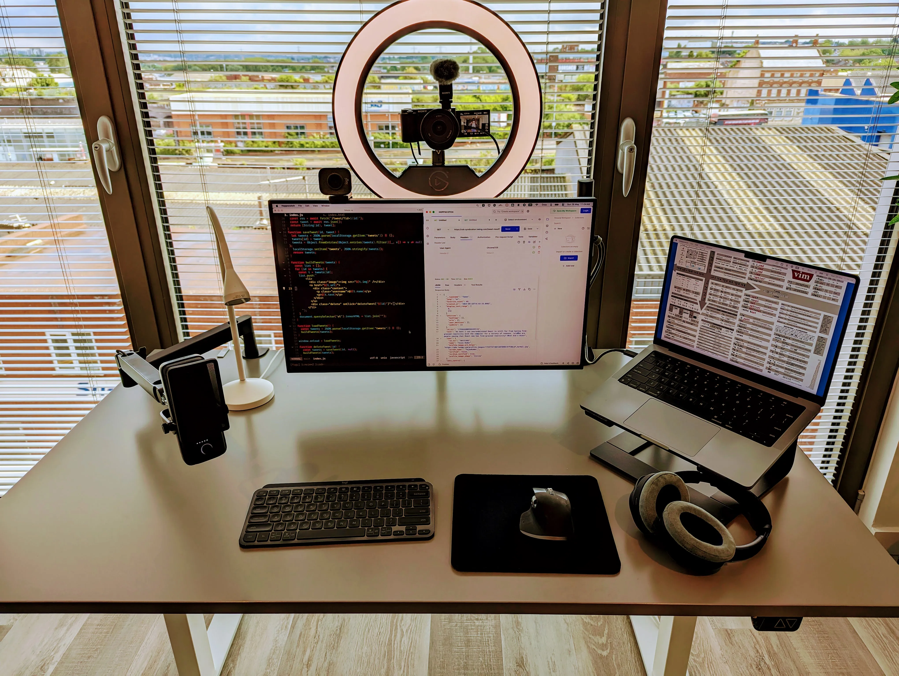
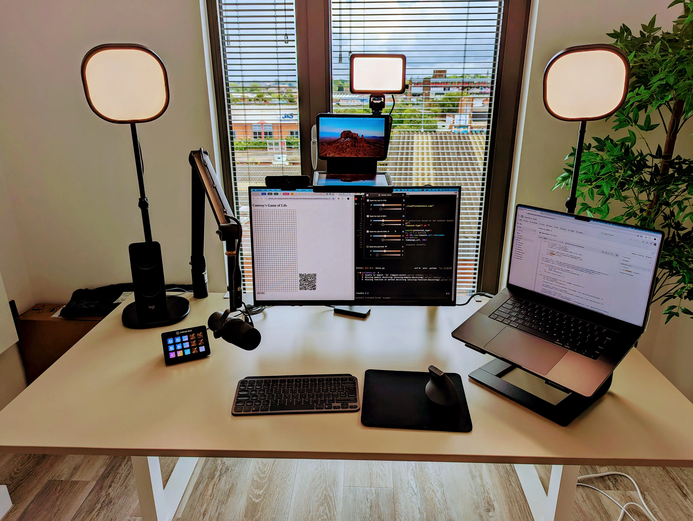

> Last updated: 04-08-2024

## Desk Mini

- [Lenovo Thinkpad x1 Carbon (6th gen)](https://www.laptopmag.com/reviews/laptops/lenovo-thinkpad-x1-carbon) - The legendary Thankpad™
- [16" portable display](https://www.aliexpress.com/item/1005004508875049.html) - Work on the go

## Desk Pro

- [Ikea Styrspel](https://www.ikea.com/gb/en/p/styrspel-gaming-chair-blue-light-grey-90506689/) - Herman Miller Aeron for cheap
- [Ikea Rodulf](https://www.ikea.com/gb/en/p/rodulf-desk-sit-stand-grey-white-s99396323/) - Auto sit/stand desk
- [Dell U2723QE](https://www.amazon.co.uk/dp/B09RSTWVTP) - Best 4k monitor
- [2023 14" MacBook Pro](https://support.apple.com/kb/SP889) - M2 Power
- [Sony WH-1000XM4 Headphones](https://www.sony.com/ng/electronics/headband-headphones/wh-1000xm4) - Noise cancelling king
- [Logitech MX Keys Mini](https://www.logitech.com/en-us/products/keyboards/mx-keys-mini.html) - One keyboard, all OSes
- [Logitech MX Master 3](https://www.logitech.com/en-us/products/mice/mx-master-3s.910-006557.html) - An infinite scroll wheel
- [Elgato Wave 3](https://www.elgato.com/uk/en/p/wave-3-black) - Hassle-free mic
- [Elgato Wave Mic Arm LP](https://www.elgato.com/uk/en/p/wave-mic-arm-lp) -
  Just get this
- [Ikea Nävlinge](https://www.ikea.com/gb/en/p/naevlinge-led-work-lamp-white-90404921/) - Let
  your light shine
- [Logitech Streamcam](https://www.logitech.com/en-us/products/webcams/streamcam.html) - 1080p streaming webcam
- [Elgato Ring Light](https://www.elgato.com/uk/en/p/ring-light) - Pro video light
- [Sony ZV-E10](https://electronics.sony.com/imaging/interchangeable-lens-cameras/aps-c/p/ilczve10-b) - Compact APS-C king

## Desk Ultra

- [Ikea Styrspel](https://www.ikea.com/gb/en/p/styrspel-gaming-chair-blue-light-grey-90506689/) - Herman Miller Aeron for cheap (again)
- [Ikea Trotten](https://www.ikea.com/gb/en/p/trotten-desk-sit-stand-white-s79429602/) - Manual sit/stand desk
- [Dell P2723QE](https://www.amazon.co.uk/Dell-Dis-P2723QE-Professional-UHD/dp/B09TY127B8/) - Professional 4k monitor
- [2023 16" MacBook Pro](https://support.apple.com/kb/SP858?locale=en_US) - Apple's amazing ARM
- [Logitech C925e](https://www.logitech.com/en-gb/products/webcams/c925e-business-webcam.960-001076.html) - Surprisingly good webcam
- [Logitech MX Keys Mini](https://www.logitech.com/en-us/products/keyboards/mx-keys-mini.html) - One keyboard, all OSes (again)
- [Logitech MX Vertical](https://www.logitech.com/en-us/products/mice/mx-vertical-ergonomic-mouse.910-005447.html) - Vertical ergo
- [Blue Compass Mic Arm](https://www.logitechg.com/en-us/products/streaming-gear/compass-boom-microphone-arm.989-000517.html) - Microphone boom arm
- [Shure SM7B Mic](https://www.shure.com/en-US/products/microphones/sm7b) -
  You'll sound like Celine Dion
- [Focusrite Scarlet 2i2](https://us.focusrite.com/products/scarlett-2i2) - USB audio DAC interface
- [Cloudlifter Mic Activator](https://www.cloudmicrophones.com/cloudlifter-cl-1) - Mic preamp
- [Elgato Stream Deck MK.2](https://www.elgato.com/us/en/p/stream-deck-mk2-black) - Programmable keypad
- [Logitech Z207 Stereo Speakers](https://www.logitech.com/en-us/products/speakers/z207-stereo-speakers-bluetooth.980-001294.html) - Great 3-in-1 speakers
- [Elgato Key Light Air](https://www.elgato.com/us/en/p/key-light-air) - Smart key lights
- [Elgato Key Light Mini](https://www.elgato.com/uk/en/p/key-light-mini) - Portable and rechargeable
- [Elgato Master Mount L](https://www.elgato.com/us/en/p/master-mount-l) - Mount the universe
- [Elgato Prompter](https://www.elgato.com/uk/en/p/prompter) - Don't forget what to say
- [Sony A7C](https://electronics.sony.com/imaging/interchangeable-lens-cameras/all-interchangeable-lens-cameras/p/ilce7c-b) - Legendary mirrorless king

## Miscellaneous

- [Google Pixel 7](https://store.google.com/us/product/pixel_7) - A simple android for a simple human
- [Google Nest Mini](https://store.google.com/us/product/google_nest_mini?hl=en-US) - OK, Google

## Software

- [Firefox](https://www.mozilla.org/en-US/firefox/new/) - A RAM friendly browser
- [Syncthing](https://syncthing.net/) - Airdrop for the rest of us
- [Neovim](https://github.com/neovim/neovim) - The last editor you'll need
- [ZSH](https://github.com/ohmyzsh/ohmyzsh/wiki/Installing-ZSH) - An infinitely customizable shell
- [Oh My ZSH](https://ohmyz.sh/) - The config manager for ZSH
- [Tmux](https://github.com/tmux/tmux) - Advanced terminal Multiplexing
- [Tilix](https://github.com/gnunn1/tilix) / [iTerm2](https://iterm2.com/) - Best terminal emulators
- [Fira Code](https://github.com/tonsky/FiraCode) - Free fancy fonts
