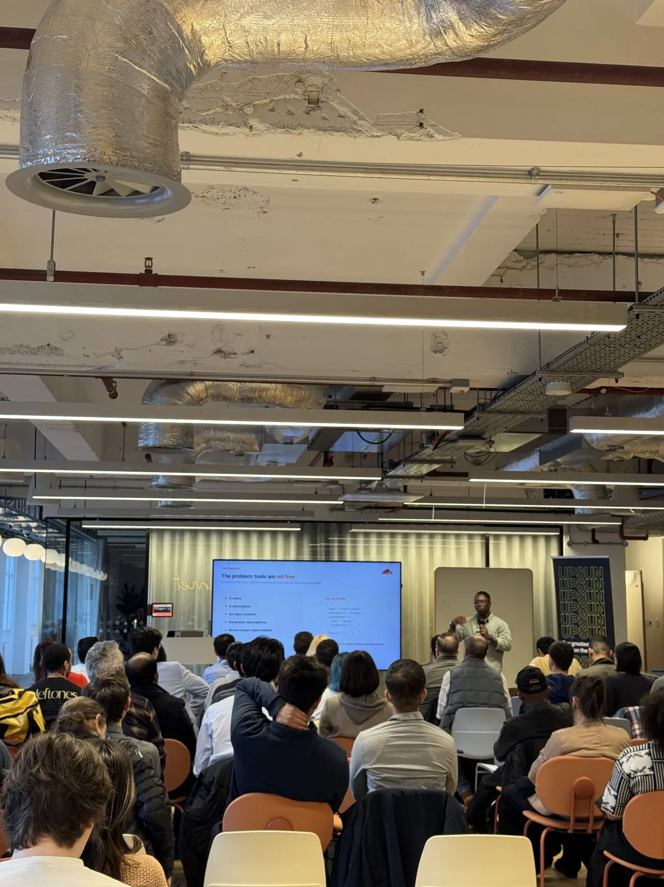
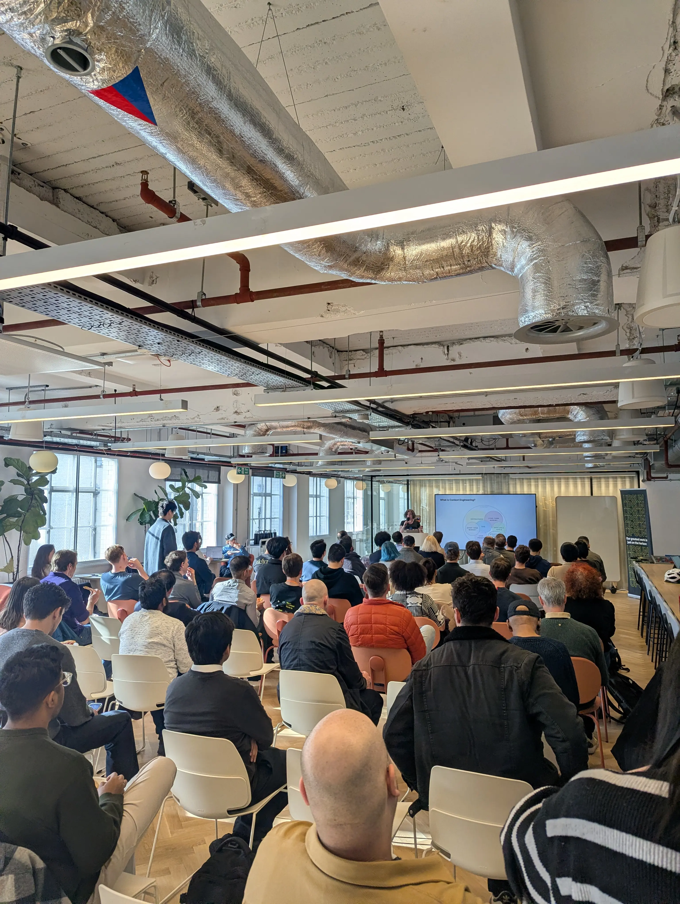
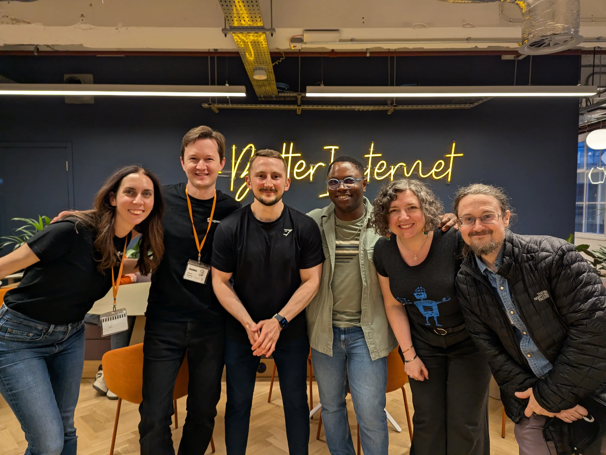

I organized the 'Building with MCP' event in the London HQ with friends from
Upsun, Microsoft and Elastic. We had several amazing talks about MCP and what
the best practices are for building with MCP.

I gave a talk about managing tokens for MCP tools efficiently using MCP codemode
developed by Cloudflare. The idea is you reduce the tool surface to two tools
i.e search and execute. Then the model/agent can progressively discover and use
the tools as needed. This is much more efficient than having 500 tools in the
models context.

Here are my links:

<a href="https://docs.google.com/presentation/d/11OiKGkOvT04XudiS6peNncJiUUka4NhJhr9LvoHosi0/edit?usp=sharing" target="_blank" class="btn">🔗 Link to presentation</a>

...and some pics:

