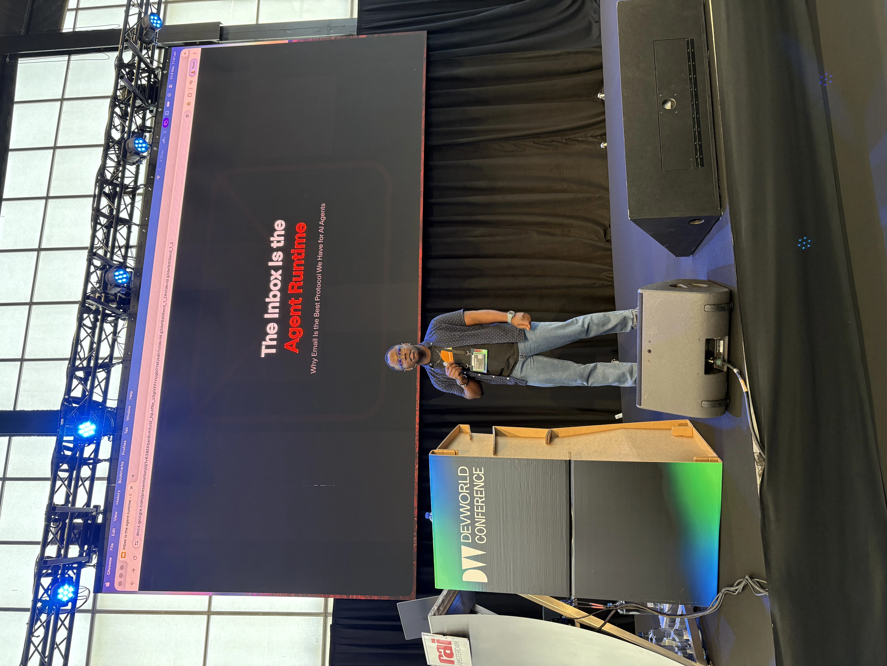
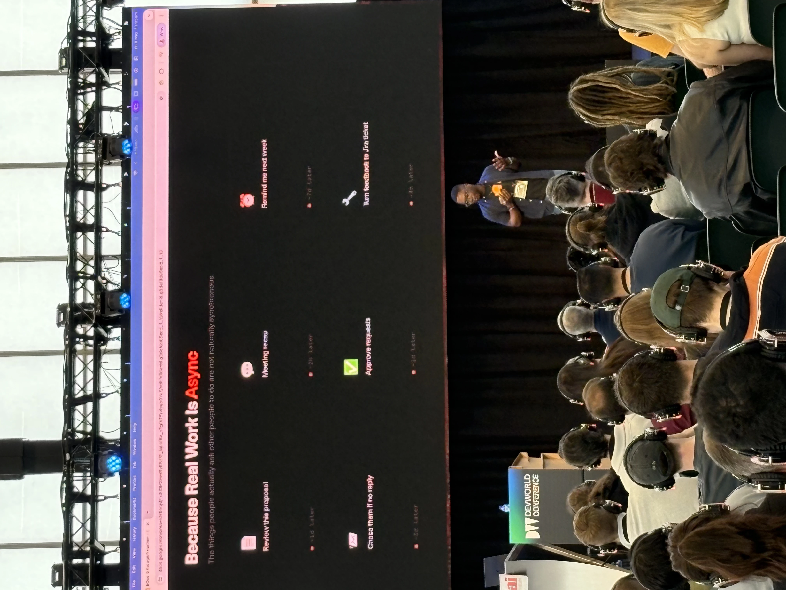

I gave a talk at DevWorld Conf 2026 in Amsterdam on why the inbox is an agent runtime.

Every agent demo is a chat window. It shouldn't be. Email is async, universal, and stateful, which is exactly what agents need.

In this talk, I showed how to build an agent that lives at an email address, remembers users, and works from a single platform. I also did a live demo on stage.

Here are my links:

<a href="https://docs.google.com/presentation/d/1_Ac4z5L30Pb3FI5l47T7vPgLsVX7GX35pf873pVonoo/edit?usp=sharing" target="_blank" class="btn">🔗 Link to presentation</a>

...and some pics:

