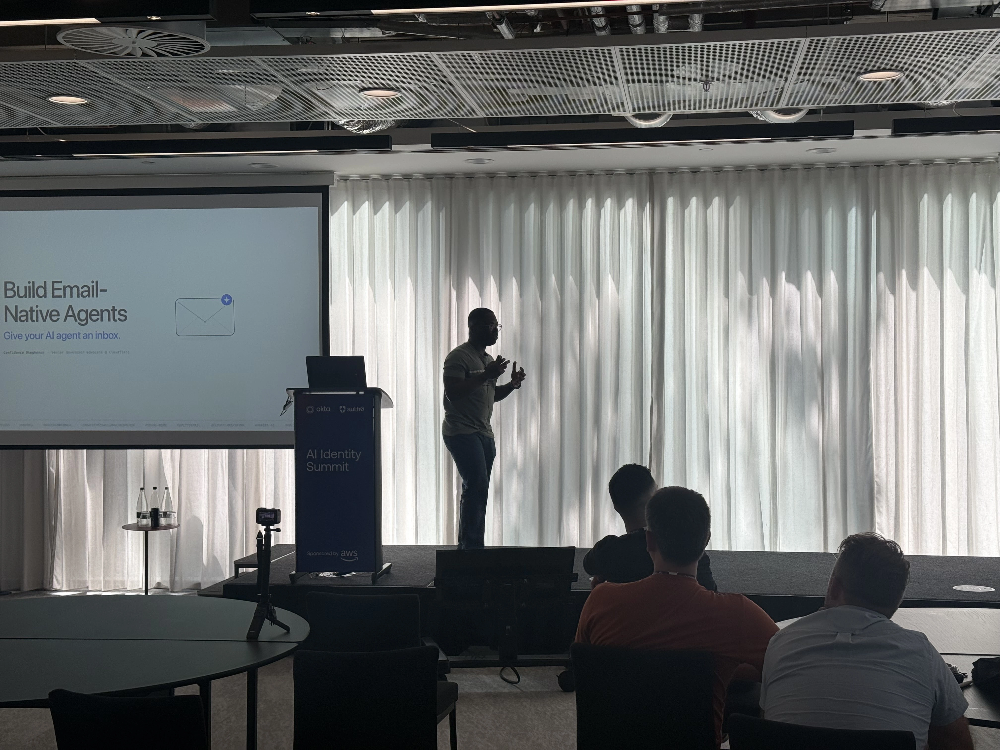
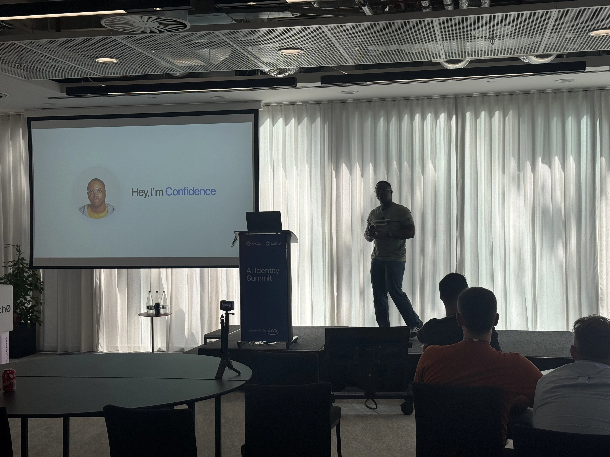
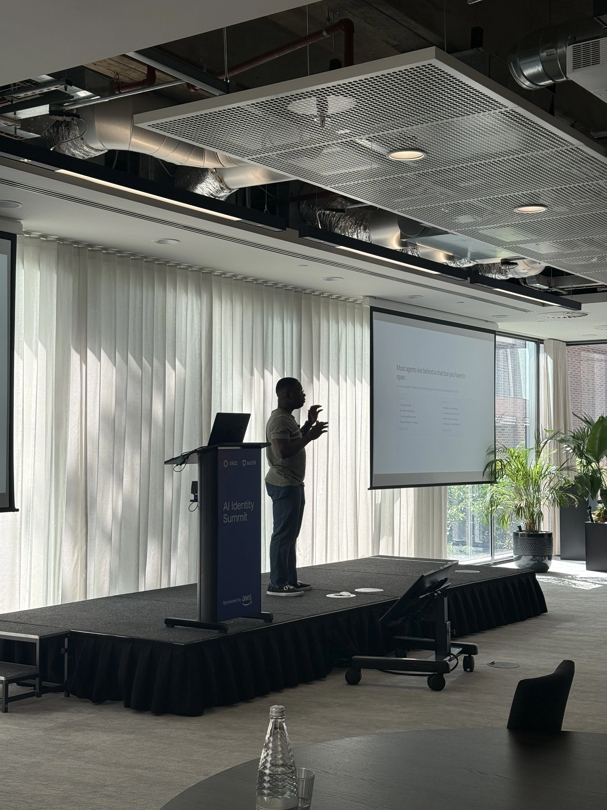

We spend a good amount of our time each day at work communicating with others.
Email has been a powerful communication system that every company uses to
communicate and coordinate work. What if you could put an agent in the inbox and
have it automate all the boring tasks you shouldn't be doing?

I gave this talk titled 'How to build email-native agent' at Okta's AI identity
summit in London. It was a blazing hot summer day but we had fun building agents
and exploring the demo. Both the demo and my presentation are linked below.

Here are my links:

<a href="https://email-native-agents.conflare.workers.dev/1" target="_blank" class="btn">🔗 Link to presentation</a>
<a href="https://github.com/megaconfidence/email-agent" target="_blank" class="btn">🔗 Link to demo</a>

<iframe src="https://www.youtube.com/embed/WvY304cqQug" title="YouTube video" frameborder="0" allow="accelerometer; autoplay; clipboard-write; encrypted-media; gyroscope; picture-in-picture; web-share" allowfullscreen style="aspect-ratio:16/9;width:100%;"></iframe>

...and some pics:

